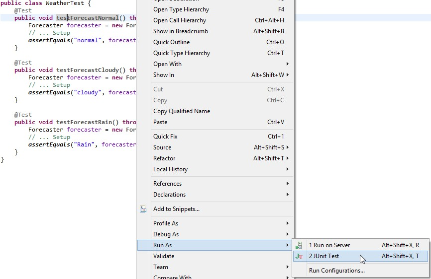
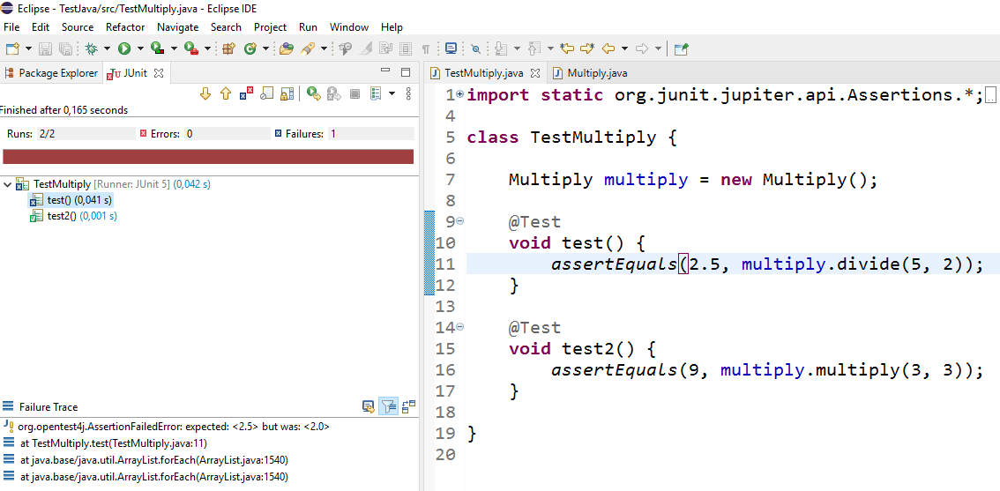

:lib: pass:quotes[_library_]
:libs: pass:quotes[_libraries_]
:j: Java
:fs: functies
:f: functie
:m: method
:icons: font
:source-highlighter: rouge

//ifdef::env-github[]
:tip-caption: :bulb:
:note-caption: :information_source:
:important-caption: :heavy_exclamation_mark:
:caution-caption: :fire:
:warning-caption: :warning:
//endif::[]

= JUnit
//Author Mark Nuyts
//v0.1
:toc: left
:toclevels: 4

JUnit is een {j} {lib} om software testen uit te voeren. 
Via _Maven_ kunnen we in de _pom.xml_ een referentie naar JUnit toevoegen. 
Na een _build_ van de applicatie is deze {lib} beschikbaar om te gebruiken.
Dankzij JUnit kunnen we klassen en methods volledig uittesten.

== Waarom software testen?

== Hoe maak je een test?

Om een test te schrijven heb je de volgende zaken nodig:

* De **Junit library** moet op het _classpath_ staan (hier zorgt Maven voor).
* Je moet een **nieuwe klasse** aanmaken (een test klasse kan meerdere testen bevatten).
* Je gebruikt de **_@Test_ annotatie** boven de methods (die de testen bevatten).

Bijvoorbeeld: 

[source,java]
----
public class TestMultiply { <1>
	@Test <2>
	void testIets() { <3>
		<4>
	}	
}
----
<1> De naam van de klasse waarin we de testen gaan schrijven.
<2> De _@Test_ annotatie moet boven een method staan.
<3> De methodnaam. Deze kan je veranderen zodat het duidelijk is wat je wil testen.
<4> De code die de test gaat bevatten.

== Wat schrijf je in de test?

In een test maak je gebruik van __assert statements__.
#Deze statements controleren een **verwachting** tegen een **resultaat**.#

Bijvoorbeeld:
----
5 gedeeld door 2, zou 2.5 als resultaat moeten geven.
----

In _code_:

[source,java]
----
public class TestMultiply {
	
	Multiply multiply = new Multiply(); <1>

	@Test <2>
	void testDivideCorrect() {
		assertEquals(2.5, multiply.divide(5, 2)); <3>
		assertEquals(Double.NaN, multiply.divide(5, 0)); <4>
	}
	
	@Test
	void testMultiplyCorrect() {
		assertEquals(9, multiply.multiply(3, 3)); <5>
	}

}
----
<1> Een instantie van een klasse die we willen testen.
<2> De _@Test_ annotatie boven de test method.
<3> Een __assert statement__: we verwachten 2.5 als deling indien we 5 delen door 2.
<4> Een volgend __assert statement__: we controleren dat een deling door 0 wel degelijk _NaN_ teruggeeft (__Not a Number__).
<5> Een ander __assert statement__ in een andere method.

== Testen uitvoeren

De Junit testen plaats je in een _Maven_ project onder de folder:
----
src/test/
----
Bij het uitvoeren van een __Maven build__ (install), wordt de _code_ gecompileerd en worden vervolgens de testen uitgevoerd.
Indien een bepaalde test een fout geeft, wordt dit in de console afgeprint en krijg je de melding dat je _build_ niet succesvol is.

=== Een specifieke JUnit test uitvoeren

In Eclipse kan je op een bepaalde JUnit test rechterklikken en kiezen voor __Run as -> Junit test__:

Na het uitvoeren van de test, krijg je in Eclipse een visueel overzicht van de geslaagde test (groen) en de gefaalde (rood):

== Hoeveel __assert statements__ schrijven?

In een software test is het belangrijk dat je:

* De #normale werking nagaat#.
* #Met alle uitzonderingen probeert rekening te houden#.

Indien je dus enkel de normale werking uittest, ben je dus onvoldoende aan het testen. Je zal ook de uitzonderingen moeten testen.
In ons voorgaande voorbeeld, betekent dit dat we een deling door 0, een integer deling met restwaarde, een nuldeling, enz. gaan moeten testen.

== Hoeveel testen schrijven?

Hierover verschillen de meningen onder programmeurs, er zijn verschillende scholen van denken: 

* De aanhangers van https://nl.wikipedia.org/wiki/Test-driven_development[TDD (Test driven development)] zijn van mening dat er geen _code_ geschreven mag worden zonder dat er een unit test voor bestaat. Dit is heel strict, maar het leidt wel tot goede resultaten.
* Er zijn programmeurs die geen testen schrijven en volledig steunen op _bugreports_. Deze aanpak leidt spijtig genoeg tot meer _bugs_..
* Een middenweg is het volledig uittesten van klassen waar complexiteit in voorkomt en voor de rest te steunen op _Integration tests_.

== Integration tests

Naast _Unit Tests_, die 1 klasse volledig uittesten. Worden er ook integratie testen gemaakt.
Deze testen controleren de werking van software op een iets **hoger niveau**, namelijk hoe de **klassen samenwerken** en functioneren als een geheel.

Bijvoorbeeld:
In het computerspel __Space Invaders_ wordt gecontroleerd dat indien de gebruiker schiet op de as van een onbeweeglijk doel, dat na een _x_ aantal seconden het doel vernietigd werd.
Deze test houdt, in detail, geen rekening met alle onderliggende klassen de ermee te maken hebben (zoals de laser, de keyboardinputklasse, het ruimteschip, de kogel,..). Maar kijkt naar het resultaat van 2 instanties (de inputklasse, het ruimteschip (de positie) en het doel (de positie)).

Doordat een integratietest steunt op de correcte implementatie van alle onderliggende klassen, neemt deze veel onderliggende testen over. Het grote nadeel is dat bij het foutlopen van de test, het zeer moeilijk kan zijn om te weten waar het net foutliep (de vinger dus correct op de wonde te kunnen leggen).

#Het is dus aangeraden gebruik te maken van een **combinatie van unit testen en integratie testen**#.

