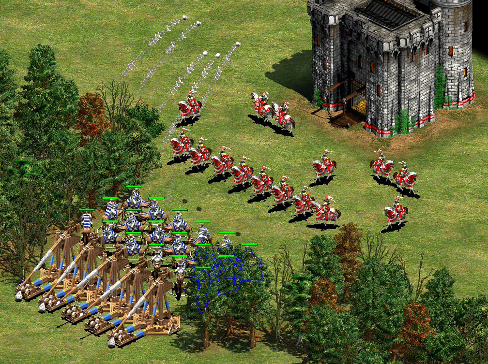
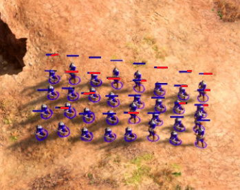

:lib: pass:quotes[_library_]
:libs: pass:quotes[_libraries_]
:j: Java
:fs: functies
:f: functie
:m: method
:icons: font
:source-highlighter: rouge

= Klassen
//Author Mark Nuyts
//v0.1
:toc: left
:toclevels: 4

Een *klasse* in een object georiënteerde taal is een concept dat een blauwdruk vormt.
Van deze blauwdruk kunnen verschillende *instanties* aangemaakt worden.
Een klasse bestaat uit:

* variabelen
* methods (functies die in een klasse geschreven zijn)

== Voorbeeld van een klasse

Een klasse kan elk concept voorstellen, bijvoorbeeld een auto, een gebouw, een cirkel,..
In computer spellen wordt veel gebruik gemaakt van klassen.

.Klassen en instanties in Age of Empires 2

In de afbeelding hierboven (uit het computerspel Age of Empires) kunnen we verschillende klassen aan het werk zien:

* Een ruiter (deze komt meerdere keren voor -> meerdere instanties)
* Een kameel (ook deze komt meerdere keren voor -> meerdere instanties)
* Een kasteel (komt 1x voor -> slechts 1 instantie)

Een ruiter is als klasse in dit computerspel slechts eenmaal gedefiniëerd.
Toch zien we meerdere ruiters.
Dit komt omdat er van deze ruiter klasse meerdere instanties werden aangemaakt.

== De _code_ om een klasse te definiëren

De ruiter klasse uit bovenstaande _screenshot_ zou als volgt geprogrameerd kunnen zijn:

[source,java]
----
public class Ruiter { <1>
  public int totalhitpoints = 200; <2>
  public int health = 200; <2>
  public int speed = 4; <2>
  public int armour = 20; <2>
  public int positionX = 485; <2>
  public int positiony = 312; <2>
  
  public void hit(){ <3>
      health -= 10; <4>
  }
  
}
----
<1> De definitie van de klasse.
<2> De variabelen in de klasse.
<3> De functie die in de klasse werd gedefiniëerd.
<4> De code in de functie werkt op de variabelen uit de klasse.

[IMPORTANT]
====
Iedere klasse moet in een aparte Java _file_ aangemaakt worden, ##met dezelfde naam als de klasse##.
De _class Ruiter_ zal dus in een Ruiter.java _file_ moeten staan.
##Een klasse begint steeds met een hoofdletter##.
====

== Instanties

Een klasse kan je beschouwen als een blauwdruk (een ontwerp of plan) van iets, bijvoorbeeld van een auto.

Dit ontwerp beschrijft hoe auto eruit moet zien, wat het concept is:

* De afmetingen
* De buiging van de carosserie
* Het aantal zetels
* De maat van de velgen
* Paardenkracht van de motor
* ..

Maar het is (nog) geen auto die je kan gebruiken.
Om het te gaan gebruiken zal je een instantie moeten maken (een echte auto van de fabrieksband laten rollen).

.In de fabriek worden instanties van Teslas aangemaakt.

Het aanmaken van instanties in {j} gebeurt met het *##new##* keyword:

[source,java]
----
Ruiter ruiter1 = new Ruiter(); <1>
----

<1> Merk op dat de klasse met een hoofdletter wordt geschreven en de instantie met een kleine letter.

Het is mogelijk meerdere instanties aan te maken van dezelfde klasse:

[source,java]
----
Ruiter ruiter2 = new Ruiter();
Ruiter ruiter3 = new Ruiter();
Ruiter ruiter4 = new Ruiter();
Ruiter ruiter5 = new Ruiter();
----

Zo lang het werkgeheugen (RAM) niet vol is, kan je instanties blijven aanmaken.

=== Variabelen en geheugengebruik

Iedere instantie van een klasse neemt een deel van het geheugen in.
Voor iedere instantie worden immers de waarden van de verschillende variabelen apart bijgehouden.

Als de hitpoints van 1 ruiter verminderen doordat hij aangevallen werd, geldt dit enkel voor deze ruiter.
De hitpoints van de andere ruiters behouden hun eigen waarden.

.Geselecteerde _units_ en hun _health bar_ in Age of Empires.

Al deze informatie moet (voor iedere instantie) in het werkgeheugen bijgehouden worden.

=== Variabelen

Om de variabele van instanties aan te passen kunnen we via de _dot notatie_ (punt notatie) aan de variabelen van een instantie:

[source,java]
----
System.out.println(ruiter2.health);
System.out.println(ruiter3.health);
----

Initieel hebben deze variabelen een standaardwaarde. Deze werd in de klasse bepaald, namelijk 200.
Het uitprinten van bovenstaande _code_ zal tweemaal 200 afprinten.

Als we de hit() method (functie in een klasse) uitvoeren op de 3de instantie, zal van deze instantie 10 hitpoints afgetrokken worden:

[source,java]
----
ruiter3.hit(); <1>
System.out.println(ruiter2.health); <2>
System.out.println(ruiter3.health); <3>
----
<1> Het uitvoeren van de hit() method op de 3de instantie (via de _dot notatie_).
<2> Het afprinten van de _health_ van ruiter 2: 200
<3> Het afprinten van de _health_ van ruiter 3. Dit is nu: 190

=== Methods (functies)

In een klasse kunnen methods (of functies) geschreven worden.
Deze methods kunnen aangeroepen worden op de instantie van een klasse.

[source,java]
----
ruiter3.hit();
----

Een dergelijke method kan gedefinieerd worden *zonder* het _static_ keyword:

[source,java]
----
public void hit(){
----

[IMPORTANT]
====
Het _static_ keyword wordt gebruik wanneer we een functie willen uitvoeren zonder gebruik te maken van een instantie.
Een functie met het _static_ keyword *kan geen gebruik maken van variabelen in de klasse* (tenzij ook deze static zijn en dus verbonden zijn aan de klasse: identiek zijn voor alle instanties van de klasse).
##In zo goed als alle gevallen is het aangeraden het _static_ keyword niet te gebruiken, maar op instanties te werken##.
====

Identieke methods kunnen niet voorkomen in een klasse.
Het volgende is dus niet mogelijk:

[source,java]
----
public void hit(){
    health -= 10;
}

public void hit(){ //Compiler error
    health -= 10;
}
----

Dit maakt 2 maal dezelfde method (naam) aan, dit geeft de compiler aan als een fout.
Wat wel kan is andere _parameters_ gebruiken:

[source,java]
----
public void hit(int hitpoints){
    health -= hitpoints;
}

public void hit(){
    health -= 10;
}
----

Hier kan de compiler een duidelijk onderscheid maken tussen de 2 methods.
Bij het aanroepen van de method op een instantie is het immers duidelijk welke van de 2 bedoeld wordt door te kijken naar de parameters:

[source,java]
----
ruiter3.hit(8);
ruiter3.hit();
----

De eerste zal de hit() method oproepen die parameters bevat.

=== Arrays

Instanties van klassen kunnen in een array worden geplaatst, net zoals andere datatypes.
De gehele getallen 4, 5, 6, 7, .. zijn immers ook maar instanties van een integer datatype.
Ruiter1, ruiter2, .. zijn instanties van het Ruiter datatype.

Om een array aan te maken van Ruiters:

[source,java]
----
Ruiter[] ruiters = new Ruiter[10];
ruiters[0] = ruiter1;
----

Bovenstaande _code_ maakt een ruiter array aan van 10 vakjes.
In het eerste vakje van de array (het 0de vakje) stoppen we de eerste ruiter instantie.

_Games_ maken veel gebruik van arrays van instanties.
Hieronder kan je een voorbeeld zien van een selectie van _units_ in een strategiespel.
De speler heeft via de muis zijn leger van _units_ geselecteerd. 
Deze selectie is zichtbaar door de kadertjes die rond de units zijn getrokken.
De groene balk geeft vervolgens de hitpoints aan van de individuele _units_ in de selectie array.

.Geselecteerde _units_ en hun _health bar_ in Tiberian Sun.
image::health.png[Game selectie]

Ieder _unit_ in het spel is een instantie van een klasse.
##Voor iedere instantie worden de variabelen apart bijgehouden.##
In het screenshot kan je zien dat enkele _units_ meer schade hebben opgelopen dan anderen.

Voor de bommenwerpers (de vliegtuigen onderaan op het screenshots) kan je zien aan de hand van de gele blokjes, hoeveel bommen ze nog dragen.

In java code zouden we de array als volgt kunnen voorstellen:

[source,java]
----
Unit[] selected = new Unit[100]; // maximaal 100 units selecteerbaar

for (int i = 0; i < selected.length; i++){
    System.out.println((selected[i].health / selected[i].hitpoints) * 100); //health percentage van elke unit
}
----

== Gebruik van bestaande klassen

In de _standard library_ van java (die wordt meegeinstalleerd bij het installeren van java) zijn veel bestaande klassen aanwezig.
Deze kan je gebruiken zonder ze zelf vanaf 0 te hoeven schrijven.

Een voorbeeld hiervan is de _Math_ klasse.
Deze bevat enkele constanten (onveranderbare variabelen), zoals het getal PI.
Ook bevat deze klasse enkele methods zoals het berekenen van het gemiddelde, maximum, minimum,.. Kortom veel zaken die in de wiskunde van pas kunnen komen.

=== Random

Een handige klasse is de _Random_ klasse. 
Deze maakt het mogelijk een random getal op te roepen:

[source,java]
----
Random rand = new Random();

// verkrijg een random nummer tussen [0 - 49].
int n = rand.nextInt(50);
----

Om een random nummer te verkrijgen tussen 10 en 20:

[source,java]
----
Random rand = new Random();

// verkrijg een random nummer tussen [10 - 20].
int n = rand.nextInt(11) + 10;
----

Om een random kommagetal te verkrijgen:

[source,java]
----
Random rand = new Random();

// verkrijg een random kommagetal tussen [0 - 9.9999999].
double n = rand.nextDouble(10);
----

Een andere mogelijkheid is gebruik te maken van de Math.random() functie.
Deze geeft een kommagetal tussen 0 en 1 terug.

[source,java]
----
double random = Math.random();
----

Om met Math.random() een getal tussen 0 en 50 te krijgen:

[source,java]
----
double random = Math.random() * 50;
----

