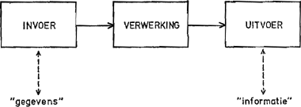

:lib: pass:quotes[_library_]
:libs: pass:quotes[_libraries_]
:j: Java
:fs: functies
:f: functie
:m: method
:icons: font
:source-highlighter: rouge

= Programmeren
//Author Mark Nuyts
//v0.1
:toc: left
:toclevels: 4

== Stappenplan

Wanneer we een programma willen schrijven, dien je eerst een voorbereiding te maken. We willen namelijk niet in het wilde weg beginnen programmeren. De verschillende stappen die we nodig hebben om tot een algoritme en vervolgens het programma te komen zijn als volgt:

. Probleemdefinitie
. Analyse
. Algoritme
. Programma
. Testen
. Documenteren

=== Probleemdefinitie

In eerste instantie gaan we voor onszelf verwoorden welk probleem we juist willen oplossen.

Bijvoorbeeld:

====
Ik wil de priemgetallen kleiner dan 1000 (maar groter dan 0) afprinten.
====

=== Analyse

Vervolgens proberen we dit probleem in kleinere deelproblemen op te splitsen (analyse van het probleem).

We kunnen dit probleem opsplitsen in deelproblemen:

* De getallen van 0 tot 1000 genereren.
* Controleren of een getal een priemgetal is.
* Een getal afprinten.

Het is mogelijk dat we ieder deelprobleem nog verder kunnen opsplitsen in onderliggende deelproblemen (dit is #de TOP-DOWN methode#).

In de probleemanalyse is het van belang rekening te houden met de #invoer -> verwerking -> uitvoer#:

* Welke gegevens worden er ingevoerd door de gebruiker (wat is de *input*)? (bv. een geboortedatum, de straal van een cirkel, …)
* Welke verwerking moet er gebeuren (*proces*)? (bv. Wat is de formule om de oppervlakte van een cirkel te berekenen?)
* Wat moet er uitgevoerd/getoond worden (*output*)? (bv. de leeftijd van de gebruiker, de oppervlakte van de cirkel, …)

=== Het algoritme

Elke dag zijn er meerdere situaties waarbij we een probleem moeten oplossen. 
In de meeste gevallen is dit een klein probleem waar we niet over moeten nadenken of een probleem waarvoor we de oplossing reeds weten. 

Bijvoorbeeld:

* Wat is de kortste weg naar school?
* Hoe stuur ik een bericht met mijn gsm?

Wanneer we een nieuw of groter probleem tegenkomen, overlopen we verschillende denkpistes om tot een gewenst resultaat te komen. 
De weg om van een probleemstelling tot een oplossing te komen, noemen we een algoritme. 
#Een algoritme is een reeks instructies die vanuit een gegeven begintoestand naar een beoogd doel leiden.#

Voorbeelden: 

* In een doos Lego zitten er heel wat losse stukjes. Het probleem is heel eenvoudig: “Hoe maken we met deze losse stukken dezelfde constructie als het voorbeeld op de doos?”. 
Hiervoor gebruiken we de handleiding, een reeks van instructies die ons naar het gewenste resultaat begeleidt.
* Wanneer je een nieuwe smartphone aankoopt, heb je steeds een handleiding (al dan niet op internet) om je te helpen probleemsituaties om te zetten in oplossingen, bv.:
** Hoe wis je alle berichten?
** Hoe bewaar ik een contactpersoon?
* Wanneer je zelf iets wil koken, kan je best gebruik maken van een recept. Hierin wordt immers stap voor stap uitgelegd hoe je van je beginsituatie tot een lekker gerecht komt.

=== Programmeren - Algoritme vs. programma

Elk computerprogramma is eigenlijk één groot algoritme, maar dan omgezet in een programmeertaal. 
Vermits het algoritme van een programma meestal te ingewikkeld is voor de programmeur om zomaar te programmeren, deelt hij het algoritme op in kleinere deelalgoritmen. 
Al deze verschillende deelalgoritmen worden vervolgens geprogrammeerd in een programmeertaal en samengevoegd tot één programma.

Enkele voorbeelden van programmeertalen zijn:

* Javascript
* Java
* Python

=== Testen

Eenmaal we een algoritme (of een programma) geprogrammeerd hebben, dienen we onze oplossing uitgebreid te testen.
**Bij het programmeren worden immers vaak fouten gemaakt**:

* typfouten
* verkeerde veronderstellingen
* fout gebruik van variabelen
* https://en.wikipedia.org/wiki/Off-by-one_error[de off-by-one error]
* ..

Al deze fouten leiden tot #_bugs_#.
Om het risico op _bugs_ te verkleinen, is het belangrijk de software te testen.
Het testen van software kan via:

* Het uitproberen van de software.
* Het interactief doorlopen van de code (via de _debugger_).
* Via _Unit testen_ (bijvoorbeeld _JUnit_).

=== Documentatie

Naast het testen van _software_ is het ook belangrijk _software_ te documenteren.
De documentatie beschrijft **welk probleem** het programma oplost en **op welke manier** dit gebeurt.

Documentatie kan geschreven zijn #in de code#:

* Via commentaren boven de klassen of methods:
+
[source,java]
----
/**
* Deze klasse berekent priemgetallen <1>
*/
public class Primes {
/**
* Aan deze functie kan je meegeven tot waar je de priemgetallen wil berekenen <2>
*/
public void printPriemgetallen(int maximum) {
// we beginnen bij 0 <3>
int i = 0;
....
}
}
----
<1> Documentatie boven de klasse (over de klasse) via javadoc
<2> Documentatie boven de method (over de method of functie) via javadoc
<3> Documentatie via commentaren in de broncode.
De documentatie kan de volgende elementen bevatten:
+
* Of buiten de code.

Documentatie buiten de code:

* Klassendiagram
* Algemene informatie over het programma:
 ** Welke probleem lost het op?
 ** Welke technologie wordt gebruikt?
 ** Welke methode of algoritme gebruik je om het probleem op te lossen
 ** Hoe gebruik je het programma?

De documentatie is belangrijk om de _code_ begrijpbaar te maken voor anderen of voor jezelf (op een later tijdstip). Je _code_ kan immers al snel zeer complex worden.

