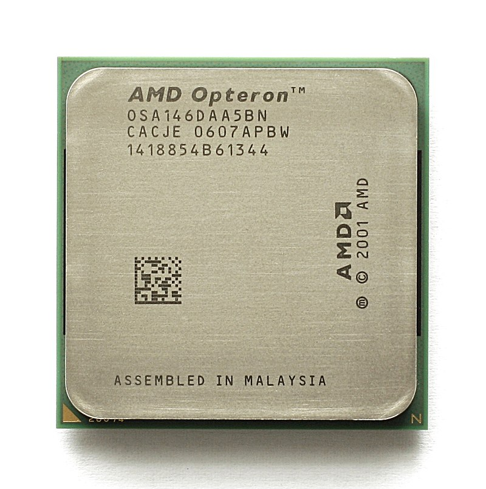
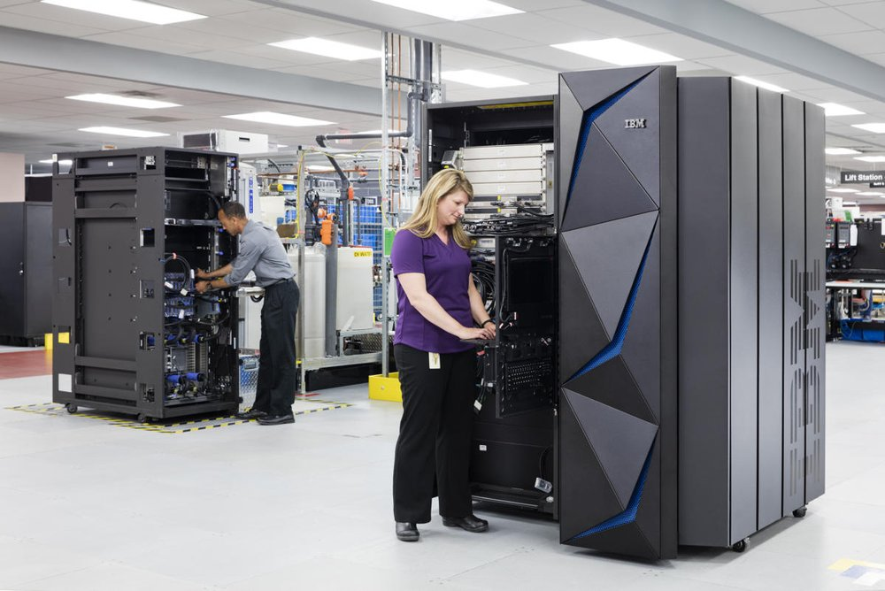

:lib: pass:quotes[_library_]
:libs: pass:quotes[_libraries_]
:j: Java
:fs: functies
:f: functie
:m: method
:icons: font
:source-highlighter: rouge
:rouge-style: thankful_eyes
:stylesheet: dark.css

//ifdef::env-github[]
:tip-caption: :bulb:
:note-caption: :information_source:
:important-caption: :heavy_exclamation_mark:
:caution-caption: :fire:
:warning-caption: :warning:
//endif::[]

:toc: left
:toclevels: 4

= Hoofdstuk 1: Programmeertalen & Programmeren

Een programma bepaalt hoe we met invoer een bepaalde uitvoer kunnen verkrijgen.

image::images/invoer-uitvoer.gif[]

Excel werkt met bepaalde invoer (bijvoorbeeld cijfergegevens) en kan deze verwerken naar een bepaalde uitvoer (bijvoorbeeld een grafiek).
Excel is dus het programma dat de verwerking uitvoert. Gebruikers kunnen verschillende programma's gebruiken of installeren. Dit om met andere invoer te werken of de verwerking anders uit te voeren.
Als programmeur kan je echter het programma maken dat de uitvoer doet.

== Opdrachten voor de computer

Een computer is een logische machine die we opdrachten kunnen geven.

Voorbeelden van opdrachten:

* Schrijf iets weg naar een bestand op de ssd.
* Krijg een lijst van de bestanden op de hdd.
* Toon iets op het scherm.
* Haal een pagina op van het internet via het ethernet netwerk.
* Tel 2 getallen op en sla het op in een variabele x.

Opdrachten worden gegeven via een programma.
De computer bestaat uit verschillende onderdelen. Het is de CPU, processor of centrale rekeneenheid die het programma interpreteert.

image::images/motherboard-drawing-53.png[De onderdelen van een moederbord.]

##Opdrachten geven aan een computer kan via een programma.
Met een programmeertaal kan een programma geschreven worden.##

== CPU Instructieset

Iedere computer **CPU** heeft een bepaalde **architectuur** of ontwerp.
Hier zijn heel wat standaarden in: 

* x86 (32bit), ontwikkeld door Intel
+
image::images/x86.jpg[x86 cpu,width=30%, height=auto]
+
* x64 (64bit), de modernere variant ontwikkeld door AMD
+

+
* ARM, een zuinigere architectuur, deze zit bijna iedere smartphone.
+
image::images/arm.webp[ARM cpu,width=30%, height=auto]
+
* RISC
+
image::images/KL_Sun_UltraSparc.jpg[SUN Sparc RISC cpu,width=30%, height=auto]
+
* Mainframe
+
image::images/mainframe1.jpg[mainframe,width=400px, height=auto]
+

Aan deze architectuurstandaarden van CPU's kunnen opdrachten gegeven worden via **de instructieset**, dit is de ##machinetaal## van de processor.
Dit zijn afgesproken opdrachten op een laag niveau (vb. onthoud een getal, tel een getal op, haal een waarde op van de ssd, ...)

Deze opdrachten via de instructieset kunnen in een laag niveau computertaal worden voorgesteld, namelijk __assembly__:

image::images/assembly.jpeg[Assembly en machinetaal]

Dit is een **zeer ingewikkelde manier om te programmeren**.

Gelukkig zijn er hoog niveau programmeertalen ontwikkeld die het ons gemakkelijker maken.

== Hoog niveau programmeertalen

Hoog niveau programmeertalen (die makkelijker zijn om te schrijven), kunnen via ##compilatie## automatisch omgezet worden naar machinetaal.

**Tekst (Hogere programmeertaal) -> compilatie -> machinetaal voor een specifieke architectuur**

De machinetaal wordt bijgehouden in een uitvoerbaar bestand of __executable__ (iets waarop je kan dubbelklikken om het programma te openen).

=== Voorbeelden __Hello World__ in enkele programmeertalen

* C
+
[source]
----
#include <stdio.h>
  
int main()
{
    printf("Hello World");
    return 0;
}
----
+
* Cpp
+
[source]
----
#include <iostream>
using namespace std;
int main()
{
    cout << "Hello World";
    return 0;
}
----
+
* Ruby
+
[source]
----
puts "Hello World!"
----
+
* Java
+
[source]
----
    class MyClass{  
        public static void main(String args[]){  
         System.out.println("Hello Java");  
        }  
    }  
----
+
* Python 3
+
[source]
----
print("Hello, World!")
----
+
* C#
+
[source]
----
using System;
namespace HelloWorldApp {
    class MyClass {
        static void Main(string[] args) {
            Console.WriteLine("Hello World!");
            Console.ReadKey();
        }
    }
}
----
+
* Fortran
+
[source]
----
program hello
  print *, 'Hello, World!'
end program hello
----

== Programmeertalen: Een historisch overzicht

image::images/ComputerLanguagesChart.png[]

Er zijn voortdurend nieuwe ontwikkelingen in programmeertalen. Nieuwe talen worden ontwikkeld. Ze kunnen populair worden, bijna niet gebruikt worden of andere talen beïnvloeden met hun nieuwe ideeën.
Iedere bestaande taal, zoals Python, wordt ook verder doorontwikkeld. Het verschil tussen python versie 1 en versie 3.11 is enorm groot. Hoewel het om dezelfde programmeertaal gaat, zal een programma ontwikkeld voor pyhton 3, niet meer werken op python 1.

== De Geschiedenis van Programmeertalen

De geschiedenis van programmeertalen is een evolutie gedreven door innovatie om aan steeds veranderende softwarebehoeften te voldoen. Laten we enkele belangrijke mijlpalen in de geschiedenis van programmeertalen nader bekijken:

- **1940s-1950s:** De allereerste programmeertalen, zoals Assembly en Fortran, waren voornamelijk gericht op machinetaal en technische details.
- **1950s-1960s:** Talen zoals COBOL en ALGOL introduceerden hogere abstractie en leesbaarheid, wat programmeren toegankelijker maakte.
- **1960s-1970s:** De opkomst van talen zoals C en Pascal bracht gestructureerd programmeren en modulariteit naar voren.
- **1980s-1990s:** Objectgeoriënteerde talen zoals C++ en Java versterkten concepten zoals herbruikbaarheid en complexe softwareontwikkeling.
- **2000s-heden:** Moderne talen zoals Python leggen de nadruk op leesbaarheid, productiviteit en veelzijdigheid, waardoor ze geschikt zijn voor diverse toepassingen.

== De programmeertaal Python

In deze cursus programmeren werken we met de programmeertaal Python. Hier zijn verschillende redenen voor:

* Python is **open source**, wat betekent dat je het gratis kunt gebruiken zonder licentiekosten.
* Python is een **krachtige programmeertaal**.
* Het is een **objectgeoriënteerde** taal en werkt met klassen naast functies.
* Python is een **multiplatform** programmeertaal. Zodra de code is geschreven, werkt deze op Windows, Linux, MacOSX, en meer.
* Python heeft een functionele programmeerstijl, naast het objectgeoriënteerde aspect (waardoor het een meervoudige paradigma-taal is).
* Python is **populair** in het bedrijfsleven en in diverse sectoren.
* Python maakt gebruik van veel concepten die ook in andere programmeertalen voorkomen. Als je eenmaal Python beheerst, kun je gemakkelijk overstappen naar andere talen.

Hoewel Python over het algemeen minder snel is dan Java vanwege zijn dynamische aard, heeft het voortdurende optimalisaties en externe modules die de prestaties kunnen verbeteren, wat de snelheidskloof in veel gevallen verkleint.

Meer informatie kan je link:extra/pythonplusminus.html[hier] terugvinden (dit behoort niet tot de te kennen leerstof).

