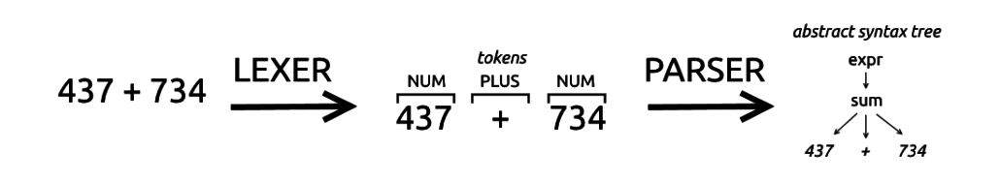

:source-highlighter: rouge
:rouge-style: thankful_eyes

= Hoofdstuk 2: Van Code naar Uitvoering op de CPU

Deze python code print een tekst naar de console:

[source,python]
----
print('Hello world!')
----

Maar toch wordt deze codeopdracht niet rechtstreeks uitgevoerd op de CPU. De CPU werkt immers enkel op machinecode instructies.

Er worden dus enkele tussenliggende stappen uitgevoerd.

== De Rol van de Interpreter

Wanneer je Python-code schrijft, schrijf je in een taal die begrijpelijk is voor mensen, maar niet direct voor computers. Om deze code uit te voeren, wordt een cruciale tussenstap ingezet: de ##Python-interpreter##.

image::images/pythonvirtualmachine.png[]

De Python-interpreter vertaalt de menselijk leesbare Python-code naar een vorm van tussentaal die bekend staat als ##bytecode##. Bytecode is een reeks instructies die specifiek zijn ontworpen om te worden uitgevoerd door de ##Python Virtual Machine (PVM)##. Dit virtuele uitvoeringssysteem fungeert als een brug tussen de abstracte code en de werkelijke uitvoering op de CPU.

image::images/python-virtual-machine.webp[]

Dit is bijvoorbeeld de gegenereerde bytecode van het 'Hello world' programma:

[source]
----
\00\00\00\00\EA\D5\E5d\00\00\00\E3\00\00\00\00\00\00\00\00\00\00\00\00\00\00\00\00\00\00\00@\00\00\00s\00\00\00e\00d\00\83\00dS\00)zHello world!N)\DAprint\A9\00r\00\00\00r\00\00\00\FAR/home/mark/Documents/python/liclipse-workspace/pythontest/pythoncode/helloworld.py\DA<module>\00\00\00s\00\00\00\00\00
----

Voor ons is dit moeilijk leesbaar, maar de Python virtual machine kan dit perfect lezen.

== Van Bytecode naar Machinecode

Machinecode is de laagste niveau van instructies die de CPU direct begrijpt. Echter, voordat de machinecode wordt bereikt, wordt de bytecode verwerkt door de PVM, die het omzet in instructies die kunnen worden uitgevoerd door de fysieke CPU van de computer.

De PVM is in feite een interpreter voor bytecode die ervoor zorgt dat de code wordt uitgevoerd op verschillende platforms (Windows, Linux, MacOSX, ... , maar ook de processor op dit systeem: x86, ARM, x64, RISC,..) zonder dat het nodig is om dezelfde code te herschrijven voor elk platform. Dit maakt Python een platformonafhankelijke taal.

== Linter: Codekwaliteit en Conventies

Voordat de ##code## wordt uitgevoerd, is het van groot belang om ervoor te zorgen dat deze ##correct is en voldoet aan specifieke coderingsstandaarden##. Een linter is een hulpmiddel dat de code ##analyseert op fouten, inconsistenties en afwijkingen van de conventies##.

Laten we dit illustreren met een voorbeeld van een stukje Python-code:

[source,python]
----
# Onjuiste naamgeving van variabelen
Var = 42
prinT(var)
----

Een linter zou hier waarschuwingen genereren voor onjuiste naamgeving van variabelen en een functie die niet correct is gespeld.

== Compilatie en Uitvoering

Python wordt beschouwd als een ##geïnterpreteerde taal##, wat betekent dat de code ##regel voor regel## wordt uitgevoerd door de interpreter. Dit in tegenstelling tot talen zoals C++ of Java, waarbij de code eerst volledig wordt omgezet in machinecode door een **compilatieproces** voordat deze wordt uitgevoerd.

=== Het Interpreterproces van de interpreter

. Tokenizing (lexer): De broncode wordt **opgesplitst in elementaire eenheden**, tokens genaamd. Deze tokens omvatten sleutelwoorden, symbolen, variabelen en getallen.

. Parsing: De tokens worden **geanalyseerd** om de **syntactische structuur** van het programma te begrijpen. Hierbij wordt gecontroleerd of de code voldoet aan de grammaticaregels van Python.

. Vertalen: De geparste code wordt omgezet in **tussentijdse bytecode**. Dit is een binair formaat dat de computer begrijpt en dat sneller kan worden uitgevoerd dan de originele broncode.

. Uitvoering: De bytecode wordt uitgevoerd door de **Python-runtime**. Tijdens deze stap worden variabelen gemaakt, waarden toegewezen, bewerkingen uitgevoerd en resultaten gegenereerd.

Deze 4 stappen zijn een voortdurende lus, die bij iedere regel (dus regel per regel) wordt uitgevoerd.

=== Een voorbeeld

Stel je voor dat je een Python-script hebt dat de beweging van een speler in een game simuleert:

[source,python]
----
initial_position = 0
movement_speed = 5

new_position = initial_position + movement_speed
print("Nieuwe positie van de speler:", new_position)
----

Bij het uitvoeren van dit script zal de interpreter de variabelen initial_position en movement_speed aanmaken en waarden toewijzen. Vervolgens wordt de positie van de speler berekend door movement_speed op te tellen bij initial_position. Het resultaat wordt afgedrukt.

=== Just-In-Time (JIT) Compiler in Python

De Just-In-Time (JIT) compiler is een techniek die wordt gebruikt om de uitvoeringssnelheid van code te verbeteren door delen van de code tijdens de uitvoering te compileren naar machinecode. Hoewel Python een geïnterpreteerde taal is, kan de JIT-compiler de prestaties aanzienlijk verbeteren door bepaalde stukken code te compileren op het moment dat ze worden uitgevoerd.

==== Hoe Werkt de JIT-Compiler?

Normaal gesproken wordt Python-code geïnterpreteerd en vertaald naar tussentijdse bytecode. Bij gebruik van een JIT-compiler worden sommige delen van de code, die vaak worden uitgevoerd, tijdens de uitvoering gecompileerd naar directe machinecode. Dit maakt de uitvoering sneller omdat machinecode direct door de computer kan worden uitgevoerd zonder interpretatie.

==== Voorbeeld

Stel je voor dat je een eenvoudig Python-script hebt voor het simuleren van de beweging van een speler in een game:

[source,python]
----
def simulate_movement(initial_position, movement_speed):
    new_position = initial_position
    for _ in range(1000000):
        new_position += movement_speed
    return new_position

initial_position = 0
movement_speed = 5

final_position = simulate_movement(initial_position, movement_speed)
print("Laatste positie van de speler:", final_position)
----

In dit voorbeeld wordt de functie simulate_movement herhaaldelijk (meerdere keren per seconde) opgeroepen om de beweging van een speler te simuleren. Python kan na een aantal uitvoeringen ervoor kiezen om de simulate_movement-functie te optimaliseren door het om te zetten in efficiënte machinecode (via de JIT compiler).

Dit proces gebeurt automatisch, hier heb je als programmeur geen invloed op.

==== Voordelen in Gaming

In de context van gaming kan de JIT-compiler de prestaties van Python-code verbeteren, vooral voor onderdelen van het spel die veelvuldig worden gebruikt, zoals fysica-simulaties, beeldverwerking of AI-berekeningen. Dit kan leiden tot soepelere en responsievere spelervaringen.

Hoewel JIT-compilatie Python niet zo snel maakt als strikt gecompileerde talen, kan het aanzienlijke prestatieverbeteringen bieden.

=== Voordelen en Nadelen

Python's interpretatieproces biedt voordelen zoals **directe feedback** en gemakkelijke debugging. Echter, omdat elke regel code wordt geïnterpreteerd wanneer deze wordt uitgevoerd, kan Python trager zijn dan gecompileerde talen voor intensieve berekeningen in games.

Ondanks enige **snelheidsbeperkingen** blijft Python een veelgebruikte taal in de game-ontwikkeling vanwege zijn flexibiliteit, eenvoudige syntax en uitgebreide bibliotheken.

== Samenvatting

Het pad van Python-code naar uitvoering op de CPU omvat diverse tussenstappen, van interpretatie en bytecode tot JIT-compilatie en uiteindelijk machinecode.

