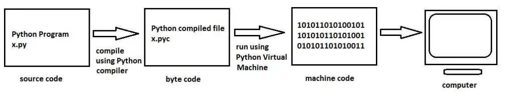

:source-highlighter: rouge
:rouge-style: thankful_eyes

= Van Code naar Uitvoering op de CPU

Deze python code print een tekst naar de console:

[source,python]
----
print('Hello world!')
----

Maar toch wordt deze codeopdracht niet rechtstreeks uitgevoerd op de CPU. De CPU werkt immers enkel op machinecode instructies.

Er worden dus enkele tussenliggende stappen uitgevoerd.

== De Rol van de Interpreter

Wanneer je Python-code schrijft, schrijf je in een taal die begrijpelijk is voor mensen, maar niet direct voor computers. Om deze code uit te voeren, wordt een cruciale tussenstap ingezet: de ##Python-interpreter##.

image::images/pythonvirtualmachine.png[]

De Python-interpreter vertaalt de menselijk leesbare Python-code naar een vorm van tussentaal die bekend staat als ##bytecode##. Bytecode is een reeks instructies die specifiek zijn ontworpen om te worden uitgevoerd door de ##Python Virtual Machine (PVM)##. Dit virtuele uitvoeringssysteem fungeert als een brug tussen de abstracte code en de werkelijke uitvoering op de CPU.

Dit is bijvoorbeeld de gegenereerde bytecode van het 'Hello world' programma:

[source]
----
\00\00\00\00\EA\D5\E5d\00\00\00\E3\00\00\00\00\00\00\00\00\00\00\00\00\00\00\00\00\00\00\00@\00\00\00s\00\00\00e\00d\00\83\00dS\00)zHello world!N)\DAprint\A9\00r\00\00\00r\00\00\00\FAR/home/mark/Documents/python/liclipse-workspace/pythontest/pythoncode/helloworld.py\DA<module>\00\00\00s\00\00\00\00\00
----

Voor ons is dit moeilijk leesbaar, maar de Python virtual machine kan dit perfect lezen.

== Van Bytecode naar Machinecode

Machinecode is de laagste niveau van instructies die de CPU direct begrijpt. Echter, voordat de machinecode wordt bereikt, wordt de bytecode verwerkt door de PVM, die het omzet in instructies die kunnen worden uitgevoerd door de fysieke CPU van de computer.

De PVM is in feite een interpreter voor bytecode die ervoor zorgt dat de code wordt uitgevoerd op verschillende platforms (Windows, Linux, MacOSX, ... , maar ook de processor op dit systeem: x86, ARM, x64, RISC,..) zonder dat het nodig is om dezelfde code te herschrijven voor elk platform. Dit maakt Python een platformonafhankelijke taal.

== Linter: Codekwaliteit en Conventies

Voordat de ##code## wordt uitgevoerd, is het van groot belang om ervoor te zorgen dat deze ##correct is en voldoet aan specifieke coderingsstandaarden##. Een linter is een hulpmiddel dat de code ##analyseert op fouten, inconsistenties en afwijkingen van de conventies##.

Laten we dit illustreren met een voorbeeld van een stukje Python-code:

[source,python]
----
# Onjuiste naamgeving van variabelen
Var = 42
prinT(var)
----

Een linter zou hier waarschuwingen genereren voor onjuiste naamgeving van variabelen en een functie die niet correct is gespeld.

== Compilatie en Uitvoering

Python wordt beschouwd als een geïnterpreteerde taal, wat betekent dat de code ##regel voor regel## wordt uitgevoerd door de interpreter. Dit in tegenstelling tot talen zoals C++ of Java, waarbij de code eerst volledig wordt omgezet in machinecode door een compilatieproces voordat deze wordt uitgevoerd.

Echter, Python maakt gebruik van compilatie op verschillende niveaus. Nadat de bytecode is gegenereerd door de interpreter, kan de PVM ervoor kiezen om deze bytecode te compileren naar machinecode op het niveau van de hostcomputer. Deze vorm van compilatie staat bekend als Just-In-Time (JIT) compilatie en draagt bij aan de snelheid van uitvoering van Python-programma's.

== Samenvatting

Het pad van Python-code naar uitvoering op de CPU omvat diverse tussenstappen, van interpretatie en bytecode tot JIT-compilatie en uiteindelijk machinecode.

