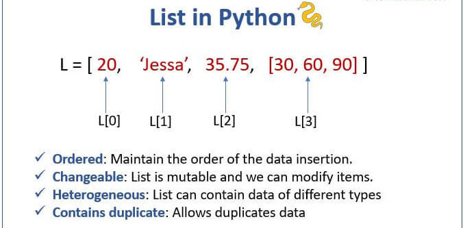

:source-highlighter: rouge
:rouge-style: thankful_eyes

= Hoofdstuk 3: Gebruik van Variabelen

== Variabelen in Python

Variabelen vormen een kernconcept in programmeren, waardoor softwareontwikkelaars waarden kunnen opslaan en manipuleren voor gebruik in hun programma's. In Python zijn variabelen ##containers voor het opslaan van gegevens## zoals getallen, tekst, lijsten, en meer.

=== Variabelen Toewijzen

Variabelen in Python worden gemaakt door een naam toe te wijzen aan een waarde. Hier is een voorbeeld waarin we de __health__ van een speler in een game bijhouden:

[source,python]
----
# Player health in Counter-Strike
player_health = 100
print("Huidige gezondheid:", player_health)
----

In dit voorbeeld wordt de variabele player_health aangemaakt en toegewezen met de waarde 100. We kunnen de naam van de variabele gebruiken om later de opgeslagen waarde te manipuleren.

=== Naamgeving van Variabelen

In Python is het benoemen van variabelen van groot belang om duidelijke en begrijpelijke code te schrijven. Door een consistente en zinvolle naamgeving te hanteren, maak je niet alleen je code leesbaarder, maar vergemakkelijk je ook het onderhoud en de samenwerking aan projecten. Hier zijn enkele belangrijke regels en tips voor het benoemen van variabelen in Python:

=== Regels voor Naamgeving van Variabelen in Python

* Geldigheid: Variabelen moeten met een letter (a-z, A-Z) of een underscore (_) beginnen. Ze kunnen ook cijfers (0-9) bevatten, maar niet als eerste teken. Bijvoorbeeld: player_score, _health, level1.

* Hoofdlettergevoeligheid: Python is hoofdlettergevoelig, wat betekent dat variabelen met verschillende hoofdletters als verschillende namen worden beschouwd. score en Score zouden bijvoorbeeld twee verschillende variabelen zijn.

* Spaties en Speciale Tekens: Spaties en speciale tekens zoals @, $, en % zijn niet toegestaan in variabelennamen.

* Spaties Vermijden: In plaats van spaties worden underscores vaak gebruikt om woorden in variabelennamen te scheiden, wat de leesbaarheid verbetert. Bijvoorbeeld: player_name, health_points.

* Betekenisvolle Namen: Geef je variabelen namen die hun functie of betekenis in de context aangeven. Een naam als player_health is duidelijker dan een generieke naam zoals x.

== Datatypen en Variabelen

In Python zijn variabelen **niet expliciet getypeerd**, wat betekent dat je geen datatype hoeft op te geven wanneer je een variabele declareert. Python bepaalt automatisch het datatype op basis van de waarde die aan de variabele wordt toegewezen.

Dit maakt van Python een dynamisch getypeerde taal.

Variabelen in Python worden toegewezen met behulp van de toewijzingsoperator (`=`). De operator wijst een waarde toe aan een variabele.

Bijvoorbeeld, om een integer (geheel getal) op te slaan in een variabele genaamd `bullet_damage`, hoef je alleen maar deze toewijzing uit te voeren:

[source,python]
----
bullet_damage = 16
----

In dit geval heeft Python automatisch het datatype van `bullet_damage` ingesteld op een integer met waarde 16.

In bijvoorbeeld Java, moet je het gegevenstype wel expliciet meegegeven:

[source,java]
----
int bullet_damage = 16
----

=== Waarden Bijwerken

Variabelen kunnen op elk moment worden bijgewerkt door er simpelweg een nieuwe waarde aan toe te wijzen. Bijvoorbeeld, als de speler schade oploopt:

[source,python]
----
# Schade oplopen
damage_taken = 25
player_health -= damage_taken
print("Nieuwe gezondheid na geraakt te zijn:", player_health)
----

Hier wordt de variabele damage_taken gemaakt en toegewezen met de waarde 25. Vervolgens verminderen we de gezondheid van de speler door damage_taken van player_health af te trekken.

=== Variabelen en Scope

Variabelen hebben een bepaalde ##"scope" of bereik, wat aangeeft waar de variabele beschikbaar en geldig is##. In Python kunnen variabelen lokaal (binnen een specifieke functie) of globaal (door het hele programma) zijn.

Laten we een voorbeeld bekijken om het concept van scope te illustreren:

[source,python]
----
globale_variabele = 10

# definitie van een functie
def functie():
    lokale_variabele = 5
    print("Lokale variabele, binnen functie:", lokale_variabele)
    print("Globale variabele, binnen functie:", globale_variabele)

# nu voeren we de functie uit
functie()

# En we voeren enkele print statements uit
print("Globale variabele, buiten functie:", globale_variabele)
print("Lokale variabele, buiten functie:", lokale_variabele)
----

Uitvoer:

[source,python]
----
Lokale variabele, binnen functie: 5 <1>
Globale variabele, binnen functie: 10 <2>
Globale variabele, buiten functie: 10 <3>
Traceback (most recent call last): <4>
  File "test.py", line 14, in <module>
    print("Lokale variabele, buiten functie:", lokale_variabele)
NameError: name 'lokale_variabele' is not defined. Did you mean: 'globale_variabele'? <5>
----
<1> De python interpreter zit in de functie, lokale variabele gevonden.
<2> De python interpreter zit in de functie, globale variabele gevonden.
<3> De python interpreter zit buiten de functie, globale variabele gevonden.
<4> De python interpreter zit buiten de functie, lokale variabele NIET gevonden.
<5> Python probeert zelfs een juiste oplossing voor te stellen. Het blijft aan de ontwikkelaar om iets met deze suggestie te doen.

Hier zien we dat de variabele `lokale_variabele` alleen beschikbaar is binnen de functie waarin deze is gedefinieerd. De variabele `globale_variabele` kan zowel binnen als buiten de functie worden gebruikt, omdat deze een globale scope heeft.

== Variabelen en Gegevenstypen

Python heeft verschillende ingebouwde gegevenstypes die je kunt gebruiken om variabelen van verschillende soorten gegevens op te slaan. Enkele van de veelgebruikte datatypen zijn:

- **int:** Gehele getallen, zoals 5, -10, 100.
- **float:** Komma-getallen, zoals 3.14, -0.5, 2.0.
- **str:** Tekst, zoals "Hallo, wereld!", 'Python'.
- **bool:** Booleaanse waarden, True of False.

Bijvoorbeeld:

[source,python]
----
a = 5          # int
b = 3.14       # float
naam = "Alice" # str
waar = True    # bool
----

.De standaard Python gegevenstypen
image::images/python-data-types.jpg[]

Gegevenstypes bepalen hoe de computer gegevens opslaat, bewerkt en weergeeft. In een gamingcontext kunnen gegevenstypes worden gebruikt om informatie zoals spelergezondheid, scores, positie en meer vast te leggen. 

Laten we de belangrijkste gegevenstypes eens overlopen:

=== Integer (int)

Het gegevenstype `int` staat voor gehele getallen, zoals 5, -10 en 100. Integer-waarden worden gebruikt voor wiskundige bewerkingen en numerieke berekeningen. Python staat toe om positieve en negatieve gehele getallen te gebruiken, evenals getallen met en zonder decimale punten.

Bijvoorbeeld:

[source,python]
----
leeftijd = 16
temperatuur = -5
aantal_studenten = 30
----

=== Float (Komma-getal)

Het gegevenstype `float` vertegenwoordigt komma-getallen, ook wel bekend als zwevendekomma-getallen. Dit omvat getallen met decimale punten, zoals 3.14, -0.5 en 2.0. Float-waarden worden gebruikt voor nauwkeurige berekeningen met reële getallen.

Bijvoorbeeld:

[source,python]
----
pi = 3.14159
geldbedrag = 123.45
hoogte = -10.5
----

=== String (str)

Het gegevenstype `str` staat voor tekstuele gegevens, zoals woorden, zinnen of karakters. Tekst in Python wordt omringd door enkele aanhalingstekens (`'`) of dubbele aanhalingstekens (`"`).

Bijvoorbeeld:

[source,python]
----
naam = "Alice"
bericht = 'Hallo, wereld!'
label = "Productcode: 12345"
----

Strings kunnen worden gecombineerd (geconcateneerd) met behulp van de `+` operator:

[source,python]
----
voornaam = "John"
achternaam = "Doe"
volledige_naam = voornaam + " " + achternaam
print(volledige_naam) # Output: John Doe
----

=== Boolean (bool)

Het gegevenstype `bool` vertegenwoordigt booleaanse waarden, namelijk `True` (waar) of `False` (onwaar). Booleaanse waarden worden veel gebruikt in logische bewerkingen en beslissingsstructuren, zoals `if`-voorwaarden.

Bijvoorbeeld:

[source,python]
----
is_student = True
heeft_toegang = False
is_regenachtig = True
----

Booleaanse waarden zijn ook het resultaat van vergelijkingsoperatoren, zoals `==` (gelijk aan), `!=` (niet gelijk aan), `<` (kleiner dan), `>` (groter dan), etc.

Stel je voor dat we een script hebben dat controleert of een speler voldoende gezondheid heeft om een bepaalde taak uit te voeren:

[source,python]
----
player_health = 75
minimum_health_required = 50

is_healthy_enough = player_health > minimum_health_required
print("Is de speler gezond genoeg?", is_healthy_enough)
----

In dit voorbeeld vergelijken we de gezondheid van de speler (player_health) met de vereiste minimale gezondheid (minimum_health_required). Als de gezondheid van de speler groter is dan het minimum, zal is_healthy_enough de waarde True krijgen. Anders zal het de waarde False krijgen.

Booleaanse waarden zijn krachtige hulpmiddelen in games omdat ze de besluitvorming en logica binnen je code mogelijk maken. Je kunt ze gebruiken om te bepalen of een speler een bepaald level heeft bereikt, of een missie is voltooid, of dat bepaalde acties kunnen worden uitgevoerd op basis van bepaalde voorwaarden.

== Lijst Gegevenstype

list: Een geordende verzameling van waarden, zoals de inventaris van een speler.

[source,python]
----
inventory = ["sword", "shield", "potion"]
----

== Tuple Gegevenstype

tuple: Een onveranderlijke verzameling van waarden, zoals de positie van een speler.

[source,python]
----
player_position = (10, 5)
----

== Dictionary Gegevenstype

dict: Een verzameling van sleutel-waardeparen, zoals attributen van een speler.

[source,python]
----
player_attributes = {"name": "John", "health": 100, "armor": "plate"}
----

=== Type Conversie

Soms is het nodig om gegevens van het ene type naar het andere te converteren. Python biedt functies om dit te doen. Bijvoorbeeld, om een getal om te zetten naar een string, kun je de functie `str()` gebruiken:

[source,python]
----
leeftijd = 16
leeftijd_als_string = str(leeftijd)
----

=== Dynamische Typing

Python staat ook bekend om 'dynamic typed' te zijn, wat betekent dat ##het datatype van een variabele kan veranderen terwijl het programma wordt uitgevoerd##. Dit in tegenstelling tot sterk getypeerde talen waar het datatype strikt moet worden gedefinieerd en behouden.

Bijvoorbeeld:

[source,python]
----
a = 5
a = "Hallo"
a = True
----

Dit houdt een groot risico voor __bugs__ in.

=== Variabelen vs Expressies

**Een expressie** is een combinatie van waarden, operatoren en/of functies die een resultaat oplevert wanneer deze wordt geëvalueerd. Expressies kunnen variëren van eenvoudige wiskundige bewerkingen tot complexere berekeningen. Ze kunnen ook variabelen bevatten.

[source,python]
----
damage = 25
health = 100
remaining_health = health - damage
----

In dit voorbeeld is health - damage een expressie die wordt geëvalueerd tot het resterende gezondheidsniveau van een speler na het oplopen van schade.

**Een variabele** is een naam die wordt gebruikt om een geheugenlocatie aan te duiden waarin gegevens kunnen worden opgeslagen. Variabelen worden gebruikt om waarden op te slaan en te bewaren, zodat ze later kunnen worden gebruikt in berekeningen, operaties en expressies.

[source,python]
----
player_health = 100
player_name = "Alice"
----

Hier worden player_health en player_name als variabelen gebruikt om respectievelijk de gezondheid van een speler en de naam van een speler op te slaan.

Het onderscheid tussen expressies en variabelen is dat ##expressies berekeningen uitvoeren en resultaten opleveren##, terwijl ##variabelen dienen als namen voor opgeslagen gegevens##. Variabelen kunnen in expressies worden gebruikt om bewerkingen uit te voeren en nieuwe waarden te genereren.

== Conclusie

De verscheidenheid aan gegevenstypes in Python, waaronder integer, float, string en boolean, biedt ontwikkelaars flexibiliteit bij het manipuleren van verschillende soorten gegevens. Het begrijpen van deze gegevenstypes en hun toepassingen is essentieel voor het schrijven van effectieve en veelzijdige Python-programma's.

