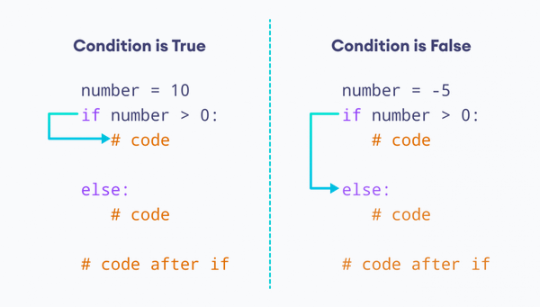
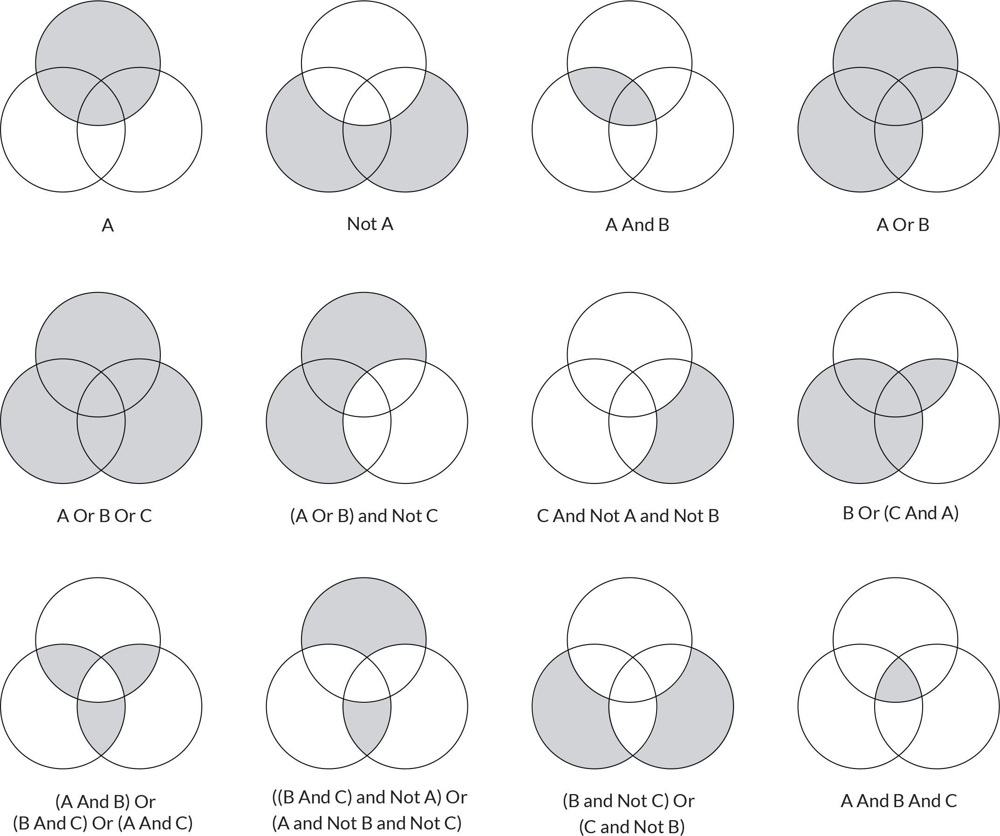

:source-highlighter: rouge
:rouge-style: thankful_eyes
:toc: left
:toclevels: 5
//:stylesheet: dark.css

= Hoofdstuk 4: Beslissingsstructuren

Beslissingsstructuren stellen ons in staat om de logica van ons programma of spel aan te passen op basis van voorwaarden en situaties.

== Het Belang van Beslissingsstructuren

Beslissingsstructuren zijn van cruciaal belang in het creëren van interactieve games. Ze stellen ons in staat om verschillende paden in het spel te volgen op basis van specifieke voorwaarden. Hierdoor kunnen we scenario's creëren waarin de uitkomst afhangt van de beslissingen van de speler.

**Keuzes in een Tekstavontuur:**

Stel je voor dat je een tekstgebaseerde RPG ontwikkelt waarin spelers een verlaten kasteel verkennen. Beslissingsstructuren kunnen worden gebruikt om verschillende resultaten te genereren op basis van keuzes:

[source,python]
----
print("Je staat voor een deur. Wat wil je doen?")
choice = "1"  # Stel dat de speler "1" invoert

if choice == "1":
    print("Je opent de deur en vindt een oude sleutel.")
else:
    print("Je doorzoekt de kamer verder maar vindt niets van belang.")
----

== If-Else Beslissingsstructuur

Python biedt de `if-else`-structuur om beslissingen te nemen op basis van één enkele voorwaarde. Als de voorwaarde waar is, wordt de code binnen het `if`-blok uitgevoerd. Anders wordt de code binnen het `else`-blok uitgevoerd.

**Beslissen of een Vijand Verslagen is:**

Laten we een gevechtsscenario overwegen waarin de speler een vijand moet verslaan. Met een `if-else`-structuur kunnen we bepalen of de vijand verslagen is:

[source,python]
----
enemy_health = 30
player_damage = 25

if player_damage >= enemy_health:
    print("Je hebt de vijand verslagen!")
else:
    print("De vijand heeft nog", enemy_health - player_damage, "gezondheid over.")
----

== If-Elif-Else Structuur

In complexere situaties waarin meerdere voorwaarden moeten worden geëvalueerd, biedt de `if-elif-else`-structuur uitkomst. Deze structuur stelt ons in staat om verschillende mogelijke uitkomsten te behandelen.

image::images/python-elif.png[]

**Beslissen over Spelerattributen:**

Laten we een situatie aannemen waarin we de prestaties van een speler evalueren op basis van hun attributen:

[source,python]
----
player_health = 75
player_strength = 8
player_agility = 6

if player_health > 70:
    print("Je bent in goede conditie.")
elif player_health > 40:
    print("Je hebt wat herstel nodig.")
else:
    print("Je gezondheid is laag. Voorzichtig blijven!")
----

== Geneste Beslissingsstructuren

Beslissingsstructuren kunnen ook genest zijn, wat betekent dat je een beslissing neemt binnen een ander beslissingsblok. Dit is nuttig om complexere logica te implementeren.

**Keuzes in een Mysterieus Bos:**

Stel je een game voor waarin spelers een mysterieus bos verkennen. Binnen dit bos kunnen ze verschillende paden kiezen, elk met hun eigen consequenties:

[source,python]
----
print("Je staat in een bos en ziet een splitsing.")
choice = "links"  # Stel dat de speler "links" invoert

if choice == "links":
    print("Je volgt het pad en vindt een verborgen schat!")
else:
    print("Je gaat een andere richting op en hoort vreemde geluiden.")
    second_choice = "doorgaan"  # Stel dat de speler "doorgaan" invoert
    if second_choice == "doorgaan":
        print("Je ontdekt een verlaten huis.")
    else:
        print("Je besluit om snel terug te keren en het enge gebied te verlaten.")
----

= Het Belang van Indentatie in Python

Indentatie is een fundamenteel concept in Python-programmering en speelt een cruciale rol in het structureren van je code. In tegenstelling tot veel andere programmeertalen, waar accolades of sleutelwoorden worden gebruikt om codeblokken te definiëren, gebruikt Python indentatie om de structuur van het programma aan te geven. Dit kan van invloed zijn op leesbaarheid, logica en werking van je code.

== Duidelijkheid en Leesbaarheid

Indentatie helpt om de structuur van je code visueel te benadrukken. Het geeft aan welke regels bij elkaar horen en vormt de basis van codeblokken. Een consistent gebruik van indentatie maakt het voor zowel jou als andere ontwikkelaars gemakkelijker om te begrijpen hoe de code is gestructureerd en welke delen met elkaar zijn verbonden.

**Duidelijke Identatie:**

[source,python]
----
if score > 100:
    print("Geweldig werk!")
    player_level += 1
    print("Je bent nu level", player_level)
----

**Onjuiste Identatie:**

[source,python]
----
if score > 100:
    print("Geweldig werk!")
print("Je bent nu level", player_level)
----

In het eerste voorbeeld wordt de tweede en derde regel uitgevoerd als de voorwaarde waar is. In het tweede voorbeeld wordt de derde regel altijd uitgevoerd, ongeacht de voorwaarde.

== Logische Structurering

De juiste indentatie zorgt ervoor dat je code correct wordt uitgevoerd volgens de gewenste logica. Indentatie scheidt codeblokken, zoals loops, functies en conditionele statements, van elkaar. Het stelt Python in staat om de scope van variabelen en de uitvoering van instructies op de juiste manier te interpreteren.

**Loop met Correcte Identatie:**

[source,python]
----
for i in range(5):
    print(i)
    print("Dit is een iteratie van de loop.")
print("De loop is voltooid.")
----

**Loop met Onjuiste Identatie:**

[source,python]
----
for i in range(5):
    print(i)
print("Dit is een iteratie van de loop.")
print("De loop is voltooid.")
----

In het eerste voorbeeld worden de eerste twee regels binnen elke iteratie van de loop uitgevoerd. In het tweede voorbeeld worden deze regels na de voltooiing van de loop uitgevoerd, wat resulteert in een ander gedrag.

== Foutpreventie

Foutieve indentatie kan leiden tot syntaxisfouten en logische fouten in je code. Python zal een foutmelding genereren als de indentatie niet correct is. Dit helpt je om snel fouten op te sporen en te corrigeren.

**Indentatiefout:**

[source,python]
----
if health > 0:
print("Je leeft nog!")
----

Python zal hier een foutmelding genereren omdat de code na de `if`-verklaring niet correct is ingesprongen.

== Indentatie Samenvatting

Indentatie is niet alleen een esthetisch aspect van Python-programmering, maar ook een fundamenteel onderdeel van hoe de taal werkt. Het zorgt voor leesbare, logische en foutvrije code. Door consequent de juiste indentatieregels te volgen, structureer je je code op een manier die gemakkelijk te begrijpen en te onderhouden is. Een goede indentatiepraktijk bevordert niet alleen jouw codebase, maar ook samenwerking met andere ontwikkelaars en het creëren van betrouwbare software.

= Boolean Logica en Combinaties

Boolean logica stelt ons in staat om complexe situaties in programma's of games te modelleren, waarbij we meerdere voorwaarden combineren om beslissingen te nemen en interacties te bepalen. De 'and' en 'or' operatoren spelen hierbij een cruciale rol.

== 'and' Operator: Samenvoegen van Voorwaarden

De 'and' operator combineert twee of meer voorwaarden en retourneert 'True' ##als alle voorwaarden 'True' zijn##.

Voorbeeld - Speler Gezondheid en Wapen Beschikbaarheid:

[source,python]
----
player_health = 70
weapon_available = True

if player_health > 50 and weapon_available:
    print("Je hebt genoeg gezondheid en een wapen om de strijd aan te gaan!")
----

In dit voorbeeld wordt de 'and' operator gebruikt om te controleren of de speler genoeg gezondheid heeft **en** of er een wapen beschikbaar is om de strijd aan te gaan.

== 'or' Operator: Alternatieve Voorwaarden

De 'or' operator combineert twee of meer voorwaarden en retourneert 'True' als ##minstens één van de voorwaarden waar is##.

Voorbeeld - Toegang tot Geheime Deur:

[source,python]
----
has_key = False
has_unlock_code = True

if has_key or has_unlock_code:
    print("Je hebt toegang tot de geheime deur!")
----

Hier wordt de 'or' operator gebruikt om te controleren of de speler geen gezondheid meer heeft of geen levens meer over heeft.

== Combinatie van 'and' en 'or': Complexe Voorwaarden

We kunnen 'and' en 'or' operatoren combineren om complexere voorwaarden te maken.

Voorbeeld - Overleven in een Gevaarlijke Zone:

[source,python]
----
player_health = 40
ammo_available = True
player_armor = 20

if (player_health > 30 or player_armor > 0) and ammo_available:
    print("Je kunt veilig navigeren in de gevaarlijke zone!")
----

Hier wordt een complexe voorwaarde gecontroleerd. De 'or' operator controleert of de speler genoeg gezondheid heeft of een bepaald niveau van bepantsering heeft. De 'and' operator combineert deze voorwaarde met de beschikbaarheid van munitie. Alleen als aan beide voorwaarden is voldaan, zal de speler veilig kunnen navigeren in de gevaarlijke zone.

== De 'not' Operator: Negatie van Voorwaarden

In Python (en andere programmeertalen) hebben we de 'not' operator, die wordt gebruikt om de negatie van een voorwaarde uit te voeren. Dit betekent dat als een voorwaarde True is, 'not' ervoor zal zorgen dat deze wordt geëvalueerd als False, en als een voorwaarde False is, zal 'not' ervoor zorgen dat deze wordt geëvalueerd als True.

Voorbeeld - Schuilplaats Status:

[source,python]
----
player_hiding = False

if not player_hiding:
    print("De speler is niet aan het schuilen.")
----

In dit voorbeeld wordt de 'not' operator gebruikt om de status van de speler te controleren. Als de speler niet aan het schuilen is (wat waar is), zal de code binnen de 'if' verklaring worden uitgevoerd.

Voorbeeld - Toegang tot Geblokkeerd Gebied:

[source,python]
----
has_key = False

if not has_key:
    print("Je hebt geen sleutel, je kunt het geblokkeerde gebied niet betreden.")
----

Hier wordt de 'not' operator gebruikt om te controleren of de speler geen sleutel heeft. Als de speler geen sleutel heeft (wat waar is), wordt de melding weergegeven dat ze het geblokkeerde gebied niet kunnen betreden.

== Gebruik in Samenwerking met 'and' en 'or'

De 'not' operator kan worden gecombineerd met de 'and' en 'or' operatoren om complexere voorwaarden te creëren.

Voorbeeld - Dubbele Ontgrendeling:

[source,python]
----
has_key = True
door_unlocked = False

if has_key and not door_unlocked:
    print("Je kunt de deur ontgrendelen met je sleutel.")
----

In dit voorbeeld wordt de 'not' operator gebruikt in samenwerking met de 'and' operator. De 'and' operator controleert of de speler zowel een sleutel heeft als de deur niet ontgrendeld is. Als aan beide voorwaarden is voldaan (speler heeft een sleutel en de deur is niet ontgrendeld), wordt de melding weergegeven om de deur te ontgrendelen.

== Het Gebruik van Haakjes

Bij het combineren van 'and' en 'or' operatoren is het vaak handig om haakjes te gebruiken om de volgorde van evaluatie te bepalen.

Voorbeeld - Prioriteit van Haakjes:

[source,python]
----
shield_available = False
sword_available = True

if (shield_available or sword_available) and not (shield_available and sword_available):
    print("Je hebt ofwel een schild, ofwel een zwaard, maar niet beide.")
----

In dit voorbeeld worden haakjes gebruikt om duidelijk te maken dat de 'not' operator wordt toegepast op de combinatie van het hebben van zowel een schild als een zwaard.

== Samenvatting

Het gebruik van 'and' en 'or' operatoren in games stelt ontwikkelaars in staat om complexe voorwaarden te controleren. Dit kan variëren van het bepalen van interacties tussen personages tot het regelen van toegang tot verschillende delen van een spelwereld.

