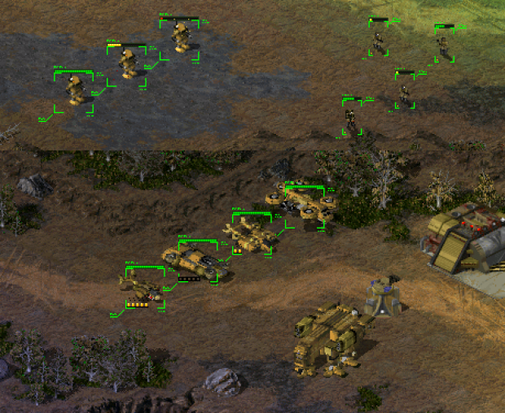

:lib: pass:quotes[_library_]
:libs: pass:quotes[_libraries_]
:fs: functies
:f: functie
:m: method
:icons: font
:source-highlighter: rouge

= Klassen
//Author Mark Nuyts
//v0.1
:toc: left
:toclevels: 4

Een *klasse* in een object georiënteerde taal is een concept dat een blauwdruk vormt.
Van deze blauwdruk kunnen verschillende *instanties* aangemaakt worden.
Een klasse bestaat uit:

* variabelen
* methods (functies die in een klasse geschreven zijn)

== Voorbeeld van een klasse

Een klasse kan elk concept voorstellen, bijvoorbeeld een auto, een gebouw, een cirkel,..
In computerspellen wordt veel gebruik gemaakt van klassen.

.Klassen en instanties in Age of Empires 2
image::images/ages.png[Game characters]

In de afbeelding hierboven (uit het computerspel __Age of Empires__) kunnen we verschillende klassen aan het werk zien:

* Een ruiter (deze komt meerdere keren voor -> meerdere instanties)
* Een kameel (ook deze komt meerdere keren voor -> meerdere instanties)
* Een kasteel (komt 1x voor -> slechts 1 instantie)

Een ruiter is als **klasse** in dit computerspel slechts **eenmaal gedefiniëerd**.
Toch zien we meerdere ruiters.
Dit komt omdat er van deze ruiter klasse **meerdere instanties** werden aangemaakt.

== De _code_ om een klasse te definiëren

De ruiter klasse uit bovenstaande _screenshot_ zou als volgt geprogrameerd kunnen zijn:

[source,python]
----
class Ruiter: <1>
    def __init__(self): <2>
        self.totalhitpoints = 200
        self.health = 200
        self.speed = 4
        self.armour = 20
        self.positionX = 485
        self.positionY = 312

    def hit(self): <3>
        self.health -= 10 <4>
----

<1> We definiëren een Python-klasse genaamd `Ruiter`. De definitie van de klasse.
<2> Binnen de klasse `Ruiter` definiëren we enkele attributen zoals `totalhitpoints`, `health`, `speed`, `armour`, `positionX`, en `positionY`.
<3> We definiëren een methode genaamd `hit()`, die de gezondheid (`health`) van de ruiter verlaagt wanneer deze wordt aangeroepen.
<4> De code in de functie werkt op de variabelen uit de klasse.

[IMPORTANT]
====
##Een klasse begint steeds met een hoofdletter##.
====

== Instanties

Een klasse kan je beschouwen als een blauwdruk (een ontwerp of plan) van iets, bijvoorbeeld van een auto.

Dit ontwerp beschrijft hoe een auto eruit moet zien, wat het concept is:

* De afmetingen
* De buiging van de carosserie
* Het aantal zetels
* De maat van de velgen
* Paardenkracht van de motor
* ..

Maar het is (nog) geen auto die je kan gebruiken.
Om het te gaan gebruiken zal je een instantie moeten maken (een echte auto van de fabrieksband laten rollen).

.In de fabriek worden instanties van Teslas aangemaakt.
image::images/teslas.webp[Tesla fabriek]

Het aanmaken van instanties in Python gebeurt door de naam van de klasse te geven, gevolgd door de ronde haken:

[source,python]
----
ruiter1 = Ruiter(); <1>
----

<1> Merk op dat de klasse met een hoofdletter wordt geschreven en de instantie met een kleine letter.

Het is mogelijk meerdere instanties aan te maken van dezelfde klasse:

[source,python]
----
ruiter2 = Ruiter();
ruiter3 = Ruiter();
ruiter4 = Ruiter();
ruiter5 = Ruiter();
----

**Zo lang het werkgeheugen (RAM) niet vol is, kan je instanties blijven aanmaken.**

=== Variabelen en geheugengebruik

Iedere instantie van een klasse neemt een deel van het geheugen in.
##Voor iedere instantie worden immers de waarden van de verschillende variabelen apart bijgehouden.##

Als de hitpoints van 1 ruiter verminderen doordat hij aangevallen werd, geldt dit enkel voor deze ruiter.
De hitpoints van de andere ruiters behouden hun eigen waarden.

.Geselecteerde _units_ en hun _health bar_ in Age of Empires.
image::images/health2.jpg[Game health]

Al deze informatie moet (voor iedere instantie) in het werkgeheugen bijgehouden worden.

=== Variabelen

Om de variabele van instanties aan te passen kunnen we via de _dot notatie_ (punt notatie) aan de variabelen van een instantie:

[source,python]
----
print(ruiter1.health)  # Geeft de gezondheid van 'ruiter1' weer (200)
print(ruiter2.positionX)  # Geeft de X-positie van 'ruiter2' weer (485)

ruiter2.hit()  # Roept de 'hit' methode aan voor 'ruiter2', verlaagt de gezondheid met 10
print(ruiter2.health)  # Geeft de bijgewerkte gezondheid van 'ruiter2' weer (190)
----

Initieel hebben deze variabelen een standaardwaarde. Deze werd in de klasse bepaald, namelijk 200.

Als we de hit() method (functie in een klasse) uitvoeren op de 3de instantie, zal van deze instantie 10 hitpoints afgetrokken worden:

[source,python]
----
ruiter3.hit() <1>
print(ruiter2.health) <2>
print(ruiter3.health) <3>
----
<1> Het uitvoeren van de hit() method op de 3de instantie (via de _dot notatie_).
<2> Het afprinten van de _health_ van ruiter 2: 200
<3> Het afprinten van de _health_ van ruiter 3. Dit is nu: 190

=== Methods (functies)

In een klasse kunnen methods (of functies) geschreven worden.
Deze methods kunnen aangeroepen worden op de instantie van een klasse.

[source,python]
----
ruiter3.hit()
----

Een dergelijke method kan gedefinieerd worden:

[source,python]
----
def hit(self):
        self.health -= 10
----

Identieke methods kunnen niet voorkomen in een klasse, tenzij de parameters verschillend zijn.
Het volgende is dus niet mogelijk:

[source,python]
----
def hit(self):
        self.health -= 10
        
def hit(self):
        self.health -= 20
----

Dit maakt 2 maal dezelfde method (naam) aan, dit geeft de compiler aan als een fout.
Wat wel kan is andere _parameters_ gebruiken:

[source,python]
----
def hit(self):
        self.health -= 10
        
def hit(self, damage):
        self.health -= damage
----

Hier kan de compiler een duidelijk onderscheid maken tussen de 2 methods.
Bij het aanroepen van de method op een instantie is het immers duidelijk welke van de 2 bedoeld wordt door te kijken naar de parameters:

[source,python]
----
ruiter3.hit(8);
ruiter3.hit();
----

De eerste zal de hit() method oproepen die parameters bevat.

=== Lists en Tuples

Instanties van klassen kunnen in een list (of Tuple of dictionary) worden geplaatst, net zoals andere datatypes.
De gehele getallen 4, 5, 6, 7, .. zijn immers ook maar instanties van een integer datatype.
Ruiter1, ruiter2, .. zijn instanties van het Ruiter datatype.

Om een list aan te maken van Ruiters:

[source,python]
----
# Maak een lijst van Ruiter-instanties
ruiters = []

# Voeg instanties toe aan de lijst
ruiters.append(Ruiter())  # Voeg een nieuwe Ruiter-instantie toe
ruiters.append(Ruiter())  # Voeg nog een Ruiter-instantie toe

# Je kunt zoveel instanties toevoegen als je nodig hebt
ruiters.append(Ruiter())  # Voeg nog een Ruiter-instantie toe

# Toegang tot individuele ruiters in de lijst
eerste_ruiter = ruiters[0]
tweede_ruiter = ruiters[1]

# Roep methoden aan voor individuele ruiters
eerste_ruiter.hit(10)  # Pas schade toe op de eerste ruiter
tweede_ruiter.hit(15)  # Pas schade toe op de tweede ruiter

# Controleer de gezondheid van individuele ruiters
print("Gezondheid van de eerste ruiter:", eerste_ruiter.health)
print("Gezondheid van de tweede ruiter:", tweede_ruiter.health)
----

_Games_ maken veel gebruik van lijsten van instanties.
Hieronder kan je een voorbeeld zien van een selectie van _units_ in een strategiespel.
De speler heeft via de muis zijn leger van _units_ geselecteerd. 
Deze selectie is zichtbaar door de kadertjes die rond de units zijn getrokken.
De groene balk geeft vervolgens de hitpoints aan van de individuele _units_ in de selectie list.

.Geselecteerde _units_ en hun _health bar_ in Tiberian Sun.

Ieder _unit_ in het spel is een instantie van een klasse.
##Voor iedere instantie worden de variabelen apart bijgehouden.##
In het screenshot kan je zien dat enkele _units_ meer schade hebben opgelopen dan anderen.

Voor de bommenwerpers (de vliegtuigen onderaan op het screenshots) kan je zien aan de hand van de gele blokjes, hoeveel bommen ze nog dragen.

In Python code zouden we de array als volgt kunnen voorstellen:

[source,python]
----
class Unit:
    def __init__(self):
        self.health = 0
        self.hitpoints = 0

# Maak een lijst van Unit-objecten met een maximum van 100 eenheden
selected = []

# Bereken het gezondheidspercentage van elke eenheid en druk dit af
for unit in selected:
    if unit.hitpoints != 0:
        health_percentage = (unit.health / unit.hitpoints) * 100
        print(health_percentage)
    else:
        print("Deze eenheid heeft geen hitpoints, dus het gezondheidspercentage kan niet worden berekend.")
----

== Gebruik van bestaande klassen

In de _standard library_ van Python (die wordt meegeinstalleerd bij het installeren van Python) zijn veel bestaande klassen aanwezig.
Deze kan je gebruiken zonder ze zelf vanaf 0 te hoeven schrijven.

Een voorbeeld hiervan is de _math_ klasse.
Deze bevat enkele constanten (onveranderbare variabelen), zoals het getal PI.

[source,python]
----
import math

# Gebruik de math.pi constante om de waarde van pi te verkrijgen
pi_value = math.pi

# Druk de waarde van pi af
print("De waarde van pi is:", pi_value)
----

Ook bevat deze klasse enkele methods zoals het berekenen van het gemiddelde, maximum, minimum,.. Kortom veel zaken die in de wiskunde van pas kunnen komen.

=== Random

Om een willekeurig getal te genereren in Python, kun je de `random`-module gebruiken. Hier is een voorbeeld van hoe je een willekeurig getal kunt maken:

[source,python]
----
import random

# Genereer een willekeurig geheel getal tussen 1 en 10 (inclusief 1 en 10)
random_number = random.randint(1, 10)

# Druk het willekeurige getal af
print("Willekeurig getal tussen 1 en 10:", random_number)
----

1. We importeren eerst de `random`-module, die functionaliteit biedt om willekeurige getallen te genereren.
2. Met `random.randint(a, b)` kunnen we een willekeurig geheel getal genereren tussen `a` (inclusief) en `b` (inclusief). In het bovenstaande voorbeeld genereren we een willekeurig getal tussen 1 en 10 en slaan dit op in de variabele `random_number`.
3. We drukken het willekeurige getal af met `print()`.

Telkens wanneer je dit script uitvoert, wordt een ander willekeurig getal tussen 1 en 10 gegenereerd. Je kunt de bereikwaarden (`1` en `10` in dit voorbeeld) aanpassen aan je specifieke behoeften.

