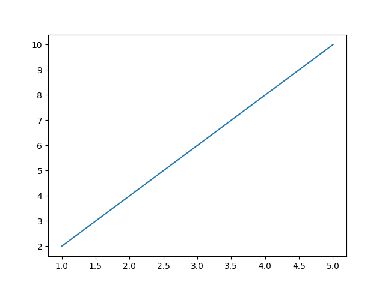
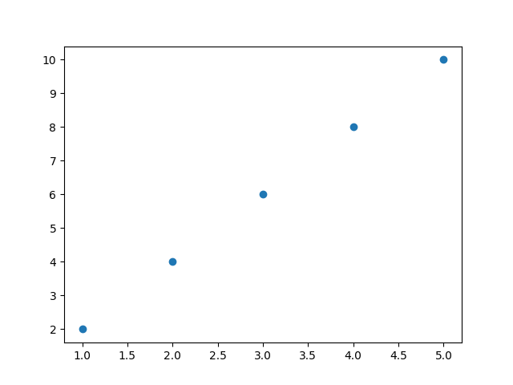
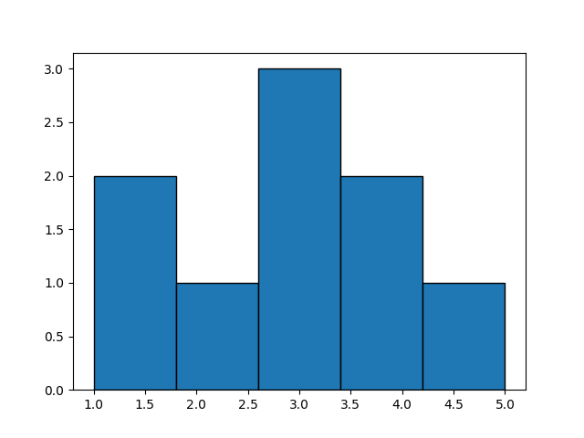
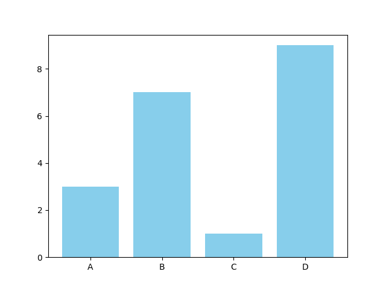

:lib: pass:quotes[_library_]
:libs: pass:quotes[_libraries_]
:fs: functies
:f: functie
:m: method
:icons: font
:source-highlighter: rouge
:rouge-style: thankful_eyes
:toc: left
:toclevels: 5
:sectnums:

= Matplotlib: Grafieken

Matplotlib is een krachtige bibliotheek voor datavisualisatie in Python. 
Het biedt de mogelijkheid om verschillende soorten grafieken en plots te maken. 
In dit hoofdstuk zullen we dieper ingaan op het gebruik van Matplotlib, beginnend met eenvoudige grafieken en geleidelijk aan naar meer complexe visualisaties.

== Inleiding tot Matplotlib

Matplotlib is ontworpen voor het genereren van statische, interactieve en geanimeerde plots in Python. Het is handig voor het weergeven van gegevens en patronen, en het wordt veel gebruikt in wetenschappelijke en technische gebieden.

Om Matplotlib te gebruiken, moet je het eerst installeren:

[source, bash]
----
pip install matplotlib
----

Importeer het vervolgens in je python script:

[source, python]
----
import matplotlib.pyplot as plt
----

Op de https://matplotlib.org/[website van maptplotlib] kan je uitleg en veel voorbeelden vinden.
In de rest van dit hoofdstuk overlopen we enkele voorbeelden.

== Eenvoudige Lijnplot

Laten we beginnen met het maken van een eenvoudige lijnplot:

[source, python]
----
import matplotlib.pyplot as plt

# Gegevens
x = [1, 2, 3, 4, 5]
y = [2, 4, 6, 8, 10]

# Maak een lijnplot
plt.plot(x, y)

# Toon de plot
plt.show()
----

Dit zal een eenvoudige lijnplot genereren met punten verbonden door lijnen.

== Scatterplot

Een scatterplot is handig om individuele punten weer te geven:

[source, python]
----
import matplotlib.pyplot as plt

# Gegevens
x = [1, 2, 3, 4, 5]
y = [2, 4, 6, 8, 10]

# Maak een scatterplot
plt.scatter(x, y)

# Toon de plot
plt.show()
----

Dit genereert een scatterplot met punten zonder lijnen.

== Histogram

Matplotlib kan ook histogrammen maken:

[source, python]
----
import matplotlib.pyplot as plt

# Gegevens
gegevens = [1, 1, 2, 3, 3, 3, 4, 4, 5]

# Maak een histogram
plt.hist(gegevens, bins=5, edgecolor='black')

# Toon de plot
plt.show()
----

Dit geeft een histogram weer met vijf delen.

== Balkgrafiek

Een balkgrafiek is handig voor het vergelijken van verschillende categorieën:

[source, python]
----
import matplotlib.pyplot as plt

# Gegevens
categorieën = ['A', 'B', 'C', 'D']
waarden = [3, 7, 1, 9]

# Maak een balkgrafiek
plt.bar(categorieën, waarden, color='skyblue')

# Toon de plot
plt.show()
----

Dit geeft een eenvoudige balkgrafiek weer.

== Aanpassen van Grafieken

Matplotlib biedt uitgebreide mogelijkheden voor het aanpassen van grafieken. Je kunt labels, titels, kleuren, enzovoort toevoegen. Hier is een voorbeeld:

[source, python]
----
import matplotlib.pyplot as plt

# Gegevens
x = [1, 2, 3, 4, 5]
y = [2, 4, 6, 8, 10]

# Maak een lijnplot met aangepaste opmaak
plt.plot(x, y, marker='o', linestyle='--', color='green', label='Mijn Data')
plt.title('Mijn Eerste Matplotlib Plot')
plt.xlabel('X-as')
plt.ylabel('Y-as')
plt.legend()

# Toon de plot
plt.show()
----

Dit laat zien hoe je labels, een legende en aangepaste opmaak kunt toevoegen.

image::images/legendplot.png[]

== Opslaan van Grafieken

Je kunt je grafieken ook opslaan in verschillende formaten, zoals PNG of PDF:

[source, python]
----
import matplotlib.pyplot as plt

# Gegevens en plot

# Opslaan als PNG
plt.savefig('mijn_plot.png')

# Opslaan als PDF
plt.savefig('mijn_plot.pdf')
----

Dit zijn slechts enkele basisconcepten van Matplotlib. De bibliotheek biedt veel meer functies en mogelijkheden, dus het is de moeite waard om de documentatie te verkennen voor meer geavanceerde visualisaties.
