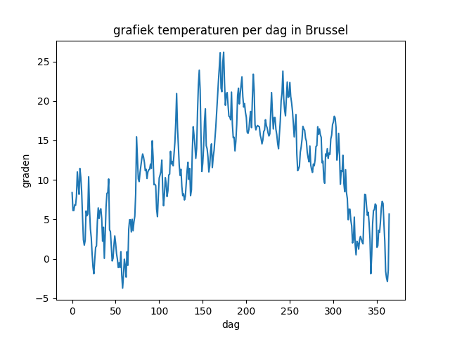

:lib: pass:quotes[_library_]
:libs: pass:quotes[_libraries_]
:fs: functies
:f: functie
:m: method
:icons: font
:source-highlighter: rouge

= Project Temperatuur grafieken

In dit voorbeeldproject, gaan we met **Matplotlib** een grafiek maken van de temperatuur in België.
We gaan in dit project gebruik maken van brondata.

Dit is de werkwijze:

. We downloaden een csv bestand met temperatuursinfo.
. We lezen het bestand met python in.
. Via python filteren we op Brussel en op een bepaald jaar.
. De gefilterde gegevens plaatsen we in een python list.
. We plotten de gegevens met Matplotlib.

== De brondata

Het csv bestand kan je hier terugvinden: https://www.kaggle.com/datasets/sudalairajkumar/daily-temperature-of-major-cities 

Een csv bestand bevat verschillende gegevens die met een komme gescheiden zijn (vandaar csv: __Comma Seperated Values__).

Enkele voorbeeldlijnen uit het bestand:

[source, text]
----
Europe,Belgium,,Brussels,6,1,2009,66.1
Europe,Belgium,,Brussels,6,2,2009,61.3
Europe,Belgium,,Brussels,6,3,2009,55.9
Europe,Belgium,,Brussels,6,4,2009,52.1
Europe,Belgium,,Brussels,6,5,2009,51.9
Europe,Belgium,,Brussels,6,6,2009,52.6
Europe,Belgium,,Brussels,6,7,2009,54.6
Europe,Belgium,,Brussels,6,8,2009,56.2
Europe,Belgium,,Brussels,6,9,2009,59.2
Europe,Belgium,,Brussels,6,10,2009,56.7
Europe,Belgium,,Brussels,6,11,2009,56.5
Europe,Belgium,,Brussels,6,12,2009,57.6
Europe,Belgium,,Brussels,6,13,2009,61.1
Europe,Belgium,,Brussels,6,14,2009,63.0
----

== Het bronbestand inlezen

We kunnen het bestand inlezen door in de folder en de naam van het bestand te specifiëren:

[source, python]
----
with open("object-oriented-programming\\Modules\\data_plotting\\city_temperature.csv", "r") as csvfile:
----

== Filteren op jaartal

Het bestand is geopend, nu kunnen we het inlezen in een datastructuur.
Via de (in Python ingebouwde) csv module, kunnen we het bestand inlezen in een dictionary:

[source, python]
----
import csv

with open("object-oriented-programming\\Modules\\data_plotting\\city_temperature.csv", "r") as csvfile:
        reader = csv.DictReader(csvfile)
----

Aan de gebruiker kunnen we een jaartal vragen:

[source, python]
----
year = input("Enter a year (from 1996): ")
----

Vervolgens kunnen we beginnen filteren.
De dictreader maakt een lijst van rows (waar we over kunnen lussen).
Elke row wordt voorgesteld als een dictionary (waarvan we een __key__ kunnen opvragen).

Filteren doen we door te aan de dictionary een bepaalde key te vragen voor elke row:

[source, python]
----
for row in reader:
            # Filter op Brussel en een gegeven jaartal
            if row["City"] == "Brussels" and row["Year"] == year:
----

Na het filteren kunnen we van de juiste rows (Brussel en juiste jaartal), de temperatuur opvragen:

[source, python]
----
fahrenheit = row["AvgTemperature"]
----

Deze temperatuur kunnen we omzetten in Celcius. Hiervoor maken we zelf een functie aan:

[source, python]
----
def FtoC(F):
    '''Deze functie zet de temparatuur van Fahrenheit om naar Celcius'''
    return (float(F) - 32) * 5/9
----

Deze gebruiken we als volgt:

[source, python]
----
celcius = FtoC(fahrenheit)
----

Deze temperatuur kunnen we vervolgens toevoegen aan een lijst van temperaturen:

[source, python]
----
temperatures = [] # bovenaan in het programma
temperatures.append(celcius) # telkens bij het uitlezen van de row
----

== De code organiseren

We splitsen de code best op in verschillende functies. Dit bakent de moeilijkheid af per deelprobleem.
En het maakt de code ook veel leesbaarder.

Ik heb hier gekozen voor de volgende functies (maar hier ben je zelf vrij in, er zijn meerdere wegen naar Rome):

[source, python]
----
def FtoC(F):
    '''Deze functie zet de temparatuur van Fahrenheit om naar Celcius'''

def readcsv_from_file():
    '''Deze functie leest het csv bestand in en filtert'''

def toongrafiek():
    '''Deze functie tekent de matplotlib grafiek.

#we starten het programma door de readcsv functie op te roepen:

readcsv_from_file()
----

== Het volledige project

De volledige code van het projectje:

[source, python]
----
import csv
import matplotlib.pyplot as plt

#We houden de ingelezen temperaturen globaal bij, om ze ook in andere functies te kunnen gebruiken
temperatures = []

def FtoC(F):
    '''Deze functie zet de temparatuur van Fahrenheit om naar Celcius'''
    return (float(F) - 32) * 5/9

def readcsv_from_file():
    with open("object-oriented-programming\\Modules\\data_plotting\\city_temperature.csv", "r") as csvfile:
        year = input("Enter a year (1996 or higher): ")
        reader = csv.DictReader(csvfile)
        
        for row in reader:
            # Filter op Brussel en een gegeven jaartal
            if row["City"] == "Brussels" and row["Year"] == year:
                # Haal voor iedere row de temperatuur op
                fahrenheit = row["AvgTemperature"]
                # Zet de temperatuur om naar graden Celcius
                celcius = FtoC(fahrenheit)
                # Meetfouten halen we uit de gegevens (er zitten meetfouten van 0 kelvin in het bronbestand)
                if celcius < -30:
                    # Bij een meetfout gaan we naar de volgene iteratie van de lus
                    break
                # Voeg de gevonden tempertuur toe aan de lijst van temperaturen
                temperatures.append(celcius) # F° => C°

        # Na het uitvoeren van de lus, roepen we de toongrafiek functie op.  
        toongrafiek()

def toongrafiek():

    dagen = [x for x in range(len(temperatures))]
    print(temperatures)
    plt.plot(dagen, temperatures)
    plt.xlabel('dag')
    plt.ylabel('graden')
    plt.title('grafiek temperaturen per dag in Brussel')
    plt.show()
    
readcsv_from_file()
----

Het resultaat wanneer we deze code uitvoeren:

