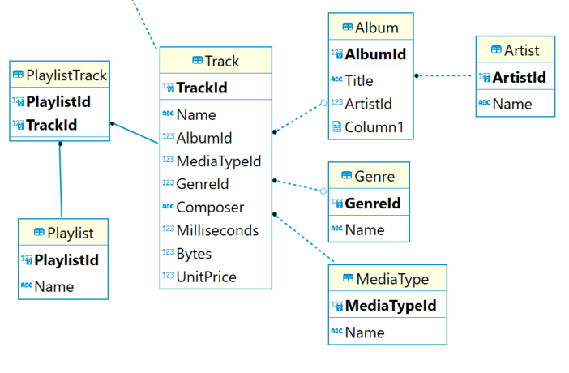
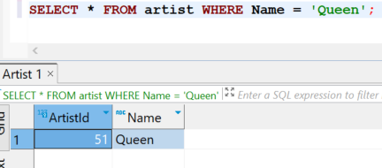
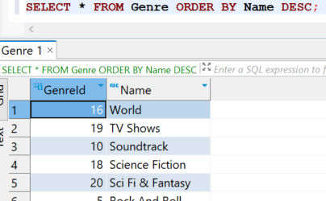

= SQL: Basisprincipes en Querying

== Inleiding tot Databanken en Tabellen

Een database is een gestructureerde verzameling gegevens die op een systematische manier is georganiseerd en gemakkelijk toegankelijk is. Databases gebruiken tabellen om gegevens op te slaan. Deze tabellen kunnen onderlinge relaties hebben.

Bijvoorbeeld:

Een tabel bestaat uit kolommen en rijen. Elke kolom (of veld) kan een bepaald datatype bevatten.In één veld/kolom (data-element) staan gegevens van dezelfde soort. In de "Album" tabel van de chinook database, staan bijvoorbeeld de velden:
albumid, Title, Artistid.  

image::images/albumtabel.PNG[]

Elke rij (of record) in de tabel stelt een ingave in de tabel voor. Meerdere albums (CD's) met elk een _Title_ en _Artist_ , houden we bij in aparte rijen.

Elk veld (of kolom) in de tabel is van een bepaald datatype. Bijvoorbeeld integer, string, date, float, …
Bijvoorbeeld een _Title_ is een string, de _ArtistId_ is een integer, een geboortedatum is een date. Dit is vergelijkbaar met Python, toch kunnen de datatypes net iets anders zijn:

image::images/sqldatatypes.PNG[]

== Het Gebruiken van SQLite

SQLite is een lichte, ingebouwde database-engine die geen aparte server nodig heeft. De Chinook-database is een kleine SQLite databank.
De software die we gaan gebruiken om de database te queriën (ondervragen) is DBeaver. Deze kan je hier downloaden: https://dbeaver.io/download/[DBeaver software]. Deze __community edition__ software is open source en gratis te gebruiken.

In de software is de __'Sample Chinook database'__ reeds aanwezig. Deze kunnen we gebruiken om voorbeeldqueries op uit te voeren.

== Het SELECT-Statement: Basisquery

Het meest fundamentele SQL-statement is het SELECT-statement. Hiermee kun je gegevens uit een tabel ophalen.

[code, sql]
----
SELECT * FROM artist;
----

Dit geeft alle records en kolommen van de 'artists'-tabel weer:

image::images/dbresult.PNG[]

== Filteren van Resultaten met WHERE

Om specifieke resultaten te verkrijgen, gebruiken we de WHERE-clausule.

[code, sql]
----
-- Selecteer artiesten met een specifieke naam uit de 'artists' tabel
SELECT * FROM artist WHERE Name = 'Queen';
----

Dit geeft alleen de artiest 'Queen' weer:

== Sorteren van Resultaten met ORDER BY

Met ORDER BY kun je resultaten sorteren op basis van een kolom.

[code, sql]
----
-- Selecteer alle genres en sorteer ze op naam, maar descending (van Z naar A)
SELECT * FROM genre ORDER BY Name DESC;
----

Dit toont alle genres gesorteerd op naam:

== Aggregatiefuncties: COUNT, SUM, AVG

Aggregatiefuncties vatten gegevens samen. Bijvoorbeeld, het aantal tracks per album:

[coe, sql]
----
-- Tel het aantal tracks per album
SELECT AlbumId, COUNT(TrackId) AS AantalTracks FROM tracks GROUP BY AlbumId;
----

Dit geeft het aantal tracks per album weer.

== Primary Key en Foreign Key in SQL

In SQL-databases spelen de begrippen "Primary Key" en "Foreign Key" een cruciale rol bij het structureren van gegevens en het definiëren van relaties tussen tabellen.

=== Primary Key

Een **Primary Key** is een unieke identificatie voor een record in een tabel. Deze sleutel zorgt ervoor dat elke rij in de tabel eenduidig kan worden geïdentificeerd. De Primary Key moet uniek zijn voor elke rij en kan niet null (leeg) zijn.

Voorbeeld Chinook Database:

In de 'artists'-tabel van de Chinook-database is het veld 'ArtistId' een voorbeeld van een Primary Key. Hiermee wordt elke artiest #uniek geïdentificeerd#. Een bepaald primary key nummer kan dus maar 1 keer voorkomen in een tabel.

[code, sql]
----
-- Voorbeeld van een Primary Key in de 'artists'-tabel
[cols="2,3"]
|===
| ArtistId | Name
| 1        | AC/DC
| 2        | Accept
| 3        | Aerosmith
|... 
|===
----

== Foreign Key

Een **Foreign Key** is een veld in een tabel dat verwijst naar de Primary Key in een andere tabel. Het wordt gebruikt om relaties tussen tabellen tot stand te brengen. De Foreign Key zorgt ervoor dat de waarden in dat veld overeenkomen met de waarden van de Primary Key in de gerelateerde tabel.

Voorbeeld Chinook Database:

In de 'albums'-tabel van de Chinook-database verwijst het veld 'ArtistId' naar de Primary Key 'ArtistId' in de 'artists'-tabel. Hiermee wordt een relatie tussen de twee tabellen gevestigd.

[code, sql]
----
-- Voorbeeld van een Foreign Key in de 'albums'-tabel
[cols="3,2"]
|===
| AlbumId | Title                         | ArtistId
| 1       | For Those About To Rock We Salute You | 1
| 2       | Balls to the Wall             | 2
| 3       | Restless and Wild             | 2
|... 
|===
----

In dit voorbeeld verwijst het veld 'ArtistId' naar de Primary Key 'ArtistId' in de 'artists'-tabel, waardoor een **relatie ontstaat** tussen de artiesten en de albums in de database.

== FK en PK: Referentiële integriteit

Het correct gebruik van Primary en Foreign Keys waarborgt data-integriteit door:

* **Unieke Identificatie**: Elke rij heeft een unieke identificatie met de Primary Key.
* **Consistente Relaties**: Foreign Keys zorgen ervoor dat alleen geldige verwijzingen naar bestaande Primary Key-waarden zijn toegestaan.
* **Voorkomen van Dode Verwijzingen**: Het is niet toegestaan om een Foreign Key te hebben met een waarde die niet overeenkomt met een bestaande Primary Key.

bij het verwijderen van gegevens uit de databank moet er dus steeds opgelet worden dat je niets verwijderd waar een FK naar verwijst. De referentie (FK naar PK) mag niet verstoord worden. Voor het verwijderen zal je de FK-PK verwijzing eerst moeten opheffen of verwijderen. Dit is de referentiële integriteit.

== Joins: Het Combineren van Tabellen

Een JOIN combineert gegevens uit verschillende tabellen op basis van een bepaalde kolom, de __Foreign key (FK)__ die verwijst naar een kolom in een andere tabel, de __Primary key (PK)__ van die tabel.

Met een __Join__ geven we aan welke FK overeenkomt met welke PK.

[code, sql]
----
-- Haal tracks op met bijbehorende albuminformatie
SELECT track.TrackId, track.Name AS TrackNaam, album.Title AS AlbumTitel
FROM track
JOIN album ON track.AlbumId = album.AlbumId;
----

Dit toont tracks met bijbehorende albuminformatie:

image::images/trackjoin.PNG[]

