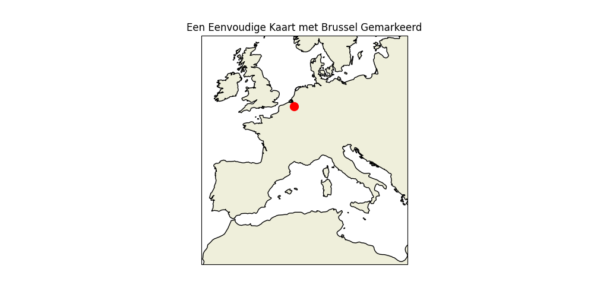
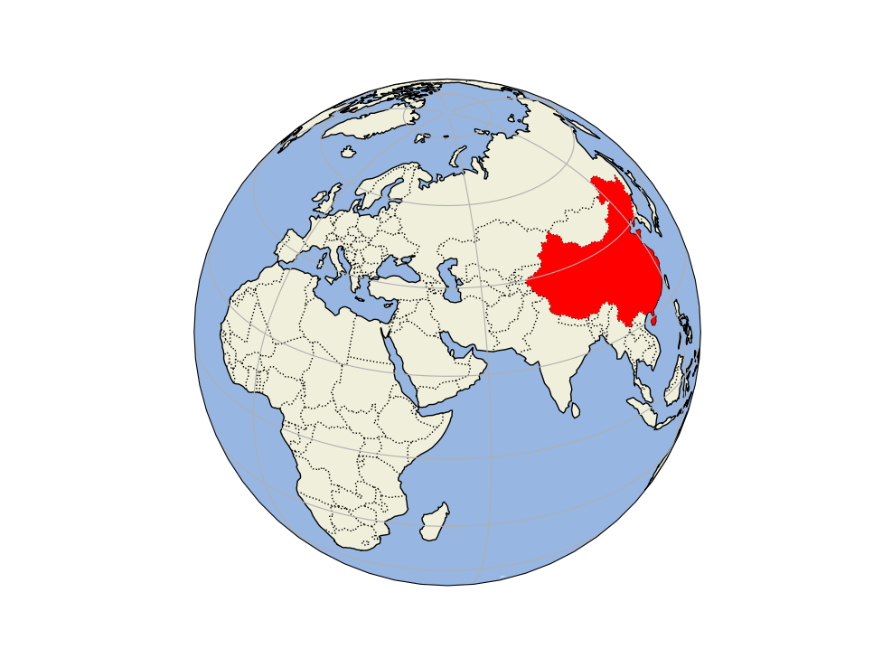

:source-highlighter: rouge
:rouge-style: thankful_eyes
:toc: left
:toclevels: 5
:sectnums:

= Cartopy: Geografische Data Visualisatie in Python

== Wat is Cartopy?

Cartopy is een open-source bibliotheek die is gebouwd bovenop Matplotlib en Shapely en die is ontworpen voor het maken van kaarten en het werken met geografische gegevens in Python. Het biedt een eenvoudige en intuïtieve interface voor het maken van verschillende soorten kaarten, zoals orthografische, cilindrische en azimutale projecties.

== Installatie van Cartopy

Om Cartopy te installeren, kunt u gebruik maken van pip, de Python package manager. U kunt Cartopy installeren met het volgende commando:

[source, bash]
----
pip install cartopy
----

== Belangrijkste Kenmerken

Enkele van de belangrijkste kenmerken van Cartopy zijn:

1. **Ondersteuning voor Verschillende Kaartprojecties:** Cartopy biedt ondersteuning voor een breed scala aan kaartprojecties, waaronder Mercator, Orthografisch, Stereografisch, en nog veel meer.
  
2. **Gegevensvisualisatie:** Met Cartopy kunt u geografische gegevens visualiseren, zoals landgrenzen, kustlijnen, rivieren, enzovoort.

3. **Geografische Plotting:** Cartopy biedt de mogelijkheid om gegevens te plotten op geografische coördinaten, waardoor u verschillende soorten kaarten kunt maken met behulp van uw eigen datasets.

4. **Eenvoudige Integratie met Matplotlib:** Omdat Cartopy is gebouwd bovenop Matplotlib, kunt u de plotfuncties van Matplotlib gebruiken in combinatie met de geografische functionaliteit van Cartopy.

== Voorbeeldcode

Hier is een eenvoudig voorbeeld van hoe Cartopy kan worden gebruikt om een eenvoudige kaart te maken:

[source, python]
----
import cartopy 
from cartopy import crs as ccrs
import matplotlib.pyplot as plt

# Maak een nieuwe kaartfiguur
plt.figure(figsize=(10, 5))
ax = plt.axes(projection=ccrs.PlateCarree())

# Voeg landen toe aan de kaart
ax.add_feature(cartopy.feature.LAND)

# Voeg kustlijnen toe aan de kaart
ax.add_feature(cartopy.feature.COASTLINE)

# Voeg een titel toe aan de kaart
plt.title('Een Eenvoudige Kaart met Cartopy')

# Toon de kaart
plt.show()
----

Dit voorbeeld creëert een eenvoudige kaart met Cartopy, met landen en kustlijnen als kenmerken:

image::images/cartopy1.png[]

=== Een punt op de kaart

Op de gerenderde kaart willen we bijvoorbeeld Brussel tonen als een rode bol.
Hiervoor moeten we de coördinaten van Brussel kennen, namelijk: 50.8503, 4.3517.

[source, python]
----
import cartopy 
from cartopy import crs as ccrs
import matplotlib.pyplot as plt

# Coördinaten van Brussel (latitude, longitude)
brussels_coords = (50.8503, 4.3517)

# Bepaal de extent voor de hele wereldkaart
extent = [-180, 180, -90, 90]

# Maak een nieuwe kaartfiguur
plt.figure(figsize=(10, 5))
ax = plt.axes(projection=ccrs.PlateCarree())
ax.set_extent(extent)

# Voeg landen toe aan de kaart
ax.add_feature(cartopy.feature.LAND)

# Voeg kustlijnen toe aan de kaart
ax.add_feature(cartopy.feature.COASTLINE)

# Voeg een rode bol toe voor Brussel
ax.plot(brussels_coords[1], brussels_coords[0], 'ro', markersize=10, transform=ccrs.PlateCarree())

# Voeg een titel toe aan de kaart
plt.title('Een Eenvoudige Kaart met Brussel Gemarkeerd')

# Toon de kaart
plt.show()
----

Resultaat:

image::images/cartopy2.png[]

=== Inzoomen

Op basis van de gekende coördinaten:

[source, python]
----
# Bepaal de extent van de kaart op basis van de coördinaten van Brussel
extent = [brussels_coords[1]-10, brussels_coords[1]+10, brussels_coords[0]-5, brussels_coords[0]+5]
ax.set_extent(extent)
----

Of via bepaalde longitude en latitude:

[source, python]
----
# Bepaal de extent voor de hele wereldkaart
extent = [-10, 20, 30, 60]
----

Resultaat:

=== Grenzen en provincies

[source, python]
----
# Bepaal de extent voor de hele wereldkaart
extent = [1.8, 6.5, 49.4, 52]

# Maak een nieuwe kaartfiguur
plt.figure(figsize=(10, 5))
ax = plt.axes(projection=ccrs.Aitoff())
ax.set_extent(extent)

# Voeg landen toe aan de kaart
ax.add_feature(cartopy.feature.LAND)
ax.add_feature(cartopy.feature.STATES, linestyle='--', edgecolor='blue')
ax.add_feature(cartopy.feature.BORDERS, linestyle=':', edgecolor='red')
----

Resultaat:

image::images/cartopy_borders.png[]

== Een land markeren

[source, python]
----
import cartopy
import cartopy.crs as ccrs
import cartopy.io.shapereader as shpreader
import matplotlib.pyplot as plt

proj = ccrs.Orthographic(50, 30)
ax = plt.axes(projection=proj)

ax.add_feature(cartopy.feature.OCEAN, zorder=0)
ax.add_feature(cartopy.feature.LAND, zorder=0, edgecolor='black')

ax.set_global()
ax.gridlines()
ax.add_feature(cartopy.feature.BORDERS, linestyle=':', alpha=1)

shpfilename = shpreader.natural_earth(resolution='110m',
                                      category='cultural',
                                      name='admin_0_countries')
reader = shpreader.Reader(shpfilename)
countries = reader.records()

for country in countries:
    print(country.attributes)
    if country.attributes['GEOUNIT'] == 'China':
        ax.add_geometries(country.geometry, ccrs.PlateCarree(), facecolor='red')

plt.show()
----

Het resultaat:

