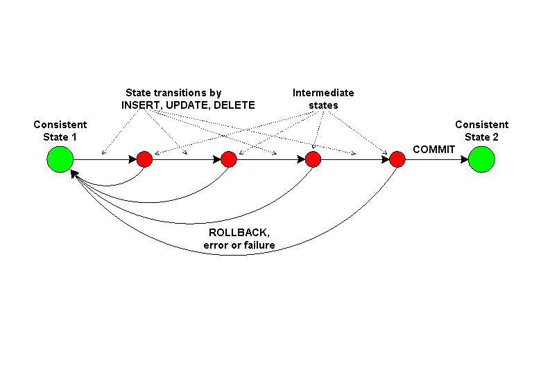

:lib: pass:quotes[_library_]
:libs: pass:quotes[_libraries_]
:fs: functies
:f: functie
:m: method
:icons: font
:source-highlighter: rouge
:rouge-style: thankful_eyes
:toc: left
:toclevels: 5
:sectnums:

= Hoofdstuk: MySQL Database Transacties

In dit hoofdstuk behandelen we MySQL transacties, een onderdeel van databases die ervoor zorgen dat groepen van gerelateerde SQL-queries betrouwbaar worden uitgevoerd. 
Transacties bieden garanties over de ##integriteit van de gegevens## en zorgen ervoor dat bewerkingen worden voltooid zoals bedoeld. 
Dit is vooral belangrijk bij complexe bewerkingen of als er meerdere gebruikers tegelijkertijd toegang hebben tot de database.

== Wat is een Transactie?

Een transactie is een reeks van één of meerdere SQL-operaties die ##als een enkel geheel worden uitgevoerd##. 
Het belangrijkste doel van transacties is om te garanderen dat een reeks bewerkingen wordt uitgevoerd zonder onderbrekingen of fouten, zelfs als er iets misgaat, zoals een systeemcrash.

De vier fundamentele eigenschappen van een transactie staan bekend als de ACID-eigenschappen:

1. **Atomiciteit**: De transactie wordt als één enkele eenheid uitgevoerd. Ofwel worden alle bewerkingen uitgevoerd, ofwel geen enkele (alles of niets-principe).
2. **Consistentie**: Een transactie begint met een geldige toestand van de database en eindigt met een geldige toestand, wat betekent dat de integriteit van de gegevens behouden blijft.
3. **Isolatie**: Transacties worden onafhankelijk van elkaar uitgevoerd. De resultaten van een transactie zijn niet zichtbaar voor andere transacties totdat deze is voltooid.
4. **Duurzaamheid**: Zodra een transactie is voltooid (gecommit), blijven de resultaten permanent, zelfs bij een storing.

== Starten van een Transactie

In MySQL beginnen transacties standaard niet automatisch. Je moet expliciet een transactie starten met het `START TRANSACTION`-commando.

[source, sql]
----
START TRANSACTION;
----

Dit commando geeft aan dat een nieuwe transactie begint. 
Alle daaropvolgende bewerkingen worden uitgevoerd binnen de context van deze transactie totdat deze wordt voltooid of teruggedraaid.

== Commit en Rollback

Elke transactie eindigt met één van twee mogelijke uitkomsten:

COMMIT: Wanneer alle bewerkingen in de transactie succesvol zijn uitgevoerd, wordt de transactie "gecommit". Dit betekent dat de wijzigingen permanent worden opgeslagen in de database.
[source, sql]
----
COMMIT;
----

ROLLBACK: Als er tijdens de transactie iets misgaat (zoals een fout in de bewerkingen), kan de transactie worden teruggedraaid met het ROLLBACK-commando. Dit zorgt ervoor dat alle bewerkingen die sinds het begin van de transactie zijn uitgevoerd, worden geannuleerd.
[source, sql]
----
ROLLBACK;
----

== Voorbeeld: Transactie in MySQL

Laten we een voorbeeld bekijken waarin we geld overboeken tussen twee bankrekeningen. 
Dit scenario vereist twee updates: het afschrijven van een bedrag van de ene rekening en het bijschrijven op een andere. 
Beide bewerkingen moeten als een enkele transactie worden uitgevoerd om te voorkomen dat er fouten optreden, zoals een negatieve balans als slechts één van de twee bewerkingen slaagt.

[source, sql]
----
START TRANSACTION;

UPDATE accounts
SET balance = balance - 100
WHERE account_id = 1;

UPDATE accounts
SET balance = balance + 100
WHERE account_id = 2;

COMMIT;
----

In dit voorbeeld:

We beginnen met START TRANSACTION.
Vervolgens passen we twee updates toe op de tabel accounts.
Als beide updates slagen, wordt de transactie gecommit en worden de wijzigingen permanent opgeslagen.
Als er echter iets fout gaat, zoals een foutieve account-ID, kunnen we de transactie terugdraaien:

[source, sql]
----
START TRANSACTION;

UPDATE accounts
SET balance = balance - 100
WHERE account_id = 1;

UPDATE accounts
SET balance = balance + 100
WHERE account_id = 999;  -- Ongeldige account ID

ROLLBACK;
----

In dit geval zorgt het ROLLBACK-commando ervoor dat de eerste update (het afschrijven van 100 euro) wordt teruggedraaid omdat de tweede bewerking niet kon worden uitgevoerd.

== Autocommit en MySQL

In MySQL worden alle bewerkingen standaard direct uitgevoerd zonder een expliciete transactie (dit heet autocommit). 
Dit betekent dat elke SQL-query die je uitvoert automatisch wordt gecommit. 
Als je transacties wilt gebruiken, moet je autocommit uitschakelen of expliciet een transactie starten.

Je kunt autocommit uitschakelen met de volgende SQL-query:

[source, sql]
----
SET autocommit = 0;
----

Nadat autocommit is uitgeschakeld, kun je transacties handmatig beginnen en beëindigen met START TRANSACTION, COMMIT, en ROLLBACK.

Om autocommit weer in te schakelen, gebruik je:

[source, sql]
----
SET autocommit = 1;
----

== Concurrerende Transacties en Isolatie

Wanneer meerdere transacties tegelijkertijd worden uitgevoerd, kunnen er conflicten optreden, zoals race-conditions of deadlocks. 
Om de integriteit van de gegevens te waarborgen, gebruikt MySQL zogenaamde isolatieniveaus. 
Het isolatieniveau bepaalt hoe transacties elkaar beïnvloeden wanneer ze gelijktijdig worden uitgevoerd.

MySQL biedt vier isolatieniveaus:

* READ UNCOMMITTED: Transacties kunnen elkaars nog niet-gecommitteerde wijzigingen zien.
* READ COMMITTED: Transacties kunnen alleen gecommitteerde wijzigingen zien.
* REPEATABLE READ: Een transactie ziet dezelfde rijen, zelfs als andere transacties wijzigingen hebben doorgevoerd.
* SERIALIZABLE: Transacties worden volledig geïsoleerd van elkaar, wat zorgt voor de hoogste mate van isolatie maar ook voor de laagste efficiëntie.

Je kunt het isolatieniveau van een transactie instellen met de volgende SQL-query:

[source, sql]
----
SET TRANSACTION ISOLATION LEVEL SERIALIZABLE;
START TRANSACTION;
----

== Race Conditions in MySQL Transacties

Een **race condition** ontstaat wanneer twee of meer transacties tegelijkertijd proberen dezelfde gegevens te lezen en te schrijven, wat kan leiden tot onverwachte resultaten of foutieve gegevens. 
Dit gebeurt vaak in scenario's waar de transacties geen rekening houden met de wijzigingen die de andere transacties tegelijkertijd doorvoeren. 

Een race condition kan bijvoorbeeld optreden wanneer twee gebruikers tegelijkertijd proberen geld over te maken van dezelfde bankrekening, zonder dat de transacties goed gesynchroniseerd zijn.

Laten we een voorbeeld bekijken:

[source, sql]
----
-- Transactie 1: Gebruiker A probeert €100 van rekening 1 af te halen
START TRANSACTION;
SELECT balance FROM accounts WHERE account_id = 1; -- Uitkomst: 1000
UPDATE accounts SET balance = balance - 100 WHERE account_id = 1;

-- Transactie 2: Gebruiker B probeert tegelijkertijd €200 van dezelfde rekening af te halen
START TRANSACTION;
SELECT balance FROM accounts WHERE account_id = 1; -- Uitkomst: 1000
UPDATE accounts SET balance = balance - 200 WHERE account_id = 1;
----

In dit voorbeeld:
- Beide transacties lezen eerst het saldo van de rekening (1000 euro).
- Daarna berekenen ze elk afzonderlijk het nieuwe saldo op basis van hun transacties.
- Gebruiker A trekt 100 euro af en gebruiker B trekt 200 euro af, maar omdat de transacties onafhankelijk werken, weten ze niet van elkaar dat er al een bewerking is uitgevoerd.

De race condition ontstaat omdat beide transacties beginnen met dezelfde waarde (1000 euro) en er geen synchronisatie is tussen de transacties. Als ze beide succesvol worden gecommit, kan het eindresultaat fout zijn. In plaats van een saldo van 700 euro (zoals verwacht als beide correct zijn uitgevoerd), kunnen we eindigen met een saldo van 900 of 800 euro, afhankelijk van welke transactie als laatste commit.

Dit soort problemen kan worden voorkomen door een hoger isolatieniveau te gebruiken, zoals **SERIALIZABLE**, waardoor transacties in een bepaalde volgorde worden uitgevoerd en er geen race conditions kunnen optreden. Hiermee worden transacties volledig geïsoleerd, zodat één transactie wordt voltooid voordat een andere begint.

[source, sql]
----
SET TRANSACTION ISOLATION LEVEL SERIALIZABLE;
START TRANSACTION;
----

Door dit isolatieniveau te gebruiken, zou MySQL voorkomen dat de tweede transactie tegelijkertijd plaatsvindt, en zou het juiste saldo worden berekend nadat de eerste transactie is voltooid.

== Deadlocks in MySQL Transacties

Een **deadlock** treedt op wanneer twee of meer transacties elkaar blokkeren doordat ze op elkaar wachten om bronnen vrij te geven. 

Elke transactie heeft een bron vergrendeld die de andere transacties nodig hebben om verder te gaan. 
Dit leidt ertoe dat geen van de transacties kan worden voltooid, omdat ze in een wederzijdse blokkering terechtkomen.
Deadlocks kunnen voorkomen in situaties waarin meerdere transacties tegelijkertijd proberen dezelfde bronnen te vergrendelen, maar in een andere volgorde.

Laten we een voorbeeld bekijken:

[source, sql]
----
-- Transactie 1
START TRANSACTION;
UPDATE accounts SET balance = balance - 100 WHERE account_id = 1;
UPDATE accounts SET balance = balance + 100 WHERE account_id = 2;

-- Transactie 2
START TRANSACTION;
UPDATE accounts SET balance = balance - 100 WHERE account_id = 2;
UPDATE accounts SET balance = balance + 100 WHERE account_id = 1;
----

In dit voorbeeld gebeurt het volgende:

- Transactie 1 vergrendelt rekening 1 en wacht om rekening 2 te vergrendelen.
- Transactie 2 vergrendelt rekening 2 en wacht om rekening 1 te vergrendelen.
- Beide transacties kunnen nu niet doorgaan, omdat ze wachten op elkaar om hun bron vrij te geven.

Dit creëert een deadlock. 

MySQL zal één van de transacties detecteren en deze beëindigen om de deadlock op te lossen. 
De andere transactie kan dan doorgaan en worden voltooid.

Deadlocks zijn lastig te voorkomen, vooral in systemen met veel gelijktijdige transacties. 
Een manier om deadlocks te minimaliseren is door ervoor te zorgen dat transacties altijd dezelfde volgorde van bronnen volgen. 
Daarnaast is het belangrijk om transacties zo kort mogelijk te houden, zodat de kans op vergrendelingen afneemt.

== MySQL Savepoints in Transactions ==

=== Wat zijn Savepoints? ===
Savepoints zijn punten binnen een transactie waarnaar je kunt terugkeren zonder de volledige transactie terug te draaien. Ze bieden meer flexibiliteit bij het beheer van transacties, vooral bij complexe operaties, door een gedeeltelijke "rollback" mogelijk te maken. Dit betekent dat je specifieke delen van een transactie kunt herstellen terwijl andere delen ongewijzigd blijven.

Savepoints worden voornamelijk gebruikt in situaties waarin je meerdere stappen in een transactie uitvoert, maar slechts een deel van die stappen wilt terugdraaien als er iets misgaat.

=== Hoe werken Savepoints? ===
Een savepoint creëert een herstelpunt binnen een transactie. Mocht er een fout optreden na een savepoint, dan kun je teruggaan naar dat savepoint en de wijzigingen vanaf dat punt terugdraaien, terwijl de wijzigingen die ervoor zijn gemaakt behouden blijven.

In MySQL kun je met `SAVEPOINT` een savepoint maken, met `ROLLBACK TO SAVEPOINT` terugkeren naar een eerder ingesteld savepoint, en met `RELEASE SAVEPOINT` een savepoint vrijgeven.

=== Voorbeeld van Savepoints ===

Laten we een voorbeeld bekijken waarin we savepoints gebruiken om te voorkomen dat een hele transactie wordt teruggedraaid:

[source, sql]
----
START TRANSACTION;

-- Voeg een nieuwe klant toe
INSERT INTO customers (customer_id, name) VALUES (1, 'Alice');
SAVEPOINT sp1;  -- Savepoint na de eerste insert

-- Voeg een bestelling toe
INSERT INTO orders (order_id, customer_id, total) VALUES (101, 1, 500);
SAVEPOINT sp2;  -- Savepoint na de tweede insert

-- Voeg een betaling toe, maar er is een fout
INSERT INTO payments (payment_id, order_id, amount) VALUES (201, 101, 'wrong_amount');

-- Er is een fout opgetreden, rollback naar sp2
ROLLBACK TO SAVEPOINT sp2;

-- Corrigeer de fout en voeg de betaling correct in
INSERT INTO payments (payment_id, order_id, amount) VALUES (201, 101, 500);

-- Maak de transactie af
COMMIT;
----

In dit voorbeeld:
. We beginnen de transactie met `START TRANSACTION`.
. Twee savepoints (`sp1` en `sp2`) worden ingesteld.
. Wanneer er een fout optreedt tijdens het invoegen van de betaling, keren we terug naar `sp2`, zonder de klant of de bestelling terug te draaien.
. Na het corrigeren van de fout wordt de transactie succesvol afgerond met `COMMIT`.

=== Voordelen van Savepoints ===
1. **Fijnmazige controle**: Savepoints bieden meer controle binnen een transactie, zodat je niet de volledige transactie hoeft terug te draaien wanneer zich een fout voordoet.
2. **Betere foutafhandeling**: Savepoints maken het eenvoudiger om gedeeltelijke fouten in complexe transacties te beheren.
3. **Flexibiliteit**: Je kunt bepaalde delen van een transactie terugdraaien zonder de rest aan te tasten.

== Conclusie

Transacties waarborgen de integriteit van gegevens in MySQL-databases. 
Ze stellen je in staat om meerdere bewerkingen als een geheel uit te voeren, zodat je de zekerheid hebt dat alle bewerkingen succesvol zijn uitgevoerd, of dat geen enkele wijziging wordt doorgevoerd bij fouten. 
Het begrijpen van transacties, isolatieniveaus en het omgaan met deadlocks is cruciaal voor het beheren van veilige en consistente databases.
