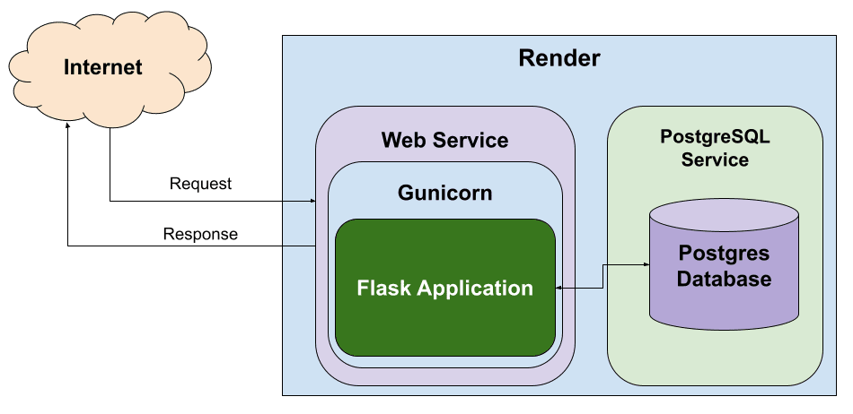

:lib: pass:quotes[_library_]
:libs: pass:quotes[_libraries_]
:fs: functies
:f: functie
:m: method
:icons: font
:source-highlighter: rouge
:rouge-style: thankful_eyes
:toc: left
:toclevels: 5
:sectnums:

= Flask: Een Web Framework voor Python =

Flask is een lichtgewicht webframework voor Python.
Het is ontworpen om snel en eenvoudig webapplicaties te bouwen.
Flask volgt het "micro" raamwerk principe, wat betekent dat het minimale tools en libraries biedt.
Dit maakt het flexibel en geschikt voor kleine tot middelgrote webapplicaties.

image::images/flask_development_server_diagram.png[]

De flask server reageert op http requests en stuurt http respone berichten terug naar de client.
Flask kan verbinden naar een databank (je kan verschillende kiezen) om er data uit op te halen via sql queries of er data in weg schrijven.

== Installatie van Flask ==

Voordat je Flask kunt gebruiken, moet je het installeren.
Dit kan eenvoudig via pip:

[source, bash]
----
pip install Flask
----

== Je Eerste Flask Applicatie ==

Hier is een eenvoudig voorbeeld van een "Hello, World!" Flask-applicatie:

[source, python]
----
from flask import Flask

app = Flask(__name__)

@app.route('/')
def hello_world():
    return 'Hello, World!'

if __name__ == '__main__':
    app.run()
----

In dit voorbeeld wordt een Flask-applicatie aangemaakt.
De `@app.route('/')` **decorator** definieert een route naar de hoofdpagina.
De functie `hello_world()` retourneert de tekst "Hello, World!".
Wanneer je het script uitvoert, start Flask een webserver en is de applicatie toegankelijk via `http://localhost:5000`.

== Routes en URL’s ==

In Flask kun je routes definiëren met behulp van de `@app.route()` decorator.
Een route is een pad in de URL die naar een specifieke functie verwijst.
Hier is een voorbeeld met meerdere routes:

[source, python]
----
@app.route('/about')
def about():
    return 'About Page'

@app.route('/user/<username>')
def show_user_profile(username):
    return f'User {username}'
----

De eerste route `'/about'` geeft een statische pagina weer.
De tweede route is dynamisch en accepteert een parameter `username`.
Deze parameter wordt doorgegeven aan de functie en verwerkt.

== HTTP Methodes ==

Flask ondersteunt verschillende HTTP-methodes zoals GET en POST.
De `@app.route()` decorator kan worden uitgebreid om specifieke methods te accepteren:

[source, python]
----
@app.route('/login', methods=['GET', 'POST'])
def login():
    if request.method == 'POST':
        return 'Processing Login'
    else:
        return 'Login Page'
----

In dit voorbeeld accepteert de `'/login'` route zowel GET- als POST-verzoeken.
De methode `request.method` controleert of het een POST-verzoek is en handelt dienovereenkomstig.

== Templates ==

Flask templates zijn HTML-bestanden die dynamische content kunnen bevatten door middel van Python-code. 
Met Flask kun je deze templates gebruiken om content te genereren op basis van variabelen, loops, en conditionele statements. 
Flask maakt gebruik van Jinja2, een krachtige template engine waarmee je HTML-pagina's kunt creëren met geavanceerde functionaliteiten.

Een voorbeeld van een template:

[source, html]
----
<!DOCTYPE html>
<html>
<head>
    <title>{{ title }}</title>
</head>
<body>
    <h1>{{ heading }}</h1>
    
{{ message }}

</body>
</html>
----

In Flask kun je de template renderen met de `render_template()` functie:

[source, python]
----
from flask import render_template

@app.route('/')
def index():
    return render_template('index.html', title='Home', heading='Welcome', message='This is the home page')
----

De variabelen `title`, `heading`, en `message` worden doorgegeven aan het template en ingevuld in de HTML.

=== Waarom Templates Gebruiken? ===

Templates scheiden de logica van je applicatie van de presentatie ervan.
Hierdoor kun je:
- Dezelfde template hergebruiken voor verschillende pagina’s.
- Dynamische content weergeven zonder je HTML handmatig te moeten genereren.
- Een duidelijke scheiding hebben tussen het Python-gedeelte van je code en de HTML-pagina's.

=== Basis Template Gebruik ===

In Flask maak je templates door HTML-bestanden in een map genaamd `templates` te plaatsen. 
Je kunt deze templates renderen in je routes met behulp van de `render_template()` functie.

==== Voorbeeld: Een eenvoudige HTML-pagina ====

Dit is een eenvoudig voorbeeld van een route die een template rendert:

[source, python]
----
from flask import Flask, render_template

app = Flask(__name__)

@app.route('/')
def home():
    return render_template('index.html')

if __name__ == '__main__':
    app.run(debug=True)
----

In dit voorbeeld verwijst `index.html` naar een bestand dat zich in de `templates` map bevindt. 

De inhoud van `index.html` zou er als volgt kunnen uitzien:

[source, html]
----
<!DOCTYPE html>
<html lang="en">
<head>
    <meta charset="UTF-8">
    <title>Welcome</title>
</head>
<body>
    <h1>Welkom op mijn Flask-applicatie!</h1>
</body>
</html>
----

Wanneer de gebruiker de index pagina bezoekt, wordt deze HTML gerenderd en naar de browser gestuurd.

=== Dynamische Inhoud met Variabelen ===

Je kunt variabelen vanuit je route naar de template sturen en die in de HTML weergeven.

[source, python]
----
@app.route('/user/<name>')
def user(name):
    return render_template('user.html', username=name)
----

In dit voorbeeld wordt de variabele `name` naar de template `user.html` gestuurd:

[source, html]
----
<!DOCTYPE html>
<html lang="en">
<head>
    <meta charset="UTF-8">
    <title>User Page</title>
</head>
<body>
    <h1>Welkom, {{ username }}!</h1>
</body>
</html>
----

Het resultaat is dat wanneer je `/user/John` bezoekt, de pagina "Welkom, John!" toont.

=== Loops en Conditionele Statements ===

Jinja2 ondersteunt ook loops en conditionele statements, waarmee je dynamische lijsten en content kunt tonen.

==== Voorbeeld: Lijsten renderen ====
[source, python]
----
@app.route('/items')
def items():
    items = ['Zwaard', 'Schild', 'Helm']
    return render_template('items.html', items=items)
----

De template `items.html` kan een lijst weergeven met een loop:

[source, html]
----
<!DOCTYPE html>
<html lang="en">
<head>
    <meta charset="UTF-8">
    <title>Items</title>
</head>
<body>
    <h1>Beschikbare Items:</h1>
    <ul>
        
            <li>{{ item }}</li>
        
    </ul>
</body>
</html>
----

=== Includen van Templates ===

Je kunt ook templates hergebruiken door stukken code te includen, zoals een header of footer die op meerdere pagina's gebruikt wordt.

[source, html]
----

<h1>Welkom op de hoofdpagina!</h1>

----

=== Templates oververven ===
Template erfenis in Flask stelt je in staat om een basislayout te maken die door andere templates geërfd kan worden. Dit wordt gedaan met de `block` tag in Jinja2.

==== Voorbeeld: Basislayout ====
Maak een bestand `base.html` dat als basis dient voor andere templates:

[source, html]
----
<!DOCTYPE html>
<html lang="en">
<head>
    <meta charset="UTF-8">
    <title>Mijn Website</title>
</head>
<body>
    <header>
        <h1>Mijn Website</h1>
    </header>

    <main>
        
    </main>

    <footer>
        
Copyright 2024

    </footer>
</body>
</html>
----

Een andere template kan deze layout erven en alleen de `content` en `title` blokken aanpassen:

[source, html]
----


Over Ons


    <h2>Over Ons</h2>
    
Wij zijn een bedrijf dat zich specialiseert in softwareontwikkeling.


----

== Flask en Forms ==

Flask maakt het eenvoudig om formulieren te verwerken.
Hier is een voorbeeld van een eenvoudig formulier met een POST-verzoek:

[source, html]
----
<form method="POST" action="/submit">
    <input type="text" name="name">
    <input type="submit" value="Submit">
</form>
----

In Flask verwerk je de gegevens van het formulier als volgt:

[source, python]
----
from flask import request

@app.route('/submit', methods=['POST'])
def submit():
    name = request.form['name']
    return f'Hello, {name}!'
----

De `request.form` methode wordt gebruikt om toegang te krijgen tot de gegevens van het formulier.

== Flask en JSON ==

Flask maakt het gemakkelijk om met JSON-gegevens te werken.
Je kunt eenvoudig JSON teruggeven als een API-reactie:

[source, python]
----
from flask import jsonify

@app.route('/api/data')
def get_data():
    data = {'name': 'John', 'age': 30}
    return jsonify(data)
----

In dit voorbeeld retourneert de route `/api/data` een JSON-object met de naam en leeftijd.

== Foutafhandeling ==

Flask biedt ingebouwde ondersteuning voor foutafhandeling.
Je kunt aangepaste foutpagina's maken voor veelvoorkomende HTTP-statuscodes zoals 404:

[source, python]
----
@app.errorhandler(404)
def page_not_found(e):
    return 'Page not found', 404
----

In dit voorbeeld wordt een aangepaste foutmelding weergegeven wanneer een pagina niet wordt gevonden.

== Development vs production

Flask wordt vaak in een ontwikkelomgeving gebruikt met zijn ingebouwde webserver. 
Deze webserver is echter niet geschikt voor productieomgevingen omdat het niet voldoende geoptimaliseerd is voor hoge belasting en meerdere gelijktijdige verzoeken.

Gunicorn is een WSGI (Web Server Gateway Interface) server die speciaal is ontworpen voor productieomgevingen.
Wanneer Flask in productie wordt gebruikt met Gunicorn, biedt dit de volgende voordelen:

- *Betere prestaties*: Gunicorn kan meerdere verzoeken tegelijk afhandelen en biedt ondersteuning voor meerdere processen en threads, wat zorgt voor schaalbaarheid en efficiëntie.
- *Stabiliteit*: In tegenstelling tot Flask’s ontwikkelingsserver, kan Gunicorn omgaan met zware belasting zonder te crashen.
- *Veiligheid*: Gunicorn biedt betere beveiligingsfunctionaliteiten en is beter geschikt om blootgesteld te worden aan het internet.
- *Multiprocessing*: Gunicorn kan meerdere werkprocessen creëren, waardoor applicaties kunnen profiteren van multi-core CPU’s en zware belasting efficiënter kunnen verdelen.

Door Flask met Gunicorn te gebruiken in productie, wordt de applicatie robuuster, sneller en stabieler.

== Debugging en Herladen ==

Flask heeft een ingebouwde debugmodus.
Dit helpt bij het opsporen van fouten tijdens de ontwikkeling.
Je kunt debugmodus inschakelen door `debug=True` aan de `app.run()` toe te voegen:

[source, python]
----
if __name__ == '__main__':
    app.run(debug=True)
----

Met debugmodus ingeschakeld wordt de applicatie automatisch opnieuw gestart wanneer je wijzigingen aanbrengt in de code.

== Extensies ==

Hoewel Flask een "micro" framework is, kan het worden uitgebreid met verschillende extensies.
Enkele populaire Flask-extensies zijn:

- `Flask-SQLAlchemy` voor database-integratie.
- `Flask-WTF` voor formuliervalidatie.

== Samenvatting ==

Flask is een flexibel en lichtgewicht framework waarmee je snel webapplicaties kunt bouwen.
Door de eenvoudige structuur en uitbreidbaarheid is het ideaal voor zowel beginners als ervaren ontwikkelaars.
Met ingebouwde ondersteuning voor routing, templates, foutafhandeling en extensies biedt Flask alles wat nodig is voor het bouwen van moderne webapplicaties.
