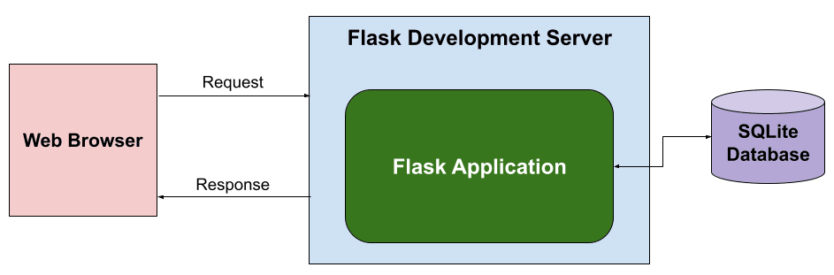

:lib: pass:quotes[_library_]
:libs: pass:quotes[_libraries_]
:fs: functies
:f: functie
:m: method
:icons: font
:source-highlighter: rouge
:rouge-style: thankful_eyes
:toc: left
:toclevels: 5
:sectnums:

= Flask: Een Web Framework voor Python =

Flask is een lichtgewicht webframework voor Python.
Het is ontworpen om snel en eenvoudig webapplicaties te bouwen.
Flask volgt het "micro" raamwerk principe, wat betekent dat het minimale tools en libraries biedt.
Dit maakt het flexibel en geschikt voor kleine tot middelgrote webapplicaties.

De flask server reageert op http requests en stuurt http respone berichten terug naar de client.
Flask kan verbinden naar een databank (je kan verschillende kiezen) om er data uit op te halen via sql queries of er data in weg schrijven.

== Installatie van Flask ==

Voordat je Flask kunt gebruiken, moet je het installeren.
Dit kan eenvoudig via pip:

[source, bash]
----
pip install Flask
----

== Je Eerste Flask Applicatie ==

Hier is een eenvoudig voorbeeld van een "Hello, World!" Flask-applicatie:

[source, python]
----
from flask import Flask

app = Flask(__name__)

@app.route('/')
def hello_world():
    return 'Hello, World!'

if __name__ == '__main__':
    app.run()
----

In dit voorbeeld wordt een Flask-applicatie aangemaakt.
De `@app.route('/')` **decorator** definieert een route naar de hoofdpagina.
De functie `hello_world()` retourneert de tekst "Hello, World!".
Wanneer je het script uitvoert, start Flask een webserver en is de applicatie toegankelijk via `http://localhost:5000`.

== Routes en URL’s ==

image::images/chapter04_flask_request_response_diagram.png[]

In Flask kun je routes definiëren met behulp van de `@app.route()` decorator.
Een route is een pad in de URL die naar een specifieke functie verwijst.
Hier is een voorbeeld met meerdere routes:

[source, python]
----
@app.route('/about')
def about():
    return 'About Page'

@app.route('/user/<username>')
def show_user_profile(username):
    return f'User {username}'
----

De eerste route `'/about'` geeft een statische pagina weer.
De tweede route is dynamisch en accepteert een parameter `username`.
Deze parameter wordt doorgegeven aan de functie en verwerkt.

== HTTP Methodes ==

Flask ondersteunt verschillende HTTP-methodes zoals GET en POST.
De `@app.route()` decorator kan worden uitgebreid om specifieke methods te accepteren:

[source, python]
----
@app.route('/login', methods=['GET', 'POST'])
def login():
    if request.method == 'POST':
        return 'Processing Login'
    else:
        return 'Login Page'
----

In dit voorbeeld accepteert de `'/login'` route zowel GET- als POST-verzoeken.
De methode `request.method` controleert of het een POST-verzoek is en handelt dienovereenkomstig.

image::images/web-crawling-scraping-ajax-sites-3-638.jpg[]

== Templates ==

Flask templates zijn HTML-bestanden die dynamische content kunnen bevatten door middel van Python-code. 
Met Flask kun je deze templates gebruiken om content te genereren op basis van variabelen, loops, en conditionele statements. 
Flask maakt gebruik van Jinja2, een krachtige template engine waarmee je HTML-pagina's kunt creëren met geavanceerde functionaliteiten.

Een voorbeeld van een template:

[source, html]
----
<!DOCTYPE html>
<html>
<head>
    <title>{{ title }}</title>
</head>
<body>
    <h1>{{ heading }}</h1>
    
{{ message }}

</body>
</html>
----

In Flask kun je de template renderen met de `render_template()` functie:

[source, python]
----
from flask import render_template

@app.route('/')
def index():
    return render_template('index.html', title='Home', heading='Welcome', message='This is the home page')
----

De variabelen `title`, `heading`, en `message` worden doorgegeven aan het template en ingevuld in de HTML.

=== Waarom Templates Gebruiken? ===

Templates scheiden de logica van je applicatie van de presentatie ervan.
Hierdoor kun je:
- Dezelfde template hergebruiken voor verschillende pagina’s.
- Dynamische content weergeven zonder je HTML handmatig te moeten genereren.
- Een duidelijke scheiding hebben tussen het Python-gedeelte van je code en de HTML-pagina's.

=== Basis Template Gebruik ===

In Flask maak je templates door HTML-bestanden in een map genaamd `templates` te plaatsen. 
Je kunt deze templates renderen in je routes met behulp van de `render_template()` functie.

==== Voorbeeld: Een eenvoudige HTML-pagina ====

Dit is een eenvoudig voorbeeld van een route die een template rendert:

[source, python]
----
from flask import Flask, render_template

app = Flask(__name__)

@app.route('/')
def home():
    return render_template('index.html')

if __name__ == '__main__':
    app.run(debug=True)
----

In dit voorbeeld verwijst `index.html` naar een bestand dat zich in de `templates` map bevindt. 

De inhoud van `index.html` zou er als volgt kunnen uitzien:

[source, html]
----
<!DOCTYPE html>
<html lang="en">
<head>
    <meta charset="UTF-8">
    <title>Welcome</title>
</head>
<body>
    <h1>Welkom op mijn Flask-applicatie!</h1>
</body>
</html>
----

Wanneer de gebruiker de index pagina bezoekt, wordt deze HTML gerenderd en naar de browser gestuurd.

=== Dynamische Inhoud met Variabelen ===

Je kunt variabelen vanuit je route naar de template sturen en die in de HTML weergeven.

[source, python]
----
@app.route('/user/<name>')
def user(name):
    return render_template('user.html', username=name)
----

In dit voorbeeld wordt de variabele `name` naar de template `user.html` gestuurd:

[source, html]
----
<!DOCTYPE html>
<html lang="en">
<head>
    <meta charset="UTF-8">
    <title>User Page</title>
</head>
<body>
    <h1>Welkom, {{ username }}!</h1>
</body>
</html>
----

Het resultaat is dat wanneer je `/user/John` bezoekt, de pagina "Welkom, John!" toont.

=== Loops en Conditionele Statements ===

Jinja2 ondersteunt ook loops en conditionele statements, waarmee je dynamische lijsten en content kunt tonen.

==== Voorbeeld: Lijsten renderen ====
[source, python]
----
@app.route('/items')
def items():
    items = ['Zwaard', 'Schild', 'Helm']
    return render_template('items.html', items=items)
----

De template `items.html` kan een lijst weergeven met een loop:

[source, html]
----
<!DOCTYPE html>
<html lang="en">
<head>
    <meta charset="UTF-8">
    <title>Items</title>
</head>
<body>
    <h1>Beschikbare Items:</h1>
    <ul>
        
            <li>{{ item }}</li>
        
    </ul>
</body>
</html>
----

=== Includen van Templates ===

Je kunt ook templates hergebruiken door stukken code te includen, zoals een header of footer die op meerdere pagina's gebruikt wordt.

[source, html]
----

<h1>Welkom op de hoofdpagina!</h1>

----

=== Templates oververven ===
Template erfenis in Flask stelt je in staat om een basislayout te maken die door andere templates geërfd kan worden. Dit wordt gedaan met de `block` tag in Jinja2.

==== Voorbeeld: Basislayout ====
Maak een bestand `base.html` dat als basis dient voor andere templates:

[source, html]
----
<!DOCTYPE html>
<html lang="en">
<head>
    <meta charset="UTF-8">
    <title>Mijn Website</title>
</head>
<body>
    <header>
        <h1>Mijn Website</h1>
    </header>

    <main>
        
    </main>

    <footer>
        
Copyright 2024

    </footer>
</body>
</html>
----

Een andere template kan deze layout erven en alleen de `content` en `title` blokken aanpassen:

[source, html]
----


Over Ons


    <h2>Over Ons</h2>
    
Wij zijn een bedrijf dat zich specialiseert in softwareontwikkeling.


----

== Flask en Forms ==

Flask maakt het eenvoudig om formulieren te verwerken.
Hier is een voorbeeld van een eenvoudig formulier met een POST-verzoek:

[source, html]
----
<form method="POST" action="/submit">
    <input type="text" name="name">
    <input type="submit" value="Submit">
</form>
----

In Flask verwerk je de gegevens van het formulier als volgt:

[source, python]
----
from flask import request

@app.route('/submit', methods=['POST'])
def submit():
    name = request.form['name']
    return f'Hello, {name}!'
----

De `request.form` methode wordt gebruikt om toegang te krijgen tot de gegevens van het formulier.

=== Uitgebreider voorbeeld ===

Een voorbeeld over hoe je een formulier in Flask kunt indienen en de ingevoerde gegevens kunt weergeven op een andere pagina.

Je volgt deze stappen:

1. **Maak het HTML-formulier**: Dit formulier wordt ingediend naar een route in Flask.
2. **Maak een route in Flask die het formulier afhandelt**: Deze route verwerkt de formuliergegevens en leidt door naar een pagina waar de gegevens worden weergegeven.
3. **Maak een route om de formuliergegevens te tonen**: Op deze pagina worden de verzonden gegevens getoond.

#### Stap 1: Maak het HTML-formulier

[source, html]
----
<!-- templates/form.html -->
<!DOCTYPE html>
<html lang="nl">
<head>
    <meta charset="UTF-8">
    <title>Formulier Indienen</title>
</head>
<body>
    <h1>Vul je gegevens in</h1>
    <form action="/verzenden" method="POST">
        <label for="name">Naam:</label>
        <input type="text" id="name" name="name">  

        <label for="email">E-mail:</label>
        <input type="email" id="email" name="email">  

        <input type="submit" value="Verzenden">
    </form>
</body>
</html>
----

Dit formulier gebruikt de `POST`-methode en stuurt de gegevens naar de route `/verzenden`.

#### Stap 2: Maak een route om het formulier te verwerken

Deze route vangt de formuliergegevens op en leidt door naar een pagina waar de gegevens worden weergegeven.

[source, python]
----
from flask import Flask, request, render_template, redirect, url_for

app = Flask(__name__)

@app.route('/')
def index():
    return render_template('form.html')

# Route om het formulier te verwerken
@app.route('/verzenden', methods=['POST'])
def verzend_formulier():
    naam = request.form['name']
    email = request.form['email']
    
    # Doorverwijzen naar de weergavepagina met de verzonden gegevens
    return redirect(url_for('toon_data', naam=naam, email=email))

# Route om de verzonden formuliergegevens weer te geven
@app.route('/weergeven')
def toon_data():
    naam = request.args.get('naam')
    email = request.args.get('email')
    
    return render_template('display.html', naam=naam, email=email)

if __name__ == '__main__':
    app.run(debug=True)
----

#### Stap 3: Maak een template om de gegevens weer te geven

Maak een template die de verzonden gegevens toont.

[source, python]
----
<!-- templates/display.html -->
<!DOCTYPE html>
<html lang="nl">
<head>
    <meta charset="UTF-8">
    <title>Ingevoerde Gegevens</title>
</head>
<body>
    <h1>Ingevoerde Gegevens</h1>
    
Naam: {{ naam }}

    
E-mail: {{ email }}

</body>
</html>
----

#### Hoe het werkt:

1. Wanneer een gebruiker naar `/` gaat, ziet hij het formulier (`form.html`).
2. Na het indienen van het formulier worden de gegevens naar de route `/verzenden` gestuurd met de methode `POST`.
3. De route `/verzenden` vangt de gegevens (`naam` en `email`) op en verwijst door naar de route `/weergeven`, waarbij de gegevens als query parameters worden meegestuurd.
4. De route `/weergeven` gebruikt de query parameters om de template `display.html` te tonen, met daarin de verzonden gegevens.

#### De app draaien:
Om deze Flask-app te draaien:

1. Sla de Python-code op als `app.py`.
2. Sla de HTML-bestanden op in een map genaamd `templates/`.
3. Installeer Flask met `pip install flask` (als dat nog niet is gedaan).
4. Start de app met: `python app.py`.
5. Open je browser en ga naar `http://127.0.0.1:5000/` om het formulier te zien, het in te vullen, en de verzonden gegevens te bekijken.

Op deze manier kun je in Flask een formulier verwerken en de ingevoerde gegevens op een andere pagina weergeven.

== Flask en JSON ==

Flask maakt het gemakkelijk om met JSON-gegevens te werken.
Je kunt eenvoudig JSON teruggeven als een API-reactie:

[source, python]
----
from flask import jsonify

@app.route('/api/data')
def get_data():
    data = {'name': 'John', 'age': 30}
    return jsonify(data)
----

In dit voorbeeld retourneert de route `/api/data` een JSON-object met de naam en leeftijd.

== Foutafhandeling ==

Flask biedt ingebouwde ondersteuning voor foutafhandeling.
Je kunt aangepaste foutpagina's maken voor veelvoorkomende HTTP-statuscodes zoals 404:

[source, python]
----
@app.errorhandler(404)
def page_not_found(e):
    return 'Page not found', 404
----

In dit voorbeeld wordt een aangepaste foutmelding weergegeven wanneer een pagina niet wordt gevonden.

== Development vs production

Flask wordt vaak in een ontwikkelomgeving gebruikt met zijn ingebouwde webserver. 
Deze webserver is echter niet geschikt voor productieomgevingen omdat het niet voldoende geoptimaliseerd is voor hoge belasting en meerdere gelijktijdige verzoeken.

image::images/flask_production_diagram.png[]

Gunicorn is een WSGI (Web Server Gateway Interface) server die speciaal is ontworpen voor productieomgevingen.
Wanneer Flask in productie wordt gebruikt met Gunicorn, biedt dit de volgende voordelen:

- *Betere prestaties*: Gunicorn kan meerdere verzoeken tegelijk afhandelen en biedt ondersteuning voor meerdere processen en threads, wat zorgt voor schaalbaarheid en efficiëntie.
- *Stabiliteit*: In tegenstelling tot Flask’s ontwikkelingsserver, kan Gunicorn omgaan met zware belasting zonder te crashen.
- *Veiligheid*: Gunicorn biedt betere beveiligingsfunctionaliteiten en is beter geschikt om blootgesteld te worden aan het internet.
- *Multiprocessing*: Gunicorn kan meerdere werkprocessen creëren, waardoor applicaties kunnen profiteren van multi-core CPU’s en zware belasting efficiënter kunnen verdelen.

Door Flask met Gunicorn te gebruiken in productie, wordt de applicatie robuuster, sneller en stabieler.

== Debugging en Herladen ==

Flask heeft een ingebouwde debugmodus.
Dit helpt bij het opsporen van fouten tijdens de ontwikkeling.
Je kunt debugmodus inschakelen door `debug=True` aan de `app.run()` toe te voegen:

[source, python]
----
if __name__ == '__main__':
    app.run(debug=True)
----

Met debugmodus ingeschakeld wordt de applicatie automatisch opnieuw gestart wanneer je wijzigingen aanbrengt in de code.

== ReactJS Gebruiken met Python Flask ==

Het integreren van een ReactJS-frontend met een Python Flask-backend: Deze combinatie van technologieën wordt vaak gebruikt om een gescheiden frontend-backendarchitectuur op te zetten. ReactJS wordt gebruikt voor het maken van interactieve user interfaces, terwijl Flask zorgt voor de server-side logica en API-communicatie.

=== Waarom ReactJS en Flask combineren? ===

Het gebruik van een gescheiden frontend (ReactJS) en backend (Flask) biedt verschillende voordelen:

* **Losse koppelbaarheid**: React en Flask werken onafhankelijk van elkaar, waardoor de frontend en backend apart kunnen worden ontwikkeld en gehost.
* **Herbruikbare API's**: De backend kan RESTful API's aanbieden die door meerdere clients (zoals web, mobiel, etc.) gebruikt kunnen worden.
* **Schaalbaarheid**: Dit maakt het eenvoudiger om onderdelen van de applicatie te schalen of te vervangen zonder dat dit grote gevolgen heeft voor het hele systeem.

* **backend/**: Dit bevat de Flask-server en de API-logica.
* **frontend/**: Dit is waar de ReactJS-applicatie zich bevindt, met de componenten, logica en frontendcode.

=== Installatie en Setup ===

### 1. Flask Backend Setup

Begin met het instellen van de Flask-backend. Installeer Flask als volgt:

[source, bash]
----
pip install Flask
----

Maak een bestand aan genaamd `app.py` in de map `backend/`. Dit is waar we onze Flask-applicatie instellen.

[source, python]
----
from flask import Flask, jsonify

app = Flask(__name__)

@app.route('/api/data')
def get_data():
    data = {"message": "Hello from Flask!"}
    return jsonify(data)

if __name__ == '__main__':
    app.run(debug=True)
----

In dit voorbeeld wordt een eenvoudige API-route gedefinieerd die een JSON-response retourneert. Wanneer je de server start, kan je via `/api/data` toegang krijgen tot deze API.

### 2. ReactJS Frontend Setup

Om de frontend op te zetten, gebruik je `create-react-app` zoals besproken in het hoofdstuk 'reactjs' in webdesign.

[source, bash]
----
npx create-react-app frontend
cd frontend
----

Dit genereert een standaard React-projectstructuur. Open vervolgens `src/App.js` en vervang de inhoud met de volgende code:

[source, javascript]
----
import React, { useEffect, useState } from 'react';

function App() {
  const [data, setData] = useState({ message: '' });

  useEffect(() => {
    fetch('/api/data')
      .then(response => response.json())
      .then(data => setData(data));
  }, []);

  return (
    

      <h1>{data.message}</h1>
    

  );
}

export default App;
----

In dit voorbeeld maakt de React-applicatie een fetch-call naar de Flask-backend om data op te halen. Deze wordt vervolgens weergegeven in de user interface.

### 3. Proxy Instellen

Omdat React en Flask op verschillende poorten draaien, moeten we een proxy instellen in het React-project. Open het bestand `package.json` in de frontend-map en voeg het volgende toe:

[source, json]
----
"proxy": "http://localhost:5000",
----

Dit zorgt ervoor dat alle API-aanvragen die vanuit React komen (bijv. `/api/data`) worden doorgestuurd naar de Flask-backend op poort 5000.

=== De Applicatie Draaien ===

### 1. Flask Backend

Start de Flask-server in de `backend`-map door het volgende commando uit te voeren:

[source, bash]
----
python app.py
----

De Flask-server draait nu op `http://localhost:5000`.

### 2. React Frontend

Ga naar de `frontend`-map en start de React-app met:

[source, bash]
----
npm start
----

De React-applicatie draait nu op `http://localhost:3000`, en maakt gebruik van de Flask-backend om data op te halen.

=== API-Communicatie en Data Handling ===

De React-frontend communiceert met de Flask-backend via API-endpoints. Dit stelt je in staat om een dynamische frontend op te bouwen met real-time data die wordt opgehaald van de backend.

In het vorige voorbeeld hebben we slechts één API-endpoint gebruikt. Je kunt meerdere API-routes in Flask definiëren om verschillende soorten data te leveren aan de React-frontend, zoals gebruikersinformatie, productgegevens, of statistieken.

Hier is een uitgebreid voorbeeld waarin we data van een database halen en naar de frontend sturen:

[source, python]
----
from flask import Flask, jsonify
import sqlite3

app = Flask(__name__)

def get_db_data():
    conn = sqlite3.connect('data.db')
    cursor = conn.cursor()
    cursor.execute('SELECT * FROM users')
    users = cursor.fetchall()
    conn.close()
    return users

@app.route('/api/users')
def get_users():
    users = get_db_data()
    return jsonify(users)

if __name__ == '__main__':
    app.run(debug=True)
----

In dit voorbeeld haalt de backend gebruikersgegevens op uit een SQLite-database en stuurt deze naar de frontend als JSON.

=== Afhandelen van Formulieren en Post Requests ===

Naast het ophalen van data via GET-aanvragen, kun je ook POST-aanvragen sturen vanuit React naar Flask om data naar de server te sturen, bijvoorbeeld bij het invullen van een formulier.

Hier is een voorbeeld van hoe je een POST-aanvraag kunt afhandelen in zowel React als Flask.

**ReactJS - versturen van data:**

[source, javascript]
----
function sendData() {
  fetch('/api/send', {
    method: 'POST',
    headers: {
      'Content-Type': 'application/json',
    },
    body: JSON.stringify({ name: 'John', age: 30 }),
  });
}
----

**Flask - ontvangen van data:**

[source, python]
----
from flask import Flask, request, jsonify

app = Flask(__name__)

@app.route('/api/send', methods=['POST'])
def receive_data():
    data = request.get_json()
    print(data)  # Verwerk de data zoals nodig
    return jsonify({"status": "success"})

if __name__ == '__main__':
    app.run(debug=True)
----

Hier wordt een JSON-object met gebruikersinformatie verstuurd vanuit React en ontvangen door Flask. De data kan vervolgens worden verwerkt of opgeslagen.

=== Conclusie ===

Door ReactJS en Flask te combineren, kun je een krachtige en moderne webapplicatie opzetten met een scheiding tussen frontend en backend. React zorgt voor een dynamische gebruikersinterface, terwijl Flask de API en backend-logica afhandelt. Met de flexibiliteit van beide technologieën kun je gemakkelijk uitbreiden en aanpassen naar de behoeften van je project.

== Extensies ==

Hoewel Flask een "micro" framework is, kan het worden uitgebreid met verschillende extensies.
Enkele populaire Flask-extensies zijn:

- `Flask-SQLAlchemy` voor database-integratie.
- `Flask-WTF` voor formuliervalidatie.

== Extensie: SQLAlchemy in Flask

SQLAlchemy is een Object Relational Mapper (ORM) voor Python die een abstractielaag biedt tussen relationele databases en Python-objecten.

Met SQLAlchemy hoef je niet handmatig SQL-queries te schrijven, maar werk je met Python-objecten om met de database te communiceren. 
Flask integreert SQLAlchemy naadloos via de `Flask-SQLAlchemy` extensie, wat het gebruik van databases eenvoudiger en overzichtelijker maakt.

=== Installatie van Flask-SQLAlchemy ===

Om SQLAlchemy te gebruiken binnen Flask, moet je eerst de benodigde module installeren. Dit kan eenvoudig worden gedaan via pip:

[source, bash]
----
pip install Flask-SQLAlchemy
----

Na installatie kunnen we SQLAlchemy in een Flask-applicatie gebruiken door het te importeren en te configureren.

=== Configureren van Flask-SQLAlchemy ===

Voordat je met SQLAlchemy kunt werken, moet je de database configureren. 
In Flask gebeurt dit door de `SQLALCHEMY_DATABASE_URI` configuratieparameter in te stellen. Dit geeft aan met welk type database je wilt verbinden en waar deze zich bevindt.

==== Voorbeeld van een basisconfiguratie ====

[source, python]
----
from flask import Flask
from flask_sqlalchemy import SQLAlchemy

app = Flask(__name__)

# Configuratie van de database
app.config['SQLALCHEMY_DATABASE_URI'] = 'sqlite:///example.db'
app.config['SQLALCHEMY_TRACK_MODIFICATIONS'] = False

# Initialiseer de SQLAlchemy database
db = SQLAlchemy(app)
----

In dit voorbeeld gebruiken we een SQLite-database. De URI `sqlite:///example.db` geeft aan dat de database een bestand is met de naam `example.db`.

=== Het maken van een Model ===
In SQLAlchemy wordt een database weergegeven door middel van "modellen". 
Een **model is een Python-klasse die een tabel in de database vertegenwoordigt**, waarbij de attributen van de klasse de kolommen van de tabel vertegenwoordigen.

==== Voorbeeld van een modelklasse ====

[source, python]
----
class User(db.Model):
    id = db.Column(db.Integer, primary_key=True)
    username = db.Column(db.String(80), unique=True, nullable=False)
    email = db.Column(db.String(120), unique=True, nullable=False)

    def __repr__(self):
        return f'<User {self.username}>'
----

Hier definiëren we een `User`-model met de volgende kolommen:
* `id`: een uniek geheel getal dat fungeert als primaire sleutel.
* `username`: een string van maximaal 80 tekens.
* `email`: een string van maximaal 120 tekens.

=== Het aanmaken van de database ===
Nadat de modellen zijn gedefinieerd, moet de database worden aangemaakt. Dit kan eenvoudig worden gedaan door de `create_all()` methode van SQLAlchemy te gebruiken. 

==== Voorbeeld van het aanmaken van de database ====

[source, python]
----
with app.app_context():
    db.create_all()
----

Dit maakt alle tabellen aan die door de gedefinieerde modellen worden gerepresenteerd in de database.

=== Het toevoegen van records/rows ===
Nadat de database en de modellen zijn aangemaakt, kun je records (rijen) toevoegen aan de tabel door een instantie van een model te maken en deze toe te voegen aan de sessie van de database.

==== Voorbeeld van het toevoegen van een gebruiker ====

[source, python]
----
new_user = User(username='johndoe', email='johndoe@example.com')
db.session.add(new_user)
db.session.commit()
----

In dit voorbeeld voegen we een nieuwe gebruiker toe met de naam 'johndoe' en e-mailadres 'johndoe@example.com'. 
De wijzigingen worden doorgevoerd met `db.session.commit()`.

=== Het opvragen van records ===
Je kunt records uit de database opvragen door gebruik te maken van de query-functionaliteit van SQLAlchemy.

==== Voorbeeld van het opvragen van een gebruiker ====

[source, python]
----
user = User.query.filter_by(username='johndoe').first()
print(user.email)
----

Hier zoeken we naar de eerste gebruiker met de gebruikersnaam 'johndoe' en printen het e-mailadres van deze gebruiker.

=== Het updaten van records ===
Om een record te updaten, zoek je het eerst op, wijzig je het gewenste veld, en voer je de wijzigingen door met `commit()`.

==== Voorbeeld van het updaten van een gebruiker ====

[source, python]
----
user = User.query.filter_by(username='johndoe').first()
user.email = 'newemail@example.com'
db.session.commit()
----

In dit voorbeeld wijzigen we het e-mailadres van de gebruiker met de gebruikersnaam 'johndoe' naar 'newemail@example.com'.

=== Het verwijderen van records ===
Je kunt een record verwijderen door de methode `delete()` te gebruiken en vervolgens de wijzigingen door te voeren met `commit()`.

=== Voorbeeld van het verwijderen van een gebruiker ===

[source, python]
----
user = User.query.filter_by(username='johndoe').first()
db.session.delete(user)
db.session.commit()
----

Dit verwijdert de gebruiker met de gebruikersnaam 'johndoe' uit de database.

=== Relaties tussen modellen ===
SQLAlchemy ondersteunt relaties tussen tabellen, zoals één-op-veel en veel-op-veel relaties. 
Dit kan eenvoudig worden geïmplementeerd door gebruik te maken van de `db.relationship()` en `db.ForeignKey()` functies.

==== Voorbeeld van een één-op-veel relatie ====

[source, python]
----
class Post(db.Model):
    id = db.Column(db.Integer, primary_key=True)
    title = db.Column(db.String(120), nullable=False)
    body = db.Column(db.Text, nullable=False)
    user_id = db.Column(db.Integer, db.ForeignKey('user.id'), nullable=False)

    author = db.relationship('User', backref=db.backref('posts', lazy=True))

----

In dit voorbeeld heeft de `Post`-tabel een `user_id`-kolom die verwijst naar de `id`-kolom in de `User`-tabel. 
De relatie tussen gebruikers en berichten wordt vastgelegd via de `db.relationship()` methode.

=== Migraties uitvoeren ===

Flask biedt, via de extensie `Flask-Migrate`, de mogelijkheid om database-migraties uit te voeren. Dit is handig wanneer je wijzigingen aanbrengt in je database zoals het toevoegen van nieuwe kolommen of tabellen.

Je kunt `Flask-Migrate` installeren via pip:

[source, bash]
----
pip install Flask-Migrate
----

Na installatie kan je migraties uitvoeren, zoals het aanmaken van nieuwe tabellen of het bijwerken van bestaande tabellen.

== Samenvatting ==

Flask is een flexibel en lichtgewicht framework waarmee je snel webapplicaties kunt bouwen.
Door de eenvoudige structuur en uitbreidbaarheid is het ideaal voor zowel beginners als ervaren ontwikkelaars.
Met ingebouwde ondersteuning voor routing, templates, foutafhandeling en extensies biedt Flask alles wat nodig is voor het bouwen van moderne webapplicaties.
