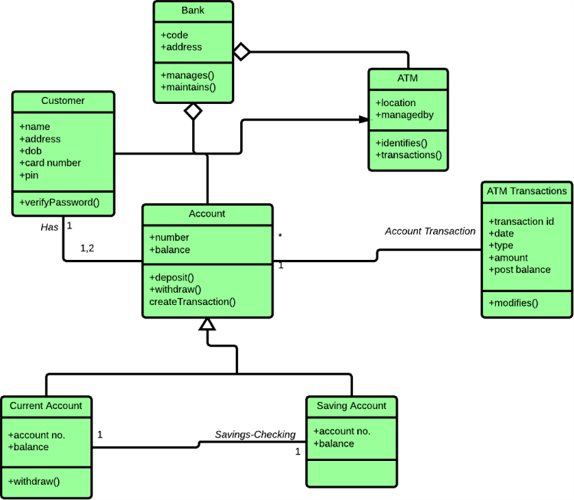
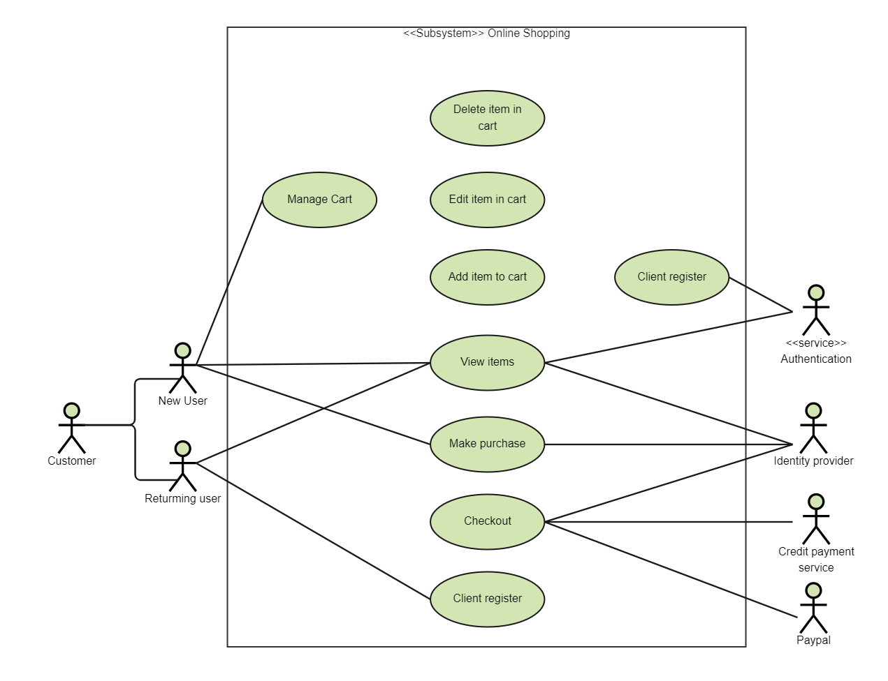

:lib: pass:quotes[_library_]
:libs: pass:quotes[_libraries_]
:fs: functies
:f: functie
:m: method
:icons: font
:source-highlighter: rouge
:rouge-style: thankful_eyes
:toc: left
:toclevels: 5
:sectnums:

= Inleiding tot UML =

Unified Modeling Language (UML) is een gestandaardiseerde modelleringstaal die wordt gebruikt om het ontwerp en de structuur van softwaresystemen te visualiseren, specificeren, construeren en documenteren. UML is essentieel voor softwareontwikkeling, omdat het helpt om complexe systemen eenvoudiger te begrijpen door abstractie en visuele representatie.

In dit hoofdstuk bespreken we de basisprincipes van UML, de meest gebruikte diagrammen en hoe ze worden toegepast in softwareontwikkeling.

== Wat is UML? ==

UML is ontworpen om een gemeenschappelijke taal te bieden voor ontwikkelaars, architecten en stakeholders.
Met UML kun je verschillende aspecten van een systeem modelleren, waaronder:

- **Structuur**: Hoe onderdelen van een systeem met elkaar in verbinding staan.
- **Gedrag**: Hoe een systeem reageert op gebeurtenissen en interacties.
- **Architectuur**: Overzicht van subsystemen en hoe ze samenwerken.

UML wordt breed ondersteund door tools zoals Pycharm[https://www.jetbrains.com/help/idea/class-diagram.html], Lucidchart, Eclipse modelling tools, enz.

== Waarom UML gebruiken? ==

UML is nuttig omdat het:

1. Complexiteit reduceert door systemen visueel weer te geven.
2. Teamleden helpt om hetzelfde mentale model van een systeem te delen.
3. De communicatie tussen technische en niet-technische stakeholders bevordert.
4. Softwareontwikkeling efficiënter maakt door ontwerp en documentatie te standaardiseren.

== Basiscomponenten van UML ==

UML maakt gebruik van symbolen en diagrammen om systemen te modelleren.
De belangrijkste componenten zijn:

1. **Actors**: Externe entiteiten zoals gebruikers of andere systemen.
2. **Objects**: Eenheden in een systeem, zoals klassen, modules of bestanden.
3. **Relationships**: Verwijzingen tussen entiteiten, zoals associaties, afhankelijkheden of generalisaties.

== UML Diagrammen ==

UML biedt 14 verschillende soorten diagrammen, verdeeld in twee hoofdgroepen:

=== 1. Structurele Diagrammen ===

Structurele diagrammen tonen de statische aspecten van een systeem.
Voorbeelden zijn:

- **Class Diagram**: Beschrijft klassen, attributen, methoden en hun relaties.
- **Component Diagram**: Toont de fysieke structuur van een systeem, zoals modules en bestanden.
- **Deployment Diagram**: Visualiseert de implementatie van een systeem op hardware.

=== 2. Gedragsdiagrammen ===

Gedragsdiagrammen tonen de dynamische aspecten van een systeem.
Voorbeelden zijn:

- **Use Case Diagram**: Laat zien hoe gebruikers (acteurs) met het systeem omgaan.
- **Sequence Diagram**: Beschrijft de interacties tussen objecten in chronologische volgorde.
- **Activity Diagram**: Geeft een overzicht van de workflow of logica van een proces.

== Voorbeeld: Class Diagram ==

Een class diagram wordt vaak gebruikt om de structuur van een systeem te visualiseren.
Hier is een eenvoudig voorbeeld:

[source, plaintext]
----
+------------------+
|    User          |
+------------------+
| - username: str  |
| - password: str  |
+------------------+
| + login(): bool  |
+------------------+
           |
           v
+------------------+
|    Admin         |
+------------------+
| - adminLevel: int|
+------------------+
| + deleteUser():  |
+------------------+
----

In dit voorbeeld:
- De klasse `User` heeft attributen `username` en `password`.
- `Admin` is een subklasse van `User` met een extra attribuut `adminLevel` en een methode `deleteUser`.

== Voorbeeld: Use Case Diagram ==

Een use case diagram toont hoe gebruikers met een systeem communiceren. Stel dat je een bibliotheeksysteem hebt:

[source, plaintext]
----
      +-------------+
      |   Librarian  |
      +-------------+
         /     \
        /       \
       v         v
+--------------+ +----------------+
| Add Book     | | Manage Members |
+--------------+ +----------------+
        \         /
         v       v
      +-------------------+
      |   Library System  |
      +-------------------+
----

Dit laat zien dat een bibliothecaris het systeem kan gebruiken om boeken toe te voegen of leden te beheren.

== Class Diagram Symbolen en Onderdelen ==

Een class diagram is een van de meest gebruikte diagrammen in UML en biedt een visuele weergave van klassen, hun attributen, methoden en de relaties tussen klassen. In dit hoofdstuk beschrijven we de verschillende symbolen en onderdelen van een class diagram, en hoe je deze kunt gebruiken.

=== Klassen en Attributen ===

Een klasse wordt weergegeven als een rechthoek met drie secties:

1. **Naam van de Klasse**: Bovenaan staat de naam van de klasse in vet of normale tekst.
2. **Attributen**: In het middelste gedeelte worden de eigenschappen (velden) van de klasse weergegeven.
3. **Methoden**: Onder attributen staan de functies (methoden) van de klasse.

**Voorbeeld:**

[source, plaintext]
----
+--------------------+
|    Student         |
+--------------------+
| - name: str        |
| - age: int         |
+--------------------+
| + getName(): str   |
| + setAge(age: int) |
+--------------------+
----

**Toelichting:**

- `-` (min-teken) voor `name` en `age` geeft aan dat deze attributen **privé** zijn.
- `+` (plus-teken) voor `getName()` en `setAge()` geeft aan dat deze methoden **publiek** toegankelijk zijn.
- **Attributen**: `name` is een tekstveld (`str`), en `age` is een integer.
- **Methoden**: `getName()` retourneert een string, en `setAge()` accepteert een integer als parameter.

=== Relaties tussen Klassen ===

Relaties tussen klassen worden weergegeven met lijnen en pijlen. Hier zijn enkele veelvoorkomende soorten relaties:

==== 1. Associatie ====

Een associatie wordt weergegeven als een rechte lijn tussen twee klassen. Het geeft aan dat de klassen samenwerken. De rol van de associatie kan met tekst worden aangegeven.

**Voorbeeld:**

[source, plaintext]
----
+------------------------+               +------------------+
|    Student             |               |    Course        |
+------------------------+               +------------------+
| - name: str            |               | - courseName: str|
| - age: int             |               | - courseCode: str|
+------------------------+               +------------------+
| + enroll(course): void |               | + getDetails(): str |
+------------------------+               +------------------+
          1                              *
          +-------------------------------> Enrolled in
----

**Toelichting:**

1. Klassen Student en Course:
- Attributen zoals name en age horen bij de Student-klasse.
- Attributen zoals courseName en courseCode horen bij de Course-klasse.
2. Methoden:
- Student heeft een enroll(course)-methode om zich in te schrijven voor een cursus.
- Course heeft een getDetails()-methode om details over de cursus op te halen.
3. Associatie:
- De pijl van Student naar Course toont een "1-to-many" relatie.
- De 1 naast Student betekent dat elke student zich kan inschrijven voor meerdere cursussen.
- De * naast Course betekent dat een cursus door meerdere studenten gevolgd kan worden.
4. Relatie "Enrolled in":
- De beschrijving "Enrolled in" verduidelijkt de aard van de associatie.

==== 2. Aggregatie ====

Aggregatie geeft een "heeft een"-relatie aan. Het wordt weergegeven met een open diamant aan één kant van de lijn.

**Voorbeeld:**

[source, plaintext]
----
+--------------------+       +--------------------+
|    Library         |<>-----|    Book            |
+--------------------+       +--------------------+
| - name: str        |       | - title: str       |
| - address: str     |       | - author: str      |
+--------------------+       +--------------------+
----

**Toelichting:**
- Een bibliotheek (`Library`) heeft meerdere boeken (`Book`).
- De open diamant aan de kant van `Library` geeft aan dat de bibliotheek eigenaar is van de boeken, maar de boeken kunnen onafhankelijk van de bibliotheek bestaan.

==== 3. Compositie ====

Compositie is een sterkere vorm van aggregatie. Het wordt weergegeven met een gevulde diamant. Als de "container"-klasse wordt verwijderd, worden de "ingesloten" objecten ook verwijderd.

**Voorbeeld:**

[source, plaintext]
----
+--------------------+       +--------------------+
|    House           |<<>>---|    Room            |
+--------------------+       +--------------------+
| - address: str     |       | - size: int        |
+--------------------+       +--------------------+
----

**Toelichting:**
- Als een `House` wordt verwijderd, worden de bijbehorende `Room`-objecten ook verwijderd.
- De gevulde diamant aan de kant van `House` geeft aan dat een kamer geen onafhankelijk bestaan heeft buiten het huis.

==== 4. Generalisatie/Erfenis ====

Generalistatie wordt weergegeven met een open pijl die wijst naar de superclass. Dit geeft aan dat een klasse eigenschappen en methoden erft van een andere klasse.

**Voorbeeld:**

[source, plaintext]
----
+--------------------+
|    Person          |
+--------------------+
| - name: str        |
| - age: int         |
+--------------------+
| + getName(): str   |
+--------------------+
         ^
         |
+--------------------+
|    Student         |
+--------------------+
| - studentID: str   |
| + enroll(): void   |
+--------------------+
----

**Toelichting:**
- `Student` is een subclass van `Person` en erft de attributen `name` en `age` en de methode `getName()`.

=== Multipliciteit ===

Multipliciteit geeft aan hoeveel objecten aan een relatie deelnemen. Dit wordt aangeduid met cijfers naast de relaties.

**Voorbeeld:**

[source, plaintext]
----
+--------------------+       +--------------------+
|    Teacher         | 1---* |    Class           |
+--------------------+       +--------------------+
----

**Toelichting:**
- De `1` geeft aan dat één leraar meerdere klassen (`*`) kan lesgeven.

=== Iteratief Gebruik van UML in Softwareontwikkeling

UML (Unified Modeling Language) is een hulpmiddel voor het ontwerpen en documenteren van software.
Het iteratief gebruik van UML betekent dat modellen gedurende de gehele levenscyclus van de software ##regelmatig worden bijgewerkt en verfijnd##.
Hier zijn enkele belangrijke aspecten:

==== 1. Initiële Analyse en Ontwerp
Tijdens de initiële fasen van een project helpt UML bij het visualiseren van de algemene structuur van het systeem.
- **Use Case Diagrammen** identificeren de vereisten en interacties tussen gebruikers en het systeem.
- **Class Diagrammen** definiëren de belangrijkste objecten en hun relaties.

==== 2. Gedetailleerd Ontwerp
In latere iteraties worden UML-diagrammen verder verfijnd:
- **Activity Diagrammen** tonen de workflows en logica van processen.
- **Sequence Diagrammen** modelleren de interacties tussen objecten in specifieke scenario's.

==== 3. Implementatie en Testing
UML ondersteunt tijdens de implementatie:
- **Component Diagrammen** helpen bij het plannen van de fysieke structuur van de software.
- **State Diagrammen** geven inzicht in de toestanden en overgangen van complexe objecten.

==== 4. Onderhoud en Uitbreidingen
Tijdens onderhoud en uitbreidingen worden UML-diagrammen geüpdatet om overeen te komen met de nieuwe of gewijzigde functionaliteit:
- Dit minimaliseert miscommunicatie binnen het team.
- Het maakt het eenvoudiger voor nieuwe teamleden om het systeem te begrijpen.

==== Belang van Iteratie
Door UML iteratief te gebruiken, wordt het ontwerp een levend document dat voortdurend evolueert.
Dit sluit beter aan bij agile methodologieën, waar aanpassingen aan het ontwerp en de specificaties vaak nodig zijn.
Dit iteratieve proces zorgt ervoor dat de UML-modellen altijd een nauwkeurige en actuele weergave van het systeem blijven.

== Tips voor Effectief Gebruik ==

1. Begin met eenvoudige diagrammen en voeg details toe naarmate je ontwerp vordert.
2. Gebruik consistente namen en notaties om verwarring te voorkomen.
3. Kies de juiste diagrammen voor je publiek: stakeholders hebben vaak baat bij use case diagrammen, terwijl ontwikkelaars meer waarde halen uit class en sequence diagrammen.

== Enkele voorbeelden ==

.Een klasse diagram

.Een use case diagram

.Deployment diagram
image::images/deployment-diagram.png[]

== Conclusie ==

UML is een krachtig hulpmiddel voor softwareontwikkeling en helpt bij het plannen, begrijpen en communiceren van de architectuur en het ontwerp van een systeem.
Door de juiste diagrammen te gebruiken, kun je complexe systemen op een heldere en gestructureerde manier weergeven.

