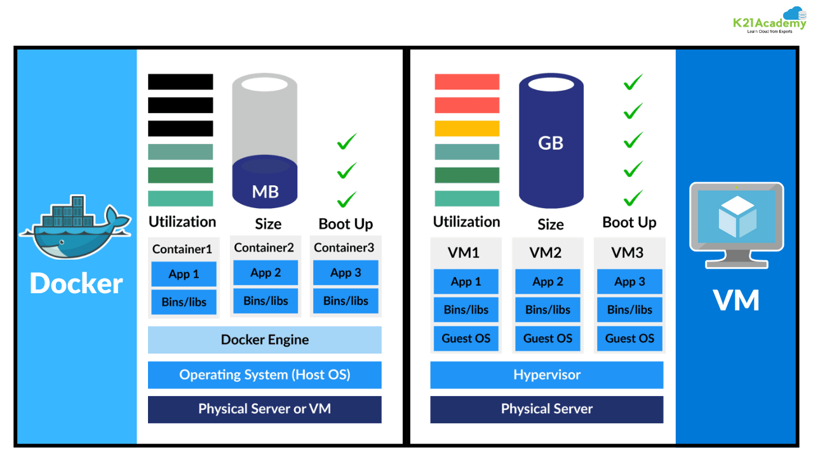

:lib: pass:quotes[_library_]
:libs: pass:quotes[_libraries_]
:fs: functies
:f: functie
:m: method
:icons: font
:source-highlighter: rouge
:rouge-style: thankful_eyes
:toc: left
:toclevels: 5
:sectnums:

= Hoofdstuk: DevOps en Docker

== Inleiding tot DevOps

DevOps is een samenvoeging van "Development" (ontwikkeling) en "Operations" (systeembeheer). 
Het doel van DevOps is om de samenwerking tussen ontwikkelaars en IT-operations te verbeteren door processen te automatiseren en continu te integreren en implementeren (CI/CD). 
DevOps streeft naar snellere levering van software met een hogere betrouwbaarheid.

DevOps is geen technologie op zich, maar eerder een cultuur en manier van werken, ondersteund door tools. Een van die tools is Docker.

== Wat is Docker?

Docker is een platform waarmee je applicaties verpakt in containers. 
Een container is een lichtgewicht, draagbare eenheid die alles bevat wat een applicatie nodig heeft om te draaien: code, runtime, libraries en configuratie.

Containers draaien consistent op elk systeem dat Docker ondersteunt – of dat nu een lokale laptop is, een server in het datacenter of een cloudomgeving.

=== Verschil tussen Docker en Virtual Machines

Docker en virtuele machines (VM's) zorgen beide voor isolatie van software, maar op een andere manier.

Een **VM** emuleert een ##volledige computer, inclusief besturingssysteem##. Elke VM draait bovenop een hypervisor en bevat zijn eigen OS, wat zorgt voor zware resourceconsumptie.

Docker gebruikt **containers**, die de ##kernel van het host-besturingssysteem delen##. Alleen de applicatie en haar afhankelijkheden worden geïsoleerd. Dit maakt containers **lichter**, **sneller opstartend** en **efficiënter** in resourcegebruik dan VM's.

Kort samengevat:

[cols="1,1"]
|===
| **Docker (containers)** | **Virtuele Machines (VM's)**
| Lichtgewicht         | Zwaar, inclusief OS
| Snelle opstart       | Trage opstart
| Deelt OS-kernel      | Volledig OS per VM
| Efficiënt in gebruik | Meer resourceverbruik
|===

Docker is ideaal voor snelle ontwikkeling en schaalbaarheid.
VM’s zijn geschikt als je volledige OS-isolatie nodig hebt (bijv. verschillende OS’en op één host).

=== Voordelen van Docker

- **Portabiliteit**: Containers draaien hetzelfde op elk platform.
- **Snelle deploys**: Containers starten snel op.
- **Isolatie**: Elke container draait in zijn eigen omgeving.
- **Versiebeheer**: Docker-images zijn versieerbaar en reproduceerbaar.
- **Schaalbaarheid**: Containers kunnen eenvoudig gerepliceerd en geschaald worden.

== Docker installeren

=== Op Linux

[source, shell]
----
sudo apt update
sudo apt install docker.io
sudo systemctl enable --now docker
----

=== Op Windows / macOS

Bezoek https://www.docker.com/products/docker-desktop/ en download Docker Desktop.

== Docker gebruiken

=== Een eenvoudige container draaien

[source, shell]
----
docker run hello-world
----

Deze container test of Docker correct werkt.

=== Interactieve shell starten in een Ubuntu-container

[source, shell]
----
docker run -it ubuntu /bin/bash
----

Hier krijg je een shell in een geïsoleerde Ubuntu-omgeving.

== Docker Images en Dockerfiles

Docker maakt gebruik van "images", vooraf gebouwde sjablonen voor containers.

=== Wat is een Dockerfile?

Een *Dockerfile* is een tekstbestand met instructies die beschrijven hoe een Docker image moet worden opgebouwd.

Je kan het vergelijken met een recept: het beschrijft stap voor stap welke software, configuraties en bestanden in een image terechtkomen.

Docker gebruikt dit bestand om automatisch een image te bouwen via het commando `docker build`.

Elke regel in een Dockerfile is een instructie, bijvoorbeeld:

- `FROM`: bepaalt het startpunt, meestal een bestaande basisimage zoals `python`, `ubuntu`, of `postgres`.
- `COPY`: kopieert bestanden van je lokale systeem naar de container.
- `RUN`: voert commando’s uit tijdens het bouwen van de image (bijv. installeren van pakketten).
- `ENV`: stelt omgevingsvariabelen in (zoals gebruikersnamen of paden).
- `CMD` of `ENTRYPOINT`: bepaalt welk commando wordt uitgevoerd als de container wordt opgestart.

Een eenvoudige Dockerfile voor een Python-script kan er bijvoorbeeld zo uitzien:

[source, dockerfile]
----
FROM python:3.10
COPY script.py /app/script.py
WORKDIR /app
CMD ["python", "script.py"]
----

Deze image bevat Python, kopieert een script en voert het uit wanneer de container start.

Dockerfiles maken het dus mogelijk om je omgeving consistent, herhaalbaar en deelbaar te maken — ideaal voor zowel ontwikkeling als productie.

=== Wat is Docker Hub?

*Docker Hub* is een publieke online dienst van Docker waar je Docker images kan *opslaan*, *delen* en *downloaden*.

Het is vergelijkbaar met GitHub, maar dan specifiek voor Docker images.

Je kan Docker Hub gebruiken om:

- Images te downloaden van andere ontwikkelaars of bedrijven.  
- Je eigen images te uploaden en te delen met anderen.  
- Automatische builds te configureren vanaf Git-repositories.  
- Openbare of privé-repositories aan te maken.  

==== Publieke images gebruiken

Docker Hub bevat duizenden publieke images, bijvoorbeeld:

[source, bash]
----
docker pull python
docker pull postgres
----

Deze commando’s halen de officiële images van Python en PostgreSQL op.

Daarna kan je ze meteen gebruiken om containers te starten:

[source, bash]
----
docker run -it python
docker run -e POSTGRES_PASSWORD=mypassword postgres
----

Docker Hub is dus een centrale plek voor samenwerking, distributie en hergebruik van containers.

=== Voorbeeld: Dockerfile voor een PostgreSQL database

Om een PostgreSQL-database te draaien met Docker, is het niet nodig om een Dockerfile zelf te schrijven, omdat er al een officiële PostgreSQL-image beschikbaar is op **Docker Hub**. Maar als je toch een eigen configuratie wil opzetten (bijvoorbeeld met extra scripts of instellingen), kan je onderstaande `Dockerfile` gebruiken als uitgangspunt.

[source, dockerfile]
----
# Gebruik de officiële PostgreSQL image als basis
FROM postgres:15

# Stel omgeving variabelen in
ENV POSTGRES_USER=admin
ENV POSTGRES_PASSWORD=geheim
ENV POSTGRES_DB=voorbeeld_db

# Voeg optioneel een SQL-initiatiescript toe
# Deze worden automatisch uitgevoerd bij de eerste keer opstarten van de container
COPY init.sql /docker-entrypoint-initdb.d/
----

In dit voorbeeld:

- `FROM postgres:15` gebruikt versie 15 van de officiële PostgreSQL Docker image.
- `ENV` stelt variabelen in zoals de gebruikersnaam, het wachtwoord en de standaarddatabase.
- `COPY` plaatst een SQL-bestand in de juiste map zodat het automatisch wordt uitgevoerd bij het opstarten van de database (bijv. voor tabellen aanmaken of data importeren).

==== init.sql voorbeeld

Als je een eenvoudig SQL-script wil gebruiken om een tabel aan te maken, kan je dit plaatsen in `init.sql`:

[source, sql]
----
CREATE TABLE leerlingen (
    id SERIAL PRIMARY KEY,
    naam TEXT NOT NULL,
    leeftijd INT
);
----

Wanneer je deze container start, zal PostgreSQL automatisch deze tabel aanmaken in de opgegeven database.

==== Container starten met Docker

image::images/what-is-docker-container-1024x354.avif[width:640]

Zorg dat je Dockerfile en `init.sql` in dezelfde map staan, en voer vervolgens uit:

[source, bash]
----
docker build -t mijn-postgres .
docker run -d -p 5432:5432 --name postgres-db mijn-postgres
----

Nu draait je eigen PostgreSQL-container met een vooraf ingestelde gebruiker en database.

== Volumes

Een volume is opslag buiten de container, zodat gegevens behouden blijven als de container verdwijnt.

[source, shell]
----
docker run -v /mijn/host/pad:/app/data mijn-python-app
----

== Poorten mappen

Wanneer je een webserver draait in Docker, moet je een poort openen.

image::images/dockerportmapping.webp[]

Wanneer een Docker-container een service aanbiedt (zoals een webserver of database), draait die service *binnenin* de container, op een interne poort (bijvoorbeeld 80 of 5432).

Om die service bereikbaar te maken vanaf je eigen computer, moet je een *poort van je host* koppelen aan een *poort in de container*.  
Dit doe je met *port mapping* via de `-p` vlag:

[source, bash]
----
docker run -p 8080:80 nginx
----

In dit voorbeeld:

- `80` is de poort *in de container* waarop de Nginx webserver draait.
- `8080` is de poort *op je computer (de host)* waar je naar surft.

Resultaat:  
Je kan nu surfen naar `http://localhost:8080` om de Nginx server in de container te zien.

Je kan meerdere port mappings opgeven met meerdere `-p` vlaggen. Bijvoorbeeld:

[source, bash]
----
docker run -p 8080:80 -p 8443:443 myserver
----

Let op: zorg ervoor dat de gekozen host-poorten niet al in gebruik zijn op je systeem.

== DevOps, CI/CD en de rol van Docker

=== Wat is DevOps?

DevOps is een combinatie van "Development" (ontwikkeling) en "Operations" (beheer).  
Het is een werkwijze die teams helpt om sneller en efficiënter software te ontwikkelen, testen en uit te rollen.  
In plaats van dat ontwikkelaars software bouwen en die dan overdragen aan een apart team voor installatie, werken beide teams samen als één geheel.

Het doel van DevOps is:
- Snellere leveringen van nieuwe softwareversies
- Minder fouten in productie
- Meer automatisatie van processen zoals testen, bouwen en uitrollen

=== Wat is CI/CD?

CI/CD staat voor:

*Continuous Integration (CI)*  
CI betekent dat ontwikkelaars regelmatig (soms meerdere keren per dag) hun code samenvoegen in een centrale code-opslagplaats (zoals GitHub of GitLab).  
Elke keer dat nieuwe code wordt toegevoegd, wordt automatisch:
- De applicatie opgebouwd (build)
- Tests uitgevoerd

*Continuous Delivery / Deployment (CD)*  
Bij CD wordt de geteste code automatisch uitgerold naar een staging- of productieomgeving.  
Er is dus geen handmatig tussenkomen meer nodig om software te installeren.

CI/CD zorgt voor:
- Snelle feedback als er iets fout zit in de code
- Automatische installaties en updates
- Betrouwbare en voorspelbare releases

=== De rol van Docker in DevOps

Docker is onmisbaar geworden binnen DevOps en CI/CD.  
Het maakt het mogelijk om een volledige applicatie, inclusief afhankelijkheden, te verpakken in een **container**.  
Zo'n container draait overal hetzelfde: op de computer van de ontwikkelaar, in de testomgeving én in productie.

Voordelen:
- Geen problemen meer met "werkt op mijn machine"
- Containers starten snel en zijn licht
- Makkelijk te automatiseren in CI/CD-pijplijnen

=== Voorbeeld: CI/CD met Docker

Een typische CI/CD-pijplijn met Docker werkt zo:

1. De ontwikkelaar pusht code naar GitHub
2. De CI-server (bijv. GitHub Actions, GitLab CI, Jenkins) voert automatisch deze stappen uit:
   - Docker-image bouwen met de nieuwe code
   - Tests uitvoeren in de container
   - Image uploaden naar Docker Hub (of andere registry)
   - Container uitrollen naar productie (bijv. met Kubernetes)

=== Samenvatting

- **DevOps** is een samenwerking tussen ontwikkeling en beheer.
- **CI/CD** automatiseert het testen en uitrollen van software.
- **Docker** zorgt ervoor dat code betrouwbaar en consistent draait, en maakt automatisatie via CI/CD eenvoudiger.
- Samen vormen deze technologieën de basis van moderne softwareontwikkeling.

Met Docker, CI/CD en DevOps kun je sneller software leveren, betrouwbaarder testen en eenvoudiger beheren.

== Nadelen van Docker

- Complexiteit bij grote projecten.
- Beveiliging als containers verkeerd geconfigureerd zijn.
- Leercurve voor beginners.

== Besluit

Docker is een essentiële tool binnen de moderne DevOps-wereld. Het zorgt voor consistente, snelle en schaalbare deployments. 
Voor wie wil werken aan cloud-native apps of microservices, is kennis van Docker onmisbaar.
