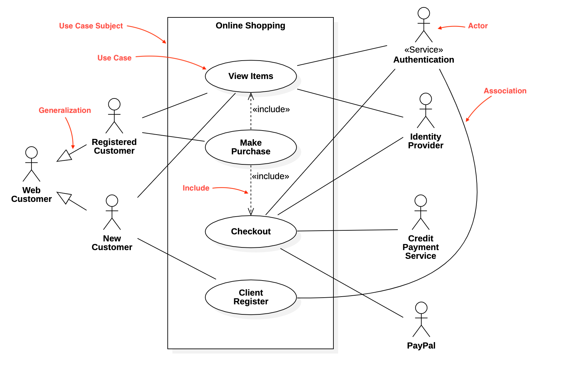
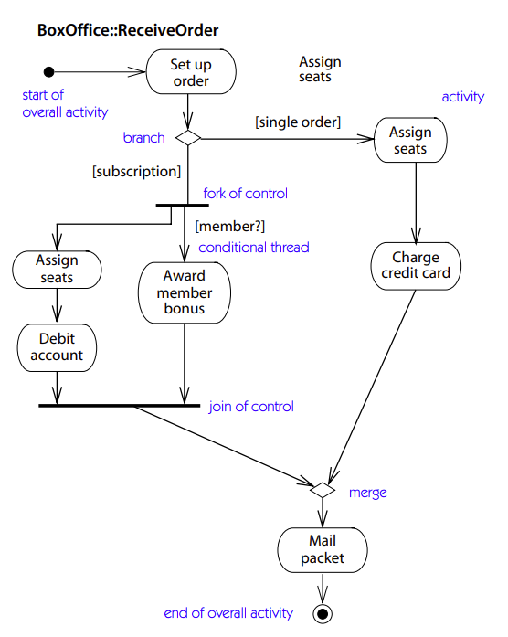
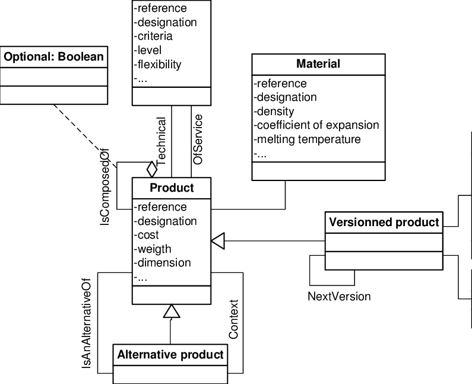
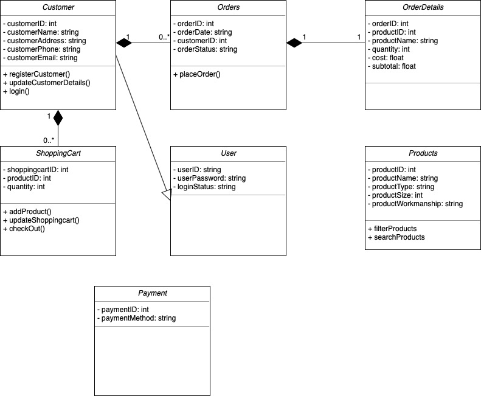

= Analyse in programmeren en UML

== Introductie

Analyse is een fase in het software-ontwikkelingsproces die voorafgaat aan het programmeren. Voor iedere nieuwe aanpassing aan een software, kan er telkens opnieuw een analyse (of aanpassing aan de bestaande analyse) plaatsvinden. 

Het analyseproces omvat:

. **Het begrijpen van de behoeften van de klant**: De eerste stap in analyse is het begrijpen van wat de klant wil. Dit kan worden gedaan door interviews, focusgroepen en het analyseren van documenten.
. **Het definiëren van de functionaliteit van het te ontwikkelen softwaresysteem.**: Dit omvat het identificeren van de functies die het systeem moet kunnen uitvoeren en de gegevens die het moet verwerken.
. **Het vastleggen van de systeemvereisten.**: De systemvereisten zijn de specificaties waaraan het softwaresysteem moet voldoen. Deze specificaties omvatten de functionele en niet-functionele vereisten, zoals prestaties, beveiliging en bruikbaarheid.

UML (Unified Modeling Language) is een visuele taal die kan worden gebruikt om de analyse van software te modelleren. Met UML wordt de software schematisch voorgesteld.

== UML-diagrammen voor analyse

Er zijn verschillende UML-diagrammen die kunnen worden gebruikt om de analyse van software te modelleren. Enkele van de meest gebruikte diagrammen zijn:

. **Use Case diagrammen**: Use Case diagrammen worden gebruikt om de functionaliteit van het te ontwikkelen softwaresysteem te modelleren. Ze tonen de interactie tussen de gebruikers en het systeem.
+

+
Voorbeeld Use Case diagram - Calculator:
+
[code,UML]
----
UseCase: Getal invoeren

Acteurs:
  - Gebruiker

Doel:
  - De gebruiker kan een getal ingeven.

Preconditions:
  - De calculator is geopend.

Flow of events:
  1. De gebruiker voert een getal in.
  2. De calculator slaat het getal op.

Postconditions:
  - Het getal is ingevoerd en opgeslagen.
----
+
. **Activitydiagrams**: Activiteitendiagrammen worden gebruikt om de workflow van het softwaresysteem te modelleren. Ze tonen de stappen die moeten worden genomen om een ​​taak te voltooien.
+
Voorbeeld Activiteitendiagram - Berekening uitvoeren:
+

+
[code,UML]
----
Activiteitendiagram: Berekening uitvoeren

Start: Start berekening

Activiteiten:
  1. Getal 1 invoeren
  2. Getal 2 invoeren
  3. Operator selecteren
  4. Berekening uitvoeren
  5. Resultaat weergeven

Eind: Berekening voltooid
----
+
. **Klassendiagrammen**: Klassendiagrammen worden gebruikt om de structuur van het softwaresysteem te modelleren. Het toont de klassen die in het systeem worden gebruikt, hun attributen, operaties en de relaties tussen deze klassen. 
+

Elementen van een klassendiagram:

. Klasse: Een rechthoek die een klasse in het softwaresysteem representeert.
. Attribuut: Een variabele die tot een klasse behoort.
. Operatie: Een functie die door een klasse wordt uitgevoerd.
. Relatie: Een verbinding tussen twee klassen die een semantische betekenis heeft.

Voorbeeld Klassendiagram - Calculator:

[code,UML]
----
Klasse: Calculator

Attributen:
  - Eerste getal
  - Tweede getal
  - Operator
  - Resultaat

Operaties:
  - Bereken()

Relaties:
  - Gebruikt (Gebruiker, Calculator)
----

=== Relaties tussen klassen

Er zijn verschillende soorten relaties tussen klassen:

**Associatie**: Een associatie is een verbinding tussen twee klassen die een associatie tussen objecten van die klassen representeert.
Voorbeeld:

[code,UML]
----
Klasse: Klant

Attributen:
  - Naam
  - Adres

Operaties:
  - Bestellen()

Relaties:
  - Bestelt (Klant, Bestelling)
----

**Aggregatie**: Een aggregatie is een speciale vorm van associatie waarbij een klasse (het geheel) een andere klasse (het deel) bevat.
Voorbeeld:

[code,UML]
----
Klasse: Bestelling

Attributen:
  - Bestelnummer
  - Datum

Operaties:
  - Toevoegen(Product)

Relaties:
  - Bevat (Bestelling, Bestelregel)
----

**Compositie**: Een compositie is een sterke aggregatie waarbij het deel niet kan bestaan zonder het geheel.

[code,UML]
----
Voorbeeld:

Klasse: Bestelregel

Attributen:
  - Aantal
  - Prijs

Operaties:
  - GetProduct()

Relaties:
  - Bestaat uit (Bestelling, Bestelregel)
----

Uitgebreid voorbeeld:

[code,UML]
----
Klasse: Klant

Attributen:
  - Naam
  - Adres

Operaties:
  - Bestellen()

Relaties:
  - Bestelt (Klant, Bestelling)

Klasse: Bestelling

Attributen:
  - Bestelnummer
  - Datum

Operaties:
  - Toevoegen(Product)

Relaties:
  - Bevat (Bestelling, Bestelregel)
  - Geleverd door (Bestelling, Leverancier)

Klasse: Product

Attributen:
  - Naam
  - Omschrijving
  - Prijs

Operaties:
  - Bestellen()

Relaties:
  - Bevat (Bestelling, Bestelregel)

Klasse: Bestelregel

Attributen:
  - Aantal
  - Prijs

Operaties:
  - GetProduct()

Relaties:
  - Bestaat uit (Bestelling, Bestelregel)

Klasse: Leverancier

Attributen:
  - Naam
  - Adres

Operaties:
  - Leveren(Bestelling)

Relaties:
  - Geleverd door (Bestelling, Leverancier)

----

Dit klassendiagram toont de structuur van een eenvoudig e-commercesysteem. Het bevat de volgende klassen:

. Klant: De klant die een bestelling plaatst.
. Bestelling: De bestelling die door de klant is geplaatst.
. Product: Het product dat is besteld.
. Bestelregel: De regel in de bestelling die het product en de hoeveelheid bevat.
. Leverancier: De leverancier die het product levert.

De relaties tussen de klassen zijn:

. Bestelt: Een klant kan een bestelling plaatsen.
. Bevat: Een bestelling bevat een of meer bestelregels.
. Geleverd door: Een bestelling wordt geleverd door een leverancier.
. Bestaat uit: Een bestelling bestaat uit een of meer bestelregels.

== Conclusie

UML kan worden gebruikt om de analyse van software te modelleren en te communiceren over ontwerp van software. 
Het gebruik van UML kan helpen om de kwaliteit van de software te verbeteren en de ontwikkelingsproces efficiënter te maken.