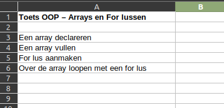
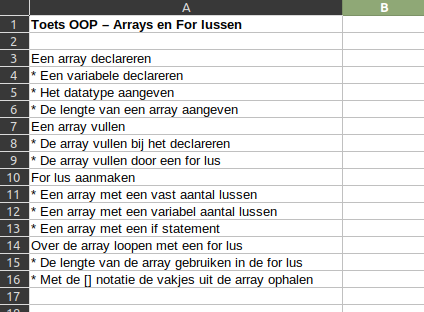
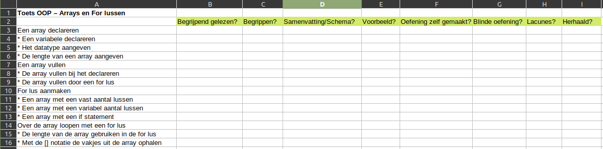
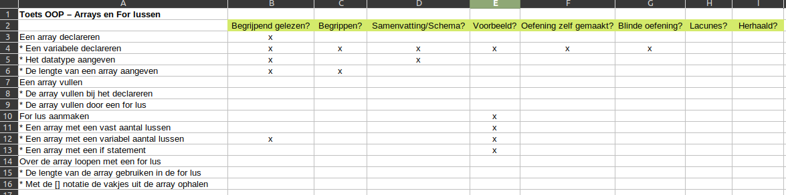
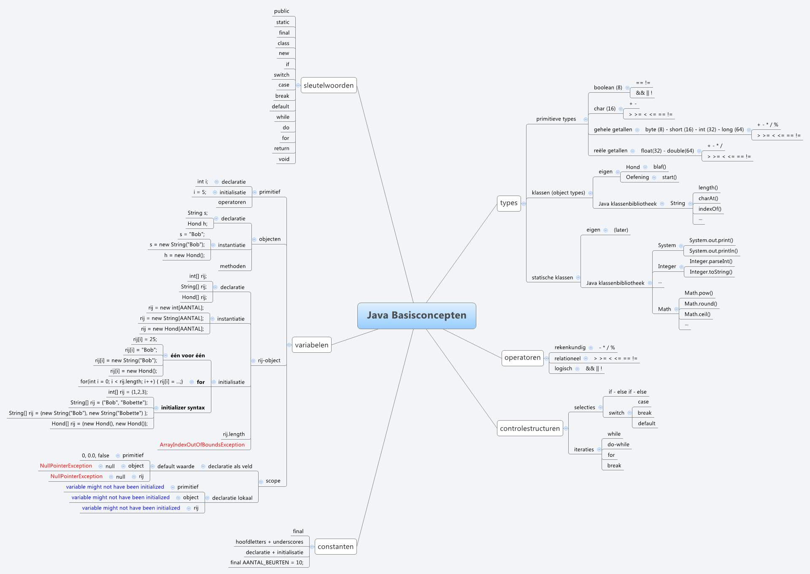
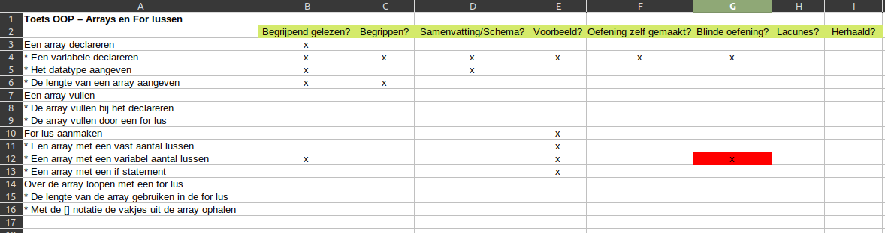

:lib: pass:quotes[_library_]
:libs: pass:quotes[_libraries_]
:j: Java
:fs: functies
:f: functie
:m: method
:icons: font
:source-highlighter: rouge

//ifdef::env-github[]
:tip-caption: :bulb:
:note-caption: :information_source:
:important-caption: :heavy_exclamation_mark:
:caution-caption: :fire:
:warning-caption: :warning:
//endif::[]

= Hoe studeren voor de informaticavakken?
//Author Mark Nuyts
//v0.1
:toc: left
:toclevels: 4

Bij het studeren van informaticavakken is het van belang de theorie te *begrijpen* en deze te kunnen *toepassen* in de praktijk.
De theorie louter van buiten leren zal je onvoldoende inzicht geven om de oefeningen goed te kunnen aanvatten.

We gaan het studieproces opsplitsen in enkele stappen: 

[TIP]
====
Het kan zijn dat jij dit impliciet al toepast, of dat bepaalde stappen je overbodig lijken. Dit is geen probleem indien je huidige systeem al voor je werkt. Indien dit niet het geval is (of je wilt het eens op een andere manier proberen), raad ik je aan deze methode eens te proberen.
====

.Het opsplitsen van het leerproces in verschillende stappen.
. Een overzicht van de leerstof maken
    .. Lijst van te kennen onderwerpen
    .. De categoriën van beheersing aangeven
. Begrijpend lezen
    .. Onbekende begrippen aanduiden
    .. De onbekende begrippen opzoeken
    .. Een schema of samenvatting maken van de theorie
        ... MindMap
        ... Samenvatting
. Een voorbeeld van een toepassing analyseren
    .. Een conceptueel schema maken
    .. De code regel per regel volgen
. De leerstof zelf toepassen (oefeningen __her__maken)
    .. Met te kijken naar een voorbeeld
    .. Zonder een voorbeeld te gebruiken
    .. Herhalen van vorige oefeningen
. Jezelf testen
    .. De onbekende begrippen nagaan
    .. Blind (zonder voorbeeld) een oefening maken
    .. Lacunes aanduiden en herhalen

== Overzicht van de leerstof

Voor iedere toets of examen zal de leerkracht aangeven wat de te kennen leerstof is. Van hieruit gaan we vertrekken om het overzicht vorm te geven.

[NOTE]
====
Om het overzicht vorm te geven, gebruik ik Excel. Je kan dit echter ook op papier of in een andere software neerschrijven.
====

=== Lijst van te kennen onderwerpen

Om ons overzicht vorm te geven, plaatsen we in een kolom de opgegeven onderwerpen:

Dit overzicht is nog niet getailleerd genoeg en kan je als leerling zelf verder #opsplitsen# door onder ieder onderwerp enkele regels bij te maken die specifieker zijn:

Het bovenstaande #opsplitsen# van de leerstof kan je toepassen #wanneer je de leerstof voor de eerste keer aan het lezen bent#.

=== De categoriën van beheersing aangeven

Nu we een overzicht hebben van #wat# we juist moeten kennen, geven we best ook nog aan #op welke manier we de leerstof beheersen#.
Dit doen we door enkele kolommen toe te voegen die aangeven hoe we de leerstof al behandeld hebben:

* Begrijpend gelezen?
* Onbekende begrippen opgezocht?
* Schema of samenvatting gemaakt/aangevuld?
* Voorbeeld nagekeken?
* Oefening met voorbeeld gemaakt?
* Oefening zelf gemaakt?
* Lacunes aangeduid?
* Herhaald?

Vervolgens ziet het overzicht er zo uit:

Met x'jes kunnen we makkelijk #aanduiden wat we al gedaan hebben (= beheersen)# en hoe ver we zitten in het leerproces:

Indien je overal vinkjes hebt staan (en je eerlijk bent geweest tegenover jezelf) kan je er wel van uitgaan dat je goed bent voorbereid op de toets of het examen.

[IMPORTANT]
====
Met kruisjes kan je aanduiden wat je volledig beheerst, met een '?' wat nog niet duidelijk is, met een aantal vinkjes 'xx' hoe duidelijk een oefening voor je was, enz.
====

== Begrijpend lezen

Voor de toets of het examen heeft de leerkracht een onderwerp (of hoofdstuk/pagina) opgegeven. 
Deze leerstof kan je vervolgens nalezen in de cursus of verder opzoeken op bijvoorbeeld w3schools.
Bij het begrijpend lezen is het belangrijk dat je niet louter de tekst leest, maar dat je #de gedachtengang van de tekst volgt en tracht te begrijpen#.

=== Onbekende begrippen

Tijdens het lezen hou je een lijstje bij van de verschillende #begrippen# in de tekst die je niet duidelijk zijn.
Dit lijstje #zoek je vervolgens op# ( in de cursus, of op het internet, of door het aan de leerkracht te vragen).
Indien je de uitleg gevonden (en begrepen) hebt, noteer je deze naast het begrip in kwestie.

Tijdens het begrijpend lezen kan je een schema (mindmap) of een samenvatting bijhouden.

=== MindMap

Een mindmap is een #schema# dat zich per onderwerp opsplitst in onderliggende onderwerpen:

Je kan een dergelijk schema maken op papier of in software. Freemind is een gratis mindmapping software die je kan downloaden: http://freemind.sourceforge.net/wiki/index.php/Download[Freemind software]

=== Samenvatting

Bij het maken van een samenvatting over een onderwerp of een tekst, is het belangrijk dat je #zo kort mogelijk, maar toch nog duidelijk#, neerschrijft waar de tekst juist over gaat.
Meer informatie: https://www.ting.nl/huiswerkcoaching/leren-leren/hoe-maak-ik-een-samenvatting[Hoe een samenvatting maken].

== Een voorbeeld analyseren

Bij ieder onderwerp van de leerstof heb je in de les, op w3schools, of bij het zelfstandig maken van een oefening, #een voorbeeld van een toepassing van de theorie# gezien. Haal dit voorbeeld erbij om het te bestuderen.

Indien het onderwerp bijvoorbeeld 'het lussen over een array' was, hebben we het volgende voorbeeld:

[source,java]
----
int[] getallen = new int[];

public void lusOverDeArray(){

    for (int i = 0; i < getallen.length; i++) {
        System.out.println(getallen[i]);
    }

}
----

=== Conceptueel schema

Om het voorbeeld te analyseren, gaan we eerst nagaan wat het voorbeeld juist wil doen of welke stappen het onderneemt. Dit kunnen we in een #schema of stappenplan# plaatsen. In het bovenstaande voorbeeld:

. Een array aanmaken
. In een functie
    .. Een variabele for lus aanmaken
    .. Ieder element uit de array naar de console afprinten

=== De code regel per regel volgen

Met het schema (of doel van het voorbeeld voor ogen), kunnen we de code regel per regel nagaan en voor onzelf noteren wat de code juist doet:

[source,java]
----
int[] getallen = new int[]; <1>

public void lusOverDeArray(){ <2>

    for (int i = 0; <3>
         i < getallen.length;<4>
                 i++) { <5>
        System.out.println( <6>
            getallen[i] <7>
            );
    }

}
----
<1> Een nieuwe array declareren met het int datatype.
<2> Een functie aanmaken zonder return type (void).
<3> Een for lus beginnen vanaf 0
<4> Het eindpunt van de for lus aangeven -> zo lang als de array is.
<5> De lus naar de volgende stap brengen na elke uitvoering.
<6> Printen naar de console.
<7> Een getal uit de array selecteren, we gebruiken hier i omdat dit het variabele getal is in de for lus.

#Zorg ervoor dat elke stap in de _code_ duidelijk voor je is#. Dat je goed begrijpt waarom deze _code_ nodig (of overbodig) is in het programma of voorbeeld.

== Zelf een oefening maken

Nu je de theorie hebt doorgenomen en een voorbeeld hebt nagekeken, ben je klaar om zelf een oefening te maken.

=== Met voorbeeld

Een eerste oefening maken we met een voorbeeld langst ons. Kijk gerust naar het voorbeeld indien je niet weet hoe je verder kan. Bekijk eventueel de code van het voorbeeld opnieuw regel per regel.

=== Zonder voorbeeld

Indien het je gelukt is een oefening te maken met het voorbeeld langst je, probeer het dan nu een keer zonder voorbeeld (zonder naar oude oefeningen te gaan kijken).

Het is belangrijk dat je:

. #Weet wat de opdracht is# (wat wil je juist gaan doen)
. #De stappen oplijst# die je nodig hebt om het gedaan te krijgen:
.. Een array aanmaken
.. Een functie aanmaken
.. Een lus aanmaken
.. Enz.

[IMPORTANT]
====
Indien het niet lukt, kan je gerust opnieuw naar het voorbeeld kijken, maar weet dat je deze stap (de oefening kunnen maken zonder voorbeeld) dan nog niet tot een goed einde hebt gebracht.
====

== Jezelf testen

Indien je een schema of samenvatting en enkele oefening hebt gemaakt, kan je jezelf nog eens testen. Indien je toch nog #onduidelijkheden vaststelt# of een variatie van de #oefening niet zelfstandig kan maken# zou je de leerstof #opnieuw moeten herhalen#.

=== De onbekende begrippen nagaan

Ken je alle begrippen nog? Dek je verklarende uitleg van de onbekende begrippen af: #Kan je elk begrip aan jezelf uitleggen#?

=== Een variatie van een oefening maken

Neem de opgave van een oefening voor je: #Maak de oefening nogmaals vanaf 0# (of verzin er een variatie op). Lukt het om de oefening blind (zonder voorbeeld) te maken?

== Lacunes aanduiden en herhalen

Indien je vaststelt dat je enkele begrippen toch nog niet volledig kent, of de oefeningen errond niet blind kan maken: duid dit dan aan in het overzichtsschema!

Bijvoorbeeld:

.Het maken van de for lus met de variabele lengte van de array lukt niet.

Volgens dit voorbeeld lukte het niet een for lus te maken die rekening houdt met de lengte van een array. Deze leerstof zou vervolgens herhaald moeten worden.
