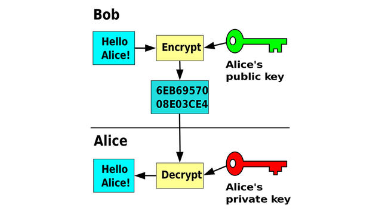
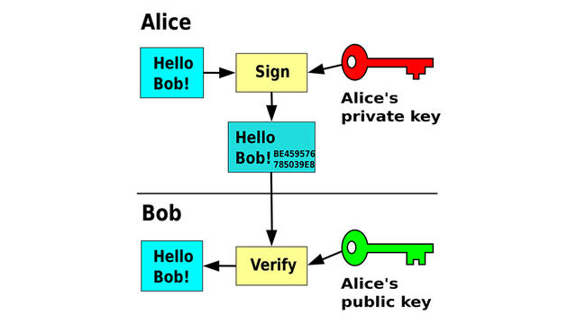

:lib: pass:quotes[_library_]
:libs: pass:quotes[_libraries_]
:j: Java
:fs: functies
:f: functie
:m: method
:source-highlighter: rouge
:icons: font

//ifdef::env-github[]
:tip-caption: :bulb:
:note-caption: :information_source:
:important-caption: :heavy_exclamation_mark:
:caution-caption: :fire:
:warning-caption: :warning:
//endif::[]

= Symetrische en asymetrische encryptie
//Author Mark Nuyts
//v0.1
:toc: left
:toclevels: 4

Bij encryptie of versleuteling wordt een boodschap (de ‘plaintext’) op zo’n manier gecodeerd dat alleen iemand met de juiste sleutel de oorspronkelijke boodschap kan decoderen.
De versleutelde versie van de boodschap wordt ook wel ‘ciphertext’ genoemd. 
Wie de ciphertext dus weer in de oorspronkelijke boodschap wil omzetten (dat proces heet ‘decryptie’), heeft de sleutel nodig.
De sleutel is in principe een willekeurig getal. 
In de praktijk maken we gebruik van een wachtwoord en dus wordt het wachtwoord via een ‘key derivation function’ eerst omgezet naar een willekeurig getal dat dan als sleutel dient.

Er bestaan diverse manieren om die versleuteling uit te voeren. 
Zo’n manier heet een encryptie-algoritme of ‘cipher’. 
De Nederlandse taalkundige en cryptograaf Auguste Kerckhoffs stelde al in de 19de eeuw een belangrijk ontwerpprincipe op: een encryptie-algoritme moet zelfs veilig zijn als alle details van het systeem publiek bekend zijn, behalve de sleutel. 
Dit principe van Kerckhoffs is anno 2020 nog altijd even belangrijk voor de veiligheid van een encryptie-algoritme.

Als iemand je dus wil overtuigen om een propriëtair, topgeheim encryptiesysteem te gebruiken, loop er dan maar in een wijde boog omheen. 
De enige verantwoorde keuzes voor encryptiesystemen zijn algoritmes waarvan de specificatie openbaar is, waarvan de ontwikkeling in open commissies gebeurt en waarvan opensource implementaties bestaan.

De diverse encryptie-algoritmes zijn in twee groepen onder te verdelen: 

* Symmetrische 
* Asymmetrische

== Symmetrische encryptie

Bij die eerste (‘symmetric-key encryption’) gebeuren de encryptie en decryptie met dezelfde sleutel. 
Een voorbeeld van zo’n algoritme is AES (Advanced Encryption Standard). 
Bijna alle programma’s die tegenwoordig symmetrische encryptie aanbieden, doen dat met AES. 
Zo ook BitLocker in Windows, FileVault in macOS en LUKS (Linux Unified Key Setup) in Linux.

Algoritmes voor **symmetrische encryptie werken doorgaans snel**.

Enkele voorbeelden hiervan zijn:

* DES (Data Encryption Standard)
+
https://nl.wikipedia.org/wiki/Data_Encryption_Standard
+
DES wordt nu als onveilig beschouwd, het is relatief makkelijk kraakbaar. Het gebruikt een sleutellengte van slechts 64 bits.
* AES of het Rijndaelcijfer (Advanced Encryption Standard)
+
https://nl.wikipedia.org/wiki/Advanced_Encryption_Standard
+
De veilige opvolger van DES. AES laat het gebruik van langere sleutellengtes toe (met blokken van minimun 128 bits).

Maar dat encryptie en decryptie dezelfde sleutel vereisen, zorgt in heel wat situaties voor praktische problemen. 
Als je een versleutelde boodschap met iemand wilt uitwisselen, dienen de ontvanger en jij namelijk ook de gebruikte sleutel uit te wisselen. 
Dat doe je het liefst op een veilige manier, maar de vraag is hoe: met encryptie? Maar hoe zit het dan met de sleutel daarvoor?

== Asymmetrische encryptie

Asymmetrische encryptie (met als bekendste algoritme RSA) pakt dit probleem aan door de sleutel voor encryptie en de sleutel voor decryptie los te koppelen. 
Bij deze vorm van encryptie heb je namelijk niet één sleutel meer voor encryptie én decryptie, maar een sleutelpaar. 
Twee afzonderlijke sleutels: ##één voor encryptie en één voor decryptie##.

Hoe werkt dat in de praktijk? 
De encryptiesleutel publiceer je en iedereen mag die zien. 
Deze sleutel wordt dan ook de ##publieke sleutel## genoemd. De decryptiesleutel houd je zelf bij en je zorgt dat alleen jijzelf deze sleutel kan inzien. 
Die heet daarom ook de geheime sleutel of ##_private key_##. 
Als iemand een boodschap met je publieke sleutel versleutelt, kan alleen jij met de bijbehorende geheime sleutel (_private key_) de boodschap decrypteren.

##Bob versleutelt zijn boodschap met de publieke sleutel van Alice.## 
Alleen Alice kan de boodschap lezen, met haar geheime sleutel – bron: Wikipedia, David Göthberg

Een bijkomend voorbeeld:

image::encrypt3.png[Public private key encryption]

== Digitale handtekening

Als je de twee sleutels omdraait, krijg je iets heel anders: een digitale handtekening.
Je zendt dan een boodschap (onversleuteld) aan iemand anders en zendt ook diezelfde boodschap mee, versleuteld met je eigen geheime sleutel.

De ontvanger kan met jouw publieke sleutel, die immers gewoon bekend is, de versleutelde boodschap decrypteren. 
Als er niets met de boodschap gebeurd is, zou die ontsleutelde boodschap exact moeten overeenkomen met de boodschap die je samen met de digitale handtekening hebt verzonden.

Het resultaat? De digitale handtekening garandeert twee zaken: ##authenticatie van de zender en integriteit van de boodschap##. 
Jij bent namelijk de enige met toegang tot je geheime sleutel. 
Als de ontvanger met je bijbehorende publieke sleutel je digitale handtekening kan ontsleutelen, weet die dan ook zeker dat jij die digitale handtekening hebt aangemaakt. 
En omdat de ontsleutelde digitale handtekening exact overeenkomt met de boodschap die je stuurde, weet hij ook zeker dat niemand die boodschap tussen de zender en ontvanger heeft veranderd.

=== Hashwaarde

In de praktijk wordt die digitale handtekening niet berekend op de boodschap zelf, want dan zou elke boodschap dubbel zo groot worden: de boodschap zelf en een versleutelde versie daarvan. 
Daarom wordt een hashwaarde van de boodschap berekend.

Een hashwaarde is een getal van een vaste lengte, dat afhangt van een boodschap van willekeurige lengte. 
##Een eigenschap van een hashwaarde is dat als de boodschap verandert, de hashwaarde ervan ook verandert.##
Als je de hashwaarde van twee boodschappen vergelijkt en die identiek zijn, ben je zo goed als zeker dat ook die boodschappen zelf identiek zijn, zonder dat je de inhoud van die boodschappen hoeft te kennen.

Een digitale handtekening maak je in de praktijk dan ook door een hashwaarde van je boodschap te berekenen, die hashwaarde te versleutelen met je geheime sleutel en het resultaat (een kort getal) mee te sturen met je boodschap. 
De ontvanger hoeft je digitale handtekening maar te ontsleutelen met je publieke sleutel en de resulterende hashwaarde te vergelijken met de hashwaarde van je boodschap, die hij eenvoudig kan berekenen.

Alice versleutelt de hashwaarde van haar boodschap met haar geheime sleutel. Bob kan met de publieke sleutel van Alice verifiëren of de boodschap van haar komt.

=== Encryptie en handtekening tegelijk

Dit alles kun je nu ook nog combineren: je versleutelt je boodschap met de publieke sleutel van de ontvanger, berekent een hashwaarde van de (onversleutelde) boodschap en versleutelt die met je eigen geheime sleutel. 
De versleutelde boodschap stuur je samen met de digitale handtekening naar de ontvanger. 
Die ontsleutelt de boodschap met zijn geheime sleutel en ontsleutelt de digitale handtekening met jouw publieke sleutel. 
Hij berekent de hashwaarde van je ontsleutelde boodschap en vergelijkt die met de ontsleutelde digitale handtekening.

Op die manier heb je een boodschap naar de ontvanger gestuurd die niemand anders kan lezen en de ontvanger weet zeker dat jij de boodschap gestuurd hebt en dat er onderweg niets aan de boodschap veranderd is. 
Dat is de kracht van asymmetrische encryptie!

== Het compromis voor snelheid

Het nadeel van symmetrische encryptie is dat het zeer traag werkt.
Eigenlijk is het niet geschikt om alle data (websites etc) over het internet op die encrypteren.

Daarom heeft men voor een compromis gezorgd:

##Asymmetrische encryptie wordt gebruikt om sleutels van symmetrische encryptie uit te wisselen.##
Op die manier neemt men het grootste nadeel van symmetrische encryptie weg (het delen van de sleutel). En ook het nadeel van asymmetrisch encryptie wordt aangepakt (snelheid).

Asymmetrische encryptie wordt voor een klein, maar belangrijk deel, van de communicatie gebruikt. Dit zijn hybride systemen.

=== Een samenvatting van de werking:

De tekst die men geëncrypteerd wil doorsturen, wordt versleuteld door **symmertrische** encryptie.
Dit is vaak een 128bit cijfer, maar het kan groter zijn.
Bij symmetrische encryptie moeten beide partijen over dezelfde sleutel beschikken.

Om dit gedaan te krijgen moet de ene partij de sleutel van de symmetrische encryptie doorsturen naar de andere partij.
Dit gebeurt op een veilige manier door de sleutel door te sturen met behulp van asymmetrische encryptie (public key encryption).

De publieke sleutel van de bestemmeling wordt gebruikt om de symmetrische sleutel te encrypteren.
De bestemmeling kan vervolgens met zijn _**private key**_ de geëncrypteerde data decrypteren om tot de sleutel van de symmetrische encryptie te komen.

Met deze informatie kan hij vervolgens de tekst die werd doorgestuurd decrypteren.
De symmetrische encryptiesleutel wordt weggegooid na de huidige sessie.
De asymmetrische encryptiesleutel kan langer in gebruik blijven (afhankelijk van het gebruikte systeem).

Een korte levensduur voor de symmetrische sleutel, verkleint het succes van _bruteforce_ aanvallen om de sleutel te achterhalen.

Tegenwoordig maken browsers gebruik van _Transport Layer Security (TLS)_ en zijn voorganger, Secure Sockets Layer (SSL).

[NOTE]
====
Bij communicatie in 2 richtingen wordt bovenstaande procedure vaak 2x toegepast. 1x in elke richting (met de andere computer als vertrekpunt en dus ook telkens geëncrypteerd met de public key van de tegenpartij).
De gebruikte sleutels voor de asymmetrische en de symmetrische encryptie zijn in beide richtingen verschillend.
====

