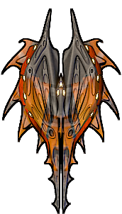
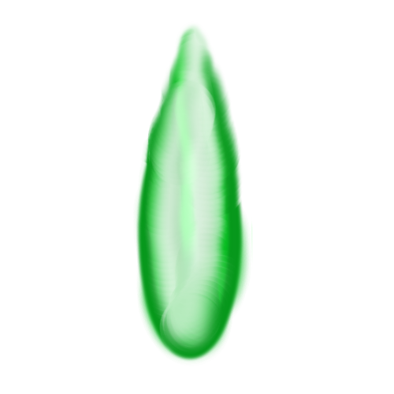
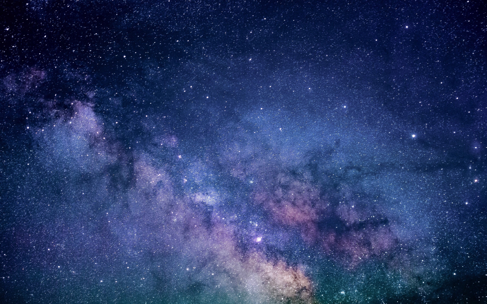
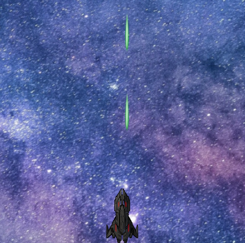

:lib: pass:quotes[_library_]
:libs: pass:quotes[_libraries_]
:j: Java
:fs: functies
:f: functie
:m: method
:icons: font
:source-highlighter: rouge
:am: Access Modifier

//ifdef::env-github[]
:tip-caption: :bulb:
:note-caption: :information_source:
:important-caption: :heavy_exclamation_mark:
:caution-caption: :fire:
:warning-caption: :warning:
//endif::[]

= Space Invaders
//Author Mark Nuyts
//v0.1
:toc: left
:toclevels: 4

In deze oefening gaan we stap voor stap het spel __Space Invaders__ namaken.

== De bestanden

We gaan het spel maken in een html file met gekoppelde javascript en css file.

De html file:

[source,html]
----
<!DOCTYPE HTML>
<html>
	<head>
		<title>Space Invaders</title>
		<link rel="stylesheet" href="invaders.css" >
		
	</head>
	<body>
	
	</body>
</html>
----

De css file en de javascript file zijn voorlopig leeg.

== De afbeeldingen

In het spel maken we gebruik van enkele afbeeldingen:

* Het ruimteschip
+
image::Char.png[200,150]
+
* De vijand
+

+
* Een laserstraal
+

+
* Een explosie
+
image::explosion-gif.gif[200,150]
+
* Een achtergrond (sterren)
+

== De achergrond toepassen

[source,css]
----
body{
	background-image: url("stars.jpg");
	background-size: cover;
}
html, body {
    height: 100%;
}
----

== Het ruimteschip

[source,html]
----
<body>
	

</body>
----

[source,css]
----
#ruimteveer{
	position:fixed;
	background-image: url("Char.png");
	background-size:cover;
	height: 9.8%;
	width: 2.5%;
	left: 50%;
	top: 90%;
}
----

== Reageren op keyboardinput

[source,html]
----
<body onkeydown="keydown(event)"> <1>
----
<1> Bij het drukken op de toetsen van het toetsenbord wordt het onkeydown event onderschept en doorgestuurd naar de functie 'keydown'.

Bijhorende javascript functie die elk keyboard _event_ afprint naar de console.

[source,js]
----
function keydown(event){
	console.log(event.code) <1>
}
----
<1> Hier printen we de toetsenbord code die werd ingedrukt af naar de console.

In deze functie kunnen we vervolgens if statement schrijven die rekening houden met de ArrowLeft of ArrowRight key.

[source,js]
----
var positie = 50; // Het ruimteveer bevindt zich in het midden van het scherm
function keydown(event){
	if (event.code == 'ArrowLeft'){
		beweegNaarLinks(); <1>
	} else if (event.code == 'ArrowRight'){
		beweegNaarRechts(); <2>
	}	
}
function beweegNaarLinks(){
	if (positie > 0){ <3>
		positie = positie - 0.4; <4>		
	}
	beweeg(); <5>
}
function beweegNaarRechts(){
	if (positie < 95){
		positie = positie + 0.4;		
	}
	beweeg();
}
function beweeg(){
	document.getElementById("ruimteveer").style.left = positie + "%"; <6>
	// console.log(document.getElementById('ruimteveer').style.left)
}
----
<1> Wanneer de keycode het pijltje naar links is, roepen we een functie op die het ruimteveer naar links laat bewegen.
<2> Wanneer de keycode het pijltje naar rechts is, roepen we een functie op die het ruimteveer naar rechts laat bewegen.
<3> In dit if statement kijken we na of het ruimteveer zich al helemaal links bevindt op het scherm (dat is de limiet)
<4> Hier maken we de positie wat kleiner (dus meer naar links).
<5> We roepen een functie op die de positie gaat wegschrijven op het div element.
<6> Via de style (css) left van het div element schrijven we de positie weg (hoe ver van de linkerkant van het scherm dat het ruimteveer zich moet bevinden).

== Schieten

Om het ruimteveer te laten schieten hanteren we de volgende denkwijze:

. We detecteren het drukken op de spatiebalk
. De afbeelding van de laserstraal tonen we boven het ruimteschip
. Via een timerfunctie (wordt herhaaldelijk uitgevoerd) passen we de positie van de laserstraal telkens aan (naar boven toe)

Als we de timerfunctie snel genoeg laten uitvoeren, lijkt het alsof de laserstraal vlot naar boven schiet.

Detectie van het drukken op de spatiebalk:

[source,js]
----
function keydown(event){
	if (event.code == 'ArrowLeft'){
		beweegNaarLinks(); <1>
	} 
	if (event.code == 'ArrowRight'){
		beweegNaarRechts(); <2>
	} 
	if (event.code == "Space"){ <1>
		schiet();
	}
}
----
<1> Hier detecteren we het drukken op de spatiebalk.

De afbeelding van de laserstraal tonen boven het ruimteschip:
[source,js]
----
function schiet(){
	var schot = document.createElement("img"); <1>
	schot.classList.add("schot"); <2>
	schot.src = 'Shot.png'; <3>	
	schot.style.left = positie + 1.5 + "%"; <4>
	schot.style.top = 87 + "%"; <5>
	document.body.appendChild(schot); <6>
}
----
<1> Hier maken we met javascript dynamisch een __img tag__ aan.
<2> We geven de tag de klasse 'shot'. Dit kunnen we in css gebruiken en later om alle schoten op te roepen van de pagina.
<3> We geven de source naar de shot.png mee.
<4> We geven een initiële positie aan het schot (in het midden van het ruimteveer).
<5> Hier plaatsen we het schot beneden, net boven het ruimteveer.
<6> En vervolgens zorgen we ervoor dat de nieuwe img tag op de webpagina body terecht komt.

We geven elk schot afbeelding een hoogte en breedte (dit kan via css klasse):
[source,css]
----
.schot{
	position:fixed;
	height: 70px;
	width: 20px;
}
----

Via een timerfunctie passen we de positie van de laserstraal telkens aan:
[source,js]
----
window.onload = function(){
	console.log('onload')
	setInterval(beweegschoten, 14); <1>
}

function beweegschoten(){
	 var schoten = document.getElementsByClassName("schot"); <2>

	//schoten naar boven laten bewegen
	for (var i = 0; i < schoten.length;i++){ <3>
		var hoogte = parseInt(schoten[i].style.top) <4>
		hoogte = hoogte - 1.5; <5>
		schoten[i].style.top = hoogte + "%"; <6>
	}

	//schoten verwijderen die uit het scherm vliegen <7>
	for (var i = 0; i < schoten.length;i++){
		if (parseInt(schoten[i].style.top) < 0){
			removeimg(schoten[i]);
		}
	}
}
function removeimg(img){
	img.parentNode.removeChild(img) <8>
}
----
<1> Een interval timer die elke 14 milliseconden de functie 'beweegschoten' oproept.
<2> We halen alle schoten op via de klasse die we elke afbeelding tag hadden gegeven.
<3> Over de array van alle schoten kunnen we lussen.
<4> We vragen de hoogte (top: hoe ver van de bovenkant van het scherm) op. Dit bevat een % teken. Met de parseInt functie houden we enkel het getal over (en wordt de % weggelaten).
<5> We passen de hoogte aan.
<6> En schrijven de hoogte weg naar de img css.
<7> Eens de schoten buiten het scherm vliegen, verwijderen we ze best uit de body (anders geraakt het geheugen uiteindelijk vol).
<8> We vragen aan de parentNode van het img, om het img te verwijderen.

Het resultaat bij het drukken op de spatieknop:

