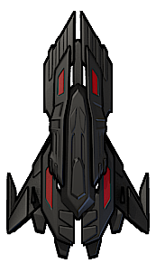

:lib: pass:quotes[_library_]
:libs: pass:quotes[_libraries_]
:j: Java
:fs: functies
:f: functie
:m: method
:icons: font
:source-highlighter: rouge
:am: Access Modifier

//ifdef::env-github[]
:tip-caption: :bulb:
:note-caption: :information_source:
:important-caption: :heavy_exclamation_mark:
:caution-caption: :fire:
:warning-caption: :warning:
//endif::[]

= Space Invaders
//Author Mark Nuyts
//v0.1
:toc: left
:toclevels: 4

In deze oefening gaan we stap voor stap het spel __Space Invaders__ namaken.

== De bestanden

We gaan het spel maken in een html file met gekoppelde javascript en css file.

De html file:

[source,html]
----
<!DOCTYPE HTML>
<html>
	<head>
		<title>Space Invaders</title>
		<link rel="stylesheet" href="invaders.css" >
		
	</head>
	<body>
	
	</body>
</html>
----

De css file en de javascript file zijn voorlopig leeg.

== De afbeeldingen

In het spel maken we gebruik van enkele afbeeldingen:

* Het ruimteschip
+

+
* De vijand
+
image::Enemy.png[200,150]
+
* Een laserstraal
+
image::Shot.png[200,150]
+
* Een explosie
+
image::explosion-gif.gif[200,150]
+
* Een achtergrond (sterren)
+
image::stars.jpg[Stars,200,150]

== De achergrond toepassen

[source,css]
----
body{
	background-image: url("stars.jpg");
	background-size: cover;
}
html, body {
    height: 100%;
}
----

== Het ruimteschip

[source,html]
----
<body>
	

</body>
----

[source,css]
----
#char{
	position:fixed;
	background-image: url("Char.png");
	background-size:cover;
	height: 9.8%;
	width: 2.5%;
	left: 50%;
	top: 90%;
}
----

